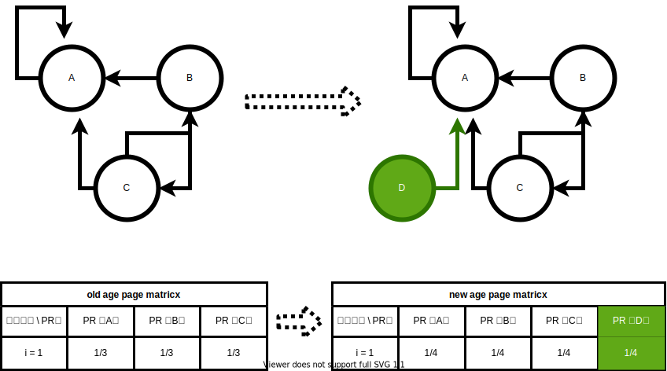

Author : Jan   
Time : 2021-10-02   
Type : DB Theory   

## 一、论文摘要

&nbsp;&nbsp;&nbsp;&nbsp;&nbsp;&nbsp;&nbsp;&nbsp;Google 以往依靠离线计算的 “网页索引服务” 存在处理时延问题，当新的文档索引矩阵更新后，需要 MapReduce 和 Batch 批处理计算新的结果。使用 Percolator 组件替换基于 batch 离线处理体系，每天相同处理文档量前提下，平均文档年龄降低 50%，主要原因便是 Percolator 的增量分布式事务处理模型。

  

 
**优点：**  
1. 增量处理，用带 Timestamp Oracle 的类 Mvcc 机制实现数据版本隔离；
2. 高容量扩展，TSO 机制和延迟清锁机制，允许集群扩展至上千台机器；   

**缺点：**   
1. 延时高，缺乏全局死锁探测器和全局事务管理器，会增大事务冲突和延时；


## 二、模型设计解析

### 2.1 并发正确性控制

&nbsp;&nbsp;&nbsp;&nbsp;&nbsp;&nbsp;&nbsp;&nbsp;原有的 MapReduce 离线计算机制自动限制并发顺序，当切换到 Percolator 控制并发时，便涉及控制并发计算的结果正确性。经典例子：PageRank 算法优化 Google 网页索引重要性服务中的并发控制，出于简述原理目的便不赘述，详解可阅读 [知乎文章](https://zhuanlan.zhihu.com/p/197877312)。    
&nbsp;&nbsp;&nbsp;&nbsp;&nbsp;&nbsp;&nbsp;&nbsp;下例简述一需并发控制场景，当爬虫爬取新的网页到存储库中，需要依新数据计算新索引页面重要性时，新旧模型差异如下：
1. 原离线模型使用 MapReduce 子任务 Reduce 不计算成功，总任务 Map 便无法汇总计算，天生可确保计算顺序。  
2. 新增量处理模型 Percolator 便有了控制不同时间计算结果的需求，Percolator 需要版本控制特性确保数据计算正确。



### 2.2 Percolator 组件作用

&nbsp;&nbsp;&nbsp;&nbsp;&nbsp;&nbsp;&nbsp;&nbsp;Percolator 通过 ACID Transaction 、 observers 、timestamp oracle、lightweight lock 四个抽象解决分布式事务中遇到的 **正确性问题、性能问题**。组件间执流入大致如下：  
1. Observers 链接 Percolator worker 并发送 Notification 信息，发起 Job 调用；   
2. Percolator Workers 发起事务，发送读写 RPC 消息给 Bigtable tablet servers；   
3. Bigtable tablet servers 发送读写 RPC 消息给 GFS chunkservers；    
4. TSO（timestamp oracle） 提供严格的曾量时间戳，确保快照隔离一致性；   
5. Percolator Workers 使用 lightweight lock 使搜索被修改过的脏数据更高效。


&nbsp;&nbsp;&nbsp;&nbsp;&nbsp;&nbsp;&nbsp;&nbsp;**ACID Transaction** ：Percolator 提供如传统数据库使用的 ACID 事务模型，确保推断存储库时间状态，确保计算正确性。    

&nbsp;&nbsp;&nbsp;&nbsp;&nbsp;&nbsp;&nbsp;&nbsp;**observers** ：Percolator 提供 observers 完成类似 Job 功能调用的系统代码段，每个观察者完成一个任务，并通过向表中写入内容为 “下游” 观察者创建更多的工作。     

&nbsp;&nbsp;&nbsp;&nbsp;&nbsp;&nbsp;&nbsp;&nbsp;**timestamp oracle** ：Percolator 提供 TSO 服务器，严格递增的顺序分发时间戳，将最大的时间戳写入稳定存储，从内存中周期性地分配一个时间戳范围满足未来的请求。如果oracle重新启动，时间戳将向前跳转到所分配的最大时间戳(但永远不会向后)。   

&nbsp;&nbsp;&nbsp;&nbsp;&nbsp;&nbsp;&nbsp;&nbsp;**lightweight lock** ：Percolator 提供 “轻量锁” 机制确保上千台机器相近时间点的并发访问，每个读操作除获取数据外，还会加读锁并写入 BigTable 内存列中持久数据存储。Get() 操作首先检查 0～timestamp 时间范围内的锁，如果锁存在其他 txn 正在并发写此处理单元,会等待到释放。如果无锁冲突，Get() 获取最新 Start Timestamp ，并且返回写的记录行。  

  


### 2.3 MVCC 与 Write Skew

#### 2.3.1 快照隔离可见性  
&nbsp;&nbsp;&nbsp;&nbsp;&nbsp;&nbsp;&nbsp;&nbsp;快照隔离级别以 start timestamp 为事务读起点，以 commit timestamp 为事务终点。与可序列化协议相比，快照隔离的主要优点是读取效率更高。因为任何时间戳都代表一致的快照，所以读取单元格只需要在给定的时间戳执行 Bigtable 查找便可，查询锁是不必要的。    
1. txn 2 在 txn 1 后开启，如果 txn 2 不 commit 则不会看到 txn1 写的数据；   
2. txn 1 和 txn 2 并行执行，如果存在相同必会有其中一个 txn 执行失败；   
3. txn 3 即会看到 txn 1 ,也会看到 txn 2；   


#### 2.3.2 快照隔离写倾斜


&nbsp;&nbsp;&nbsp;&nbsp;&nbsp;&nbsp;&nbsp;&nbsp;场景假设如下： Jan_1 和 Jan_2 均值班今天的 DBNEST Oncall 时间，并且 Jan_1 和 Jan_2 同时有事需要申请调班 txn 。 并发较高时，极易产生无人值班情况。可以使用行锁方式解决，但也会产生性能降低。    

**Txn 1 Jan_1:**
```sql
// 查询 BNEST Oncall 有多少人值班？
SELECT COUNT(*) FROM oncall_members WHERE shift_id = 123456 AND on_call = true;

// 人数 > 1, 更新调班
UPDATE oncall_members SET on_call = false WHERE name='Jan_1' AND shift_id = 123456;
```

**Txn 2 Jan_2:**
```sql
// 查询 BNEST Oncall 有多少人值班？
SELECT COUNT(*) FROM oncall_members WHERE shift_id = 123456 AND on_call = true;

// 人数 > 1, 更新调班
UPDATE oncall_members SET on_call = false WHERE name='Jan_2' AND shift_id = 123456;

```  

### 2.4 Percolator 两阶段提交


#### 2.4.1 预写入阶段  
&nbsp;&nbsp;&nbsp;&nbsp;&nbsp;&nbsp;&nbsp;&nbsp;该阶段会锁住处理单元中所有行，在客户端设计主键锁（后文详解），事务阅读元数据信息检查是否存在行处理冲突，有 3 种处理情况： 
1. 写写冲突：如果 txn 1 发现其他 txn 的 Start Timestamp 在 txn 1 之后的锁，则事务崩溃回滚；   
2. 锁释放慢：如果 txn 1 看到其他 txn 任何 Start Timestamp 的锁，则事务崩溃回滚；  
3. 正常处理：如果 txn 1 未发现任何冲突，便以自己的 Start Timestamp 进行写锁、写数据处理；      

#### 2.4.2 提交阶段
&nbsp;&nbsp;&nbsp;&nbsp;&nbsp;&nbsp;&nbsp;&nbsp;提交阶段主要操作如下：
1. 客户端首先获取 Commit TSO 并释放以主键为中心的锁；  
2. 将写处理对用户可见，写记录包含一个指针指向 start Timestamp,以便其他事务可以能够找到真实数据；   
 


### 2.5 Percolator 分布式事务

#### 2.5.1 分布式事务与传统并行事务的不同：  
1. 传统并行数据库访问会被统一事务管理器控制集中控制，由事务管理器控制获得访问存储层数据的权限；   
2. Percolator 中所有节点均直接获取数据，没有很好的方式截断访问并对事务加锁，因此锁必须在机器故障时也持久化存在，如果锁在两阶段提交时消失，那么说明已经发生了冲突；   


#### 2.5.2 Percolator 锁设计:

&nbsp;&nbsp;&nbsp;&nbsp;&nbsp;&nbsp;&nbsp;&nbsp;从锁清理机制角度看，难点在于 Percolator 发起 txn A 清理 txn B 时，必须判定 txn B 是否真的失败。   
&nbsp;&nbsp;&nbsp;&nbsp;&nbsp;&nbsp;&nbsp;&nbsp;Percolator 针对 commit 、cleanup 操作，在事务增加单元格标识位，也被称作主键锁。不同事务有自己的主键锁，执行 commit 和 cleanup 操作是时，要修改主键锁。  


**锁元数据格式**

| Column | Use |
| - | - |
| C:lock | 未提交 txn 将主键位置写入此列 |
| C:write | 已提交 txn 存储数据的时间戳 |
| C:data | 存储数据本身 |
| C:notify | 存储 hint 唤起 observers 的信息 |
| C:ack_O | observers 开始运行后，存储上次运行成功的时间戳 |


#### 2.5.3 Percolator 事务处理流程:  

&nbsp;&nbsp;&nbsp;&nbsp;&nbsp;&nbsp;&nbsp;&nbsp;本例以 Bob 到 Joe 之间转账交易为例，描述 Percolator 事务加减锁流程。

1. 初始状态，Joe 账户 2 美元，Bob 账户 10 美元。  

| key | bal:data | bal:lock | bal:write | 
| - | - | - | - |
| Bob | 6: <br/> 5:$10 | 6: <br/> 5: | 6: data@5<br/> 5: |
| Joe | 6: <br/> 5:$2 | 6: <br/> 5: | 6: data@5<br/> 5: |

2. 转账第一步，带新时间戳 7 向 bal:lock 列写入整个事务主键锁的位置,也就是处理 Bob 行；

| key | bal:data | bal:lock | bal:write | 
| - | - | - | - |
| Bob | 7:$3 <br/> 6: <br/> 5:$10 | 7:I am primary location <br/>6: <br/> 5: | 7: <br/>6: data@5<br/> 5: |
| Joe | 6: <br/> 5:$2 | 6: <br/> 5: |6: data@5<br/> 5: |

3. 转账第二步，将带有相同时间戳 7 的其他行，以指针的形式指向 Bob 的主键锁位置，形成对事务中所有行的锁定。

| key | bal:data | bal:lock | bal:write | 
| - | - | - | - |
| Bob | 7:$3 <br/> 6: <br/> 5:$10 | 7: I am primary location <br/>6: <br/> 5: | 7: <br/>6: data@5<br/> 5: |
| Joe | 7:$9 <br/> 6: <br/> 5:$2 | 7: primary@Bob.bal <br/> 6: <br/> 5: | 7:<br/> 6: data@5<br/> 5: |

4. 转账第三步，事务进入提交阶段，带有新时间戳 8 写入一条新信息擦除主键锁，bal:write 包含最近 commit 的时间戳，其他事务也会看见此事务所写内容。

| key | bal:data | bal:lock | bal:write | 
| - | - | - | - |
| Bob | 8:  <br/> 7:$3 <br/> 6: <br/> 5:$10 | 8:  <br/> 7:  <br/>6: <br/> 5: | 8: data@7<br/> 7: <br/>6: data@5<br/> 5: |
| Joe | 7:$9 <br/> 6: <br/> 5:$2 | 7: primary@Bob.bal<br/> 6: <br/> 5: | 7:<br/> 6: data@5<br/> 5: |

4. 最后，在 Bob 的 bal:write 列写入事务提交时间戳，并擦出指向原有主键锁的次级行锁。

| key | bal:data | bal:lock | bal:write | 
| - | - | - | - |
| Bob | 8:  <br/> 7:$3 <br/> 6: <br/> 5:$10 | 8:  <br/> 7:  <br/>6: <br/> 5: | 8: data@7<br/> 7: <br/>6: data@5<br/> 5: |
| Joe | 8:  <br/>7:$9 <br/> 6: <br/> 5:$2 | 8:  <br/> 7: <br/> 6: <br/> 5: | 8: data@7<br/>7:<br/> 6: data@5<br/> 5: |

 


#### 2.5.2 事务的错误处理   
&nbsp;&nbsp;&nbsp;&nbsp;&nbsp;&nbsp;&nbsp;&nbsp;清理主锁是同步操作，所以清理活动客户端持有的锁是安全的，但回滚将迫使事务中止，会产生性能问题。当事务正在提交时客户端崩溃，锁不会清除，依旧持久化在 tablet server 中。为降低清锁对性能造成影响，非阻塞当前 worker 运行或死锁情况下不会主动清理残留锁，同时引入“令牌”、“超时” 补充清锁情况。
1. 引入 “令牌” 使用 worker 向 Chubby 写入 token， 表明所属于系统及存活状态，token 在进程退出时自动删除。    
2. 引入 “超时” 确保即使 worker 的 token 有效，太久的锁也会被清除。
 


**锁释放步骤：**  
1. txn B 提交前, 必须检查是否仍然持有主键锁； 
2. txn A 清除 txn B 残留锁前，txn A 必须确保 txn B 的主键锁没有被提交； 
3. 当客户端 commit 阶段崩溃时，如果客户端已发起 commit 并以修改数据，必须前滚恢复数据；其他情况回滚数据。详情如下:   
  3.1 第一种情况：如果主键已经更换为其他记录, 说明写锁的事务已经提交，前滚事务即可；   
  3.2 其他情况：直接将 txn A 写入 txn B 主键锁行回滚 txn B 便可，因为事务提交会首先释放主键锁；  

     

### 2.4 Percolator 现存问题  
1. PRC 性能：相较 mapreduce 较低效率的是每个工作单元发送的 rpc 数量，MapReduce 对 GFS 进行一次大的读取，获取 10 ～ 100 个网页的所有数据，而 Percolator 执行大约 50 个单独的 Bigtable Rpc 操作来处理一个文档，吞吐存在问题。
2. 写锁时延：每次写锁必须执行读、修改、写三个操作，需要与 Bigtable 两次 rpc 交互 : 一次用于读取冲突锁，一次用于写入新锁。   
  2.1 优化一 批量：虽然相同 Tablet server 的写锁操作可以 batch 处理，但高并发下该问题较为明显。   
  2.2 优化二 预取：基于读一行与读取两个或多个值的成本基本相同，预取与缓存结合可以减小读 Bigtable 的次数 10 倍。  


## 三、性能与未来

**性能**   
&nbsp;&nbsp;&nbsp;&nbsp;&nbsp;&nbsp;&nbsp;&nbsp;Google 通过建立和部署 Percolator，自2010年4月以来用于制作谷歌的网络搜索索引实现了减少索引单个文档的延迟的目标。同时，为了在更实际的工作负载上评估 Percolator 实现了基于 TPC-E（TPC-E 模拟了一个经纪公司，客户执行交易、市场搜索和帐户查询） 的基准测试结果为未来的研究提供了新的前景方向。测试结果平均事务延迟是2到5秒，异常值可能需要几分钟。

**未来**  
1. Percolator 这样的巨大数据集单个共享内存机器已无法处理，需要扩展到 1000 台机器的分布式解决方案，通过牺牲并行数据库的部分灵活性和低延迟，提供了一个足以适应互联网规模的数据集的系统，解决了现有的并行数据库只能利用100台机器的节点瓶颈。  
2. Percolator 是一个数据转换系统，而不仅仅是一个数据存储系统，与 NewSQL、RocksDB 等高效存储引擎组合在一起，会比传统数据库提供更高的性能和更好的伸缩性。   


## 四、参考文章

[Paper -- Large-scale Incremental Processing
Using Distributed Transactions and Notifications](http://notes.stephenholiday.com/Percolator.pdf)   
[PingCAP Blog -- Percolator 和 TiDB 事务算法](https://pingcap.com/zh/blog/percolator-and-txn)