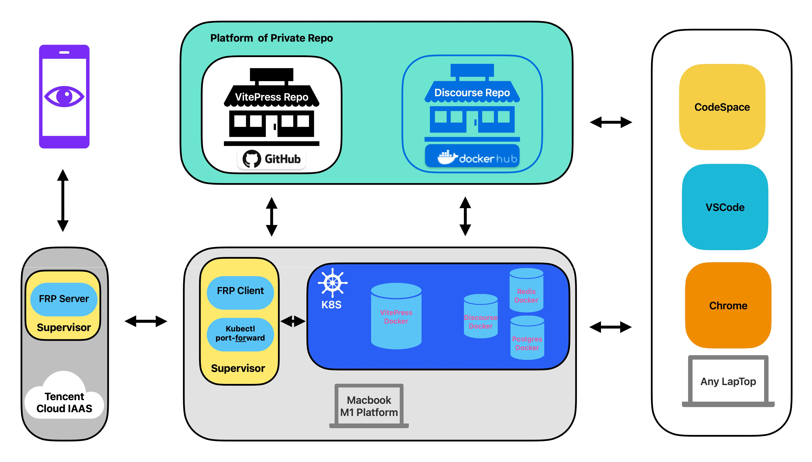
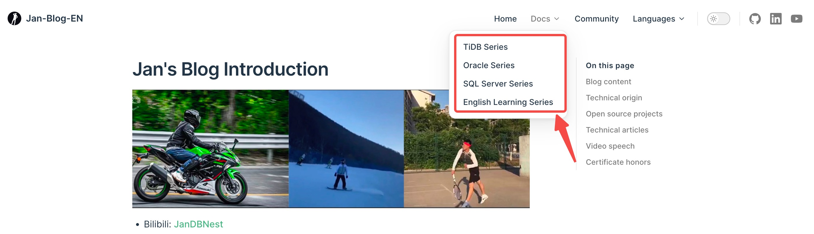
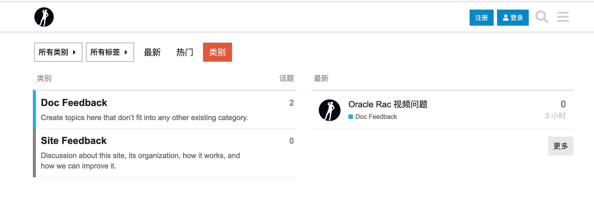

# Jan's Blog

<a href="http://www.dbnest.net/">
    
</a>

[](https://github.com/jansu-dev/Jan-Blog/master/LICENSE)
[](https://golang.org/)
[](https://www.python.org/)
[](https://travis-ci.org/pingcap/tidb)
[](https://vitepress.vuejs.org/)

1. Previous time, the repo named `TiDB-Learning-Notes`, however, recently,I've merged some repo I created into the whole my own blog repo. So, please don't feel confused.
2. By this actions, now, you could view almost my sharing in below internet link.
3. You can access my blog by clicking the logo above.

Above all, now, you can click **[the online showing](http://www.dbnest.net/zh/tidb/05TiDB-%E7%94%9F%E6%80%81%E5%B7%A5%E5%85%B7/5-1TiCDC/01%E7%AE%80%E8%BF%B0%E4%BD%BF%E7%94%A8%E8%83%8C%E6%99%AF.html)** to see all documents I've written.

1. Blog architecture, now, my blog has merged the discourse framework to improve interactive function.

    

2. Blog docs, you can click a specific doc to take a look, which is maintained at this repo.

    

3. Blog community, to tell the turth, It was implmented in another **([repo link](https://github.com/jansu-dev/discourse-on-k8s))**, if you're interested in.

    

## How does it work

1. It uses vitepress,which is a vue frame work crated by typescript programming language, as a basic framework to create blog.
2. I coded some scripts using python3 to generated SideBar based on dictionary tree and filename of blog.

## Look it on local

you can command them on terminal

```js
git clone https://github.com/jansu-dev/Jan-Blog && cd Jan-Blog
yarn add --dev vitepress vue
yarn docs:dev

// browse content in chrome browsee
127.0.0.1:3000
```
