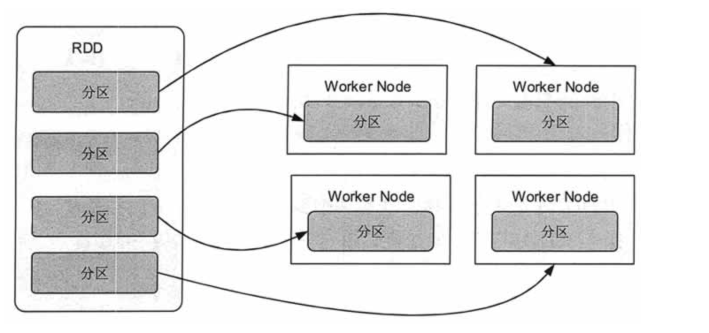
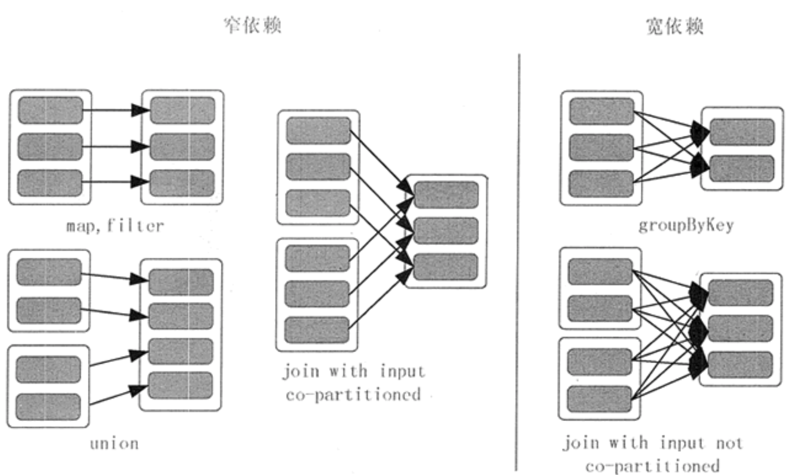

## 基础概念

### RDD 基础概念

 - Partition：分区是 spark 中数据集的最小单位，不同的分区被存储与不同的 work node。
 - RDD 定义：RDD（resilient distributed datasets）是 Spark 提供最基本的抽象概念，是一个不可变的分布式对象集合，每个 RDD 都被分为多个分区，这些分区运行在集群的不同节点上。

    - RDD 性质：
        - 只读：不能修改，只能通过转换操作生成新的 RDD。
        - 分布式：可以分布在多台机器上进行并行处理。
        - 弹性：计算过程中内存不够时它会和磁盘进行数据交换。
        - 基于内存：可以全部或部分缓存在内存中，在多次计算间重用

    - 源码注释：
        - A list of partitions（数据层面上，RDD 可以是是一组分区的集合）
        - A function for computing each split（计算层面上，RDD 可以是会存储计算信息及数据信息）
        - A list of dependencies on other RDDs（计算层面上，RDD 可以是会计算依赖转换关系）
        - Optionally, a Partitioner for key-value RDDs (e.g. to say that the RDD is hash-partitioned)（计算层面上，RDD 可以是计算分区的函数）
        - Optionally, a list of preferred locations to compute each split on (e.g. block locations for an HDFS file)（数据层面上，可以是储优先级高的分区位置信息）

    

    - 依赖类型
        - 宽依赖：宽依赖是指父 RDD 的每个分区都被多个子 RDD 的分区所依赖，如：map、filter、union；
        - 窄依赖：窄依赖是指父 RDD 的每个分区都只被子 RDD 的一个分区所使用，如：groupByKey、reduceByKey；
    
    

### DAG 阶段划分

 - 阶段划分：用户的计算任务是由 RDD 构成的 DAG，因为 RDD 的依赖类型分窄依赖、宽依赖，受宽依赖的限制 RDD 的执行阶段被划分为不同 Stage。
     - 注意：
        - 不同的 Stage 无法并行计算；
        - 划分 Job 的 Stage 时，一般会按照倒序进行（即从 Action 开始，遇到窄依赖操作，则划分到同一个执行阶段，遇到宽依赖操作，则划分一个新的执行阶段）；
        - Stage 之间根据依赖关系就构成了一个大粒度的 DAG；

    

### 算子类型

- RDD 操作：
    - 转化操作（transformation）：Spark 会将一个 RDD 转换为另一个 RDD 的信息记录下来，并不真正执行；
    - 行动操作（action）：Spark 在执行行动操作时真正执行计算，返回结果；

 - [CSDN-Spark常用算子](https://blog.csdn.net/zyzzxycj/article/details/82706233)

## 参考文章
 - https://zhuanlan.zhihu.com/p/129346816