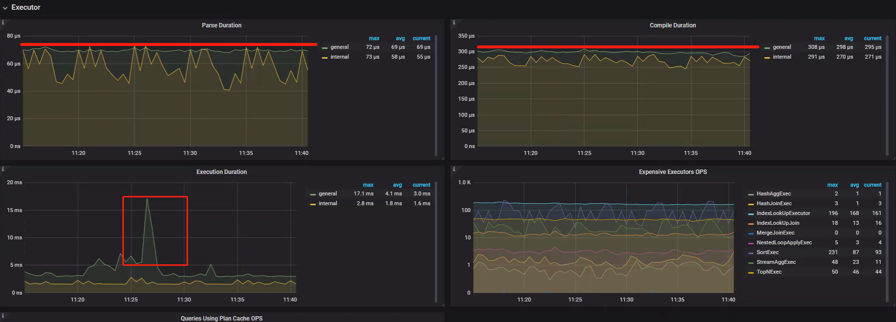

# SQL Duration 升高现象问题排查    
时间：2021-02-02  

## Summary

> - [问题现象](#问题现象)  
> - [排查过程](#排查过程)  
>   - [排查思路](#问题现象)     
>   - [核心指标](#问题现象) 
>   - [案例现象](#问题现象) 
> - [问题解决](#问题解决)  
> - [归纳总结](#归纳总结)  
> - [参考文章](#参考文章)  

## 问题现象
&nbsp;&nbsp;&nbsp;&nbsp;&nbsp;&nbsp;&nbsp;&nbsp;在客户 TiDB 生产库进行巡检，发现 SQL Duration 存在突然小幅度升高后又回落的现象，需分析导致此现象的具体原因，以规避潜在风险。

 - Metrics 中反映的问题现象  
    

## 排查过程

#### 排查思路  
&nbsp;&nbsp;&nbsp;&nbsp;&nbsp;&nbsp;&nbsp;&nbsp;依据 TiDB 各组件间关系、SQL 执行流程等体系知识，把握 Promethus 核心监控指标，自定向下逐层深挖各组件影响性能最大的因素。  

 - 案例排查思路  
   - SQL CMD细分

#### 核心指标
&nbsp;&nbsp;&nbsp;&nbsp;&nbsp;&nbsp;&nbsp;&nbsp;本次仅介绍在排查问题过程中涉及到的指标    

 - Duration  
 - QPS  
 - Statement QPS
 - Slow Query

#### 排查细节

 - SQL CMD细分
   - 排查思路   
   首先，导致 SQL Duration 可能是 SELECT、INSERT、UPDATE、DELETE 中任何类  型 SQL 的任何一种，应该通过 Statement OPS 找出其中占比重比较大的 SQL 操  作。因为 SQL 占比重较小的 SQL 即使很慢，也很小概率会出现在 99% 分位数的视  图中，所以应先对 SQL 操作分类排查。
  
   - 排查结果  
   SQL Duration 升高的原因分为两个方向一方面是慢 SQL,另一方面是集群中某个节点存在性能问题，导致整体 Duration 升高。   
   可能是 INSERT 或 UPDATE 导致的,
  
   - 案例 Metrics  
      

 - TOP SQL 方向排查
   - 排查思路   
   首先，导致 SQL Duration 可能是 SELECT、INSERT、UPDATE、DELETE 中任何类  型 SQL 的任何一种，应该通过 Statement OPS 找出其中占比重比较大的 SQL 操  作。因为 SQL 占比重较小的 SQL 即使很慢，也很小概率会出现在 99% 分位数的视  图中，所以应先对 SQL 操作分类排查。
  
   - 排查结果  
   SQL Duration 升高的原因可能是 INSERT 或 UPDATE 导致的,
  
   - 案例 Metrics  
      
      
      
      

   

   

   

   

   

   

   

## 问题解决

## 归纳总结

## 参考文章  

