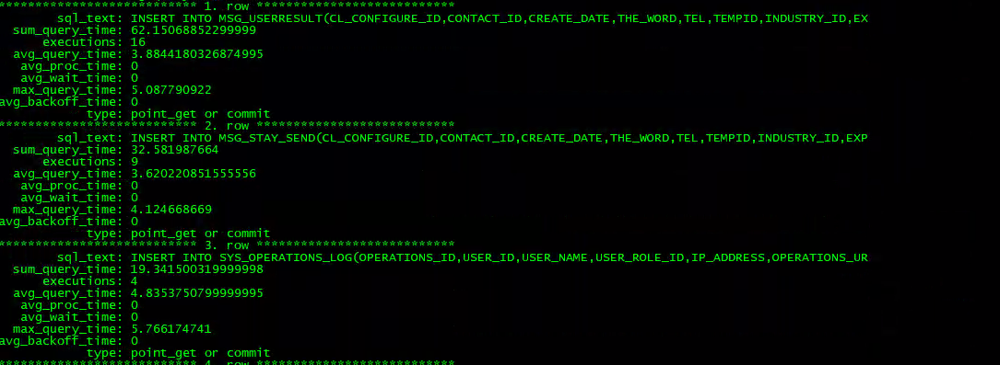
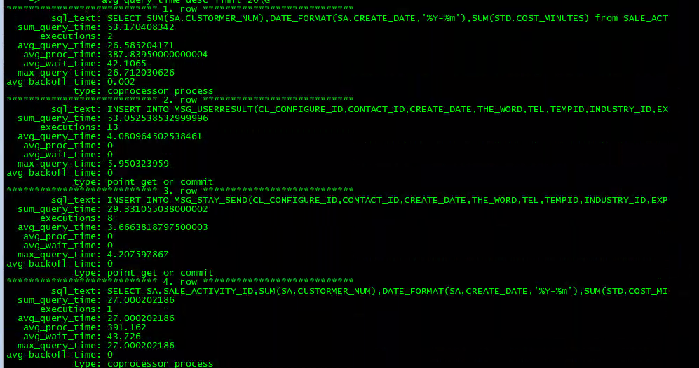
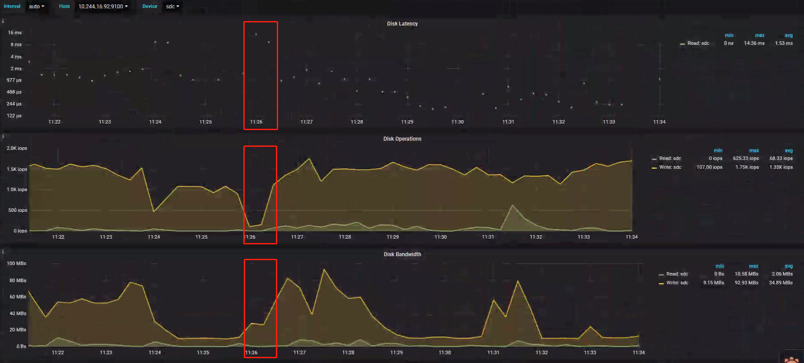

# SQL Duration 升高现象问题排查    
时间：2021-02-02  

## Summary

> - [问题现象](#问题现象)  
> - [排查过程](#排查过程)  
>   - [核心指标](#核心指标)   
> - [排查思路](#排查思路)   
>   - [网络延迟抖动性方向排查](#网络延迟抖动性方向排查)   
>   - [TOP_SQL方向排查](#TOP_SQL方向排查)   
>   - [集群组件性能问题方向排查](#集群组件性能问题方向排查)   
> - [排查细节](#排查细节)    
>   - [Query-Summary](#Query-Summary)   
>   - [TiDB部分组件排查](#TiDB部分组件排查)   
>     - [TiDB-Executer](#TiDB-Executer)   
>     - [TiDB-DistSQL](#TiDB-DistSQL)   
>     - [TiDB-KV](#TiDB-KV)   
>   - [TiKV部分组件排查](#TiDB部分组件排查)   
>     - [TiKV-gRPC](#TiKV-gRPC)   
>     - [TiKV-Scheduler](#TiKV-Scheduler)   
>     - [TiKV-RaftIO](#TiKV-RaftIO)  
>     - [Disk-Performance](#Disk-Performance)   
> - [问题解决](#问题解决)  
> - [归纳总结](#归纳总结)  
> - [参考文章](#参考文章)  

## 问题现象
&nbsp;&nbsp;&nbsp;&nbsp;&nbsp;&nbsp;&nbsp;&nbsp;在客户 TiDB 生产库进行巡检，发现 SQL Duration 存在突然小幅度升高后又回落的现象，需分析导致此现象的具体原因，以规避潜在风险。

 - Metrics 中反映的问题现象  
    

## 排查过程   

#### 核心指标
&nbsp;&nbsp;&nbsp;&nbsp;&nbsp;&nbsp;&nbsp;&nbsp;本次仅介绍在排查问题过程中涉及到的指标    

 - PingLatency  
 - QPS、Statement OPS  
 - Parse Duration、Compile Duration、Execution Duration、Distsql Duration、Coprocessor Seconds  
 - KV Request OPS、KV Request Duration 99 by store、KV Request Duration 99 by type  
 - gRPC poll CPU、Scheduler worker CPU、Raft store CPUAsync aapply CPU  
 - Scheduler writing bytes、Scheduler pending commands  
 - Propose wait duration per server、Apply wait duration per server  
 - Append log duration per server、Apply log per server、Commit log duration per server  
 - Disk Lantency、Disk Load、Disk IOps  

## 排查思路  
&nbsp;&nbsp;&nbsp;&nbsp;&nbsp;&nbsp;&nbsp;&nbsp;首先，对可能引起 SQL Duration 抖动原因进行分类，追一排查否定不可能因素，直至定位根本原因；    

 - 案例排查思路分类  
   1. 网络延迟抖动性升高，导致 Duration 上升；
   2. 慢 SQL 导致的 Duration 上升；   
   3. 集群组件性能问题导致的 Duration 上升；

### 网络延迟抖动性方向排查  
   - 排查思路  
   &nbsp;&nbsp;&nbsp;&nbsp;&nbsp;&nbsp;&nbsp;&nbsp;网络延迟可能导致 RPC 消息传输慢，进而导致 SQL CMD 执行出现 Duration 的现象。  
     - PingLatency：指标记录网络延迟情况，问题时段并未出现网络异常现象；  

   - 排查结果    
   &nbsp;&nbsp;&nbsp;&nbsp;&nbsp;&nbsp;&nbsp;&nbsp;排除网络原因导致的 SQL Duration 升高的原因；  

   - 案例 Top SQL 截图  
      

### TOP_SQL方向排查
   - 排查思路   
     1. 通过 slow_query 系统信息表相应字段分组排序，查出巡检时间内所需的 Top SQL 信息；   
     2. 如果断定 SQL 是引起 Duration 升高的主要原因，可通过 Slow Query File 进一步分析；  
         - 查询 SQL 慢的阶段，如：Parse_time、Compile_time 等等，详细信息参考-[慢查询日志字段含义说明](https://docs.pingcap.com/zh/tidb/stable/identify-slow-queries#%E5%AD%97%E6%AE%B5%E5%90%AB%E4%B9%89%E8%AF%B4%E6%98%8E) 
         - 查询 SQL 历史执行计划，如：select tidb_decode_plan(...)，优化对性能瓶颈起决定性作用的执行计划，详细信息参考-[查看 Plan](https://docs.pingcap.com/zh/tidb/stable/identify-slow-queries#%E7%9B%B8%E5%85%B3%E7%B3%BB%E7%BB%9F%E5%8F%98%E9%87%8F)
         - 定位原因后通过 Hint 或 Index 优化慢 SQL

   - 排查结果  
     &nbsp;&nbsp;&nbsp;&nbsp;&nbsp;&nbsp;&nbsp;&nbsp;案例中 TiDB 集群共有4台 TiDB 实例，分别是 IP88、IP89、IP91、IP93，在四个台 TiDB 实例上分别取问题时间段半小时的 Slow Query 情况，发现并没有慢 SQL 执行次数多到足够影响整个集群的 Duration 升高。   
     &nbsp;&nbsp;&nbsp;&nbsp;&nbsp;&nbsp;&nbsp;&nbsp;因此，慢 SQL 导致 Duration 的方向锁定问题原因的思路被排除。
  
   - 案例 Top SQL 截图  
     - IP88  
        
  
     - IP89  
        

     - IP91  
        

     - IP93  
       
   

### 集群组件性能问题方向排查  

 - 组件关系图，参考[官方问文档 Performance-map](https://download.pingcap.com/images/docs-cn/performance-map.png) 总结
      
    

 - 排查思路   
 &nbsp;&nbsp;&nbsp;&nbsp;&nbsp;&nbsp;&nbsp;&nbsp;导致 SQL Duration 的原因也可能是集群组件出现问题导致的，排查思路为依据 TiDB 各组件间关系、SQL 执行流程等体系知识，把握 Promethus 核心监控指标，自定向下逐层深挖各组件影响性能最大的因素。   

### Query-Summary    
     
 - 排查思路：   
 &nbsp;&nbsp;&nbsp;&nbsp;&nbsp;&nbsp;&nbsp;&nbsp;SELECT、INSERT、UPDATE、DELETE 中任何类型 SQL 的任何一种都有可能导致 Duration 升高，应该通过 Statement OPS 找出其中占比重比较大的 SQL 操作。因为 SQL 占比重较小的 SQL 即使很慢，也很小概率会出现在 99% 分位数的视图中，所以应先对 SQL 操作分类排查;
   - QPS：指标折线图显示问题时段 QPS 与正常时段无差异，说明 Client 请求没有增多；  
   - Statement OPS：指标显示 select、Insert 操作居多，update、delete 极少，因为已经排除慢 SQL 问题，所以更倾向于怀疑 Insert CMD 导致 Duration 升高；    

  
 - 排查结果    
 &nbsp;&nbsp;&nbsp;&nbsp;&nbsp;&nbsp;&nbsp;&nbsp;SQL Duration 抖动的原因，从 Metrics 中推断更可能是 INSERT 导致的且 Client 端请求没有增加，佐证了可能是集群中组件出现性能瓶颈导致 Duration 抖动；
  
 - 案例 Metrics  
 

## 排查细节

&nbsp;&nbsp;&nbsp;&nbsp;&nbsp;&nbsp;&nbsp;&nbsp;通过在三个方向的探索发现，基本锁定导致 Duration 抖动的原因极有可能是因为集群组件性能问题导致的 Duration 上升；下面，通过 Metrics 逐层排查原因。

### TiDB部分组件排查

#### TiDB-Executer  

 - 排查思路     
 &nbsp;&nbsp;&nbsp;&nbsp;&nbsp;&nbsp;&nbsp;&nbsp;Executer 主要职责为 AST --> Logical Plan --> Physcial Plan 执行链路上的转换与优化操作；  
   - Parse Duration 与正常阶段相比无明显异常；      
   - Compile Duration 与正常阶段相比无明显异常；   

 - 排查结果   
 &nbsp;&nbsp;&nbsp;&nbsp;&nbsp;&nbsp;&nbsp;&nbsp;基本排除 TiDB Executer 层组件瓶颈问题导致的 SQL Duration 升高；但 Execution Duration 有明显抖动，需深挖原因；  

 - 案例 Metrics   
  

#### TiDB-DistSQL

 - 排查思路   
 &nbsp;&nbsp;&nbsp;&nbsp;&nbsp;&nbsp;&nbsp;&nbsp;DistSQL 并行处理各 SQL 下推到各 TiKV 节点的 Coprocessor 处理操作，IP91 虽然较高，但峰值 23ms 的 Duration 并不能说明问题；    
   - **DistSQL Duration 有小幅度升高**，说明此时可能存在汇总查询类的慢 SQL，在 TOP SQL 方向排查过程中也可以看到 IP91 节点存在一条执行两次的平均执行时间 SQL 达 26s 的慢SQL，但不足以影响真个集群 SQL Duration；     
   - **Coprocessor Seconds 0.999 分位数**，四台 TiDB 实例均幅度不等升高，并不能说明问题；  
 - 排查结果  
 &nbsp;&nbsp;&nbsp;&nbsp;&nbsp;&nbsp;&nbsp;&nbsp;TiDB 在 DistSQL 处理阶段不存在性能问题；综上所述，基本排除 TiDB 层存在性能问题的情况；     

 - 案例 Metrics  
    
    

#### TiDB-KV  

 - 排查思路：  
 &nbsp;&nbsp;&nbsp;&nbsp;&nbsp;&nbsp;&nbsp;&nbsp;KV 线程池处理阶段处于 Transaction 处理阶段和 TiKV Client 阶段处理之间，判断 TiDB 在开启事务后处理 KV 数据是否存在性能瓶颈。  
   - KV Request OPS：指标折线显示其他节点 OPS 阶段曲线在问题时间不存在明显特别，仅有 IP91:10080-Cop 在问题阶段出现 OPS 升高的情况，但从慢查询结果来看，并无与 SELECT 有关慢查询，**可能单纯是发往 IP91:10080 的 Cop 操作过多**；    
   - KV Request Duration 99 by store：TiDB 中的 KV 阶段发向 store4 的请求存在执行缓慢现象，**折线反映飞非常明显**；    
   - KV Request Duration 99 by type：很有可能与写入有关，发生在 Prewrite 阶段，**折线反映飞非常明显**；    

 - 排查结果    
 &nbsp;&nbsp;&nbsp;&nbsp;&nbsp;&nbsp;&nbsp;&nbsp;基本判断在 Prewrite 阶段出现了问题，接下来判断是哪个或那几个节点在 Prewrite 阶段出现了问题； 

 - 案例 Metrics   
    
    

### TiKV部分组件排查

#### TiKV-gRPC  

 - 排查思路   
 &nbsp;&nbsp;&nbsp;&nbsp;&nbsp;&nbsp;&nbsp;&nbsp;gRPC 阶段属于 TiKV 端，用以接收来自 TiDB 端 TiKV Client 组件发送的请求。  
   - 99% 分位数显示 kv_prewrite-IP92:270172 在处理 kv-write Duration 峰值在 7s 左右，明显区别于其他节点**折线显示非常明显**；  
   - 图二所示，基本排除因为分配 CPU 核数不足导致的各阶段瓶颈问题，**gRPC poll CPU、Scheduler worker CPU、Raft store CPU、Async aapply CPU 均有很大可利用空间**；  
 - 排查结果  
 &nbsp;&nbsp;&nbsp;&nbsp;&nbsp;&nbsp;&nbsp;&nbsp;基本判断 IP92:270172 出现问题。接下来深挖问题原因，大概率与 I/O 问题有关。

 - 案例 Metrics   
    
    

#### TiKV-Scheduler  

 - 排查思路   
 &nbsp;&nbsp;&nbsp;&nbsp;&nbsp;&nbsp;&nbsp;&nbsp;Scheduler 阶段负责处理发往 TiKV 阶段的写请求，依据此阶段按进一步佐证在 gRPC 阶段得出的 kv_prewrite-IP92:270172 节点写请求出现性能问题的结论，并通过 IP:Port 所启动的进程查出具体的 Store；  
   - Scheduler writing bytes：指标显示 IP92、IP100 在问题时间等待写于的数据存在明显增长，极有可能存在数据积压，未能及时将数据写入到 RaftStore 中的情况；   
   - Scheduler pending commands：指标显示 IP92 在问题时间待处理的命令出现积压，**进一步佐证 IP92 写入出现问题**；  
 - 排查结果  
 &nbsp;&nbsp;&nbsp;&nbsp;&nbsp;&nbsp;&nbsp;&nbsp;基本确定 IP92:270172 对应的 Store 出现了性能问题，需查看问题时段 Disk-Performance 最终发掘问题根本；  
 &nbsp;&nbsp;&nbsp;&nbsp;&nbsp;&nbsp;&nbsp;&nbsp;通过第二张图片，锁定对应 Store 为 /dev/sdc 磁盘；  

 - 案例 Metrics   
    
    

#### TiKV-RaftIO

 - 排查思路   
 &nbsp;&nbsp;&nbsp;&nbsp;&nbsp;&nbsp;&nbsp;&nbsp;RaftIO 监控 RaftStore 阶段，RaftStore 用于存储实现 Raft 协议阶段所需要的数据。各指标发生阶段、参数理想值详细参操-[官方问文档 Performance-map](https://download.pingcap.com/images/docs-cn/performance-map.png)   
   - Propose wait duration per server：指标显示  IP92:270172 峰值达到 3.936s，**说明在 raft Log 时比较慢**；   
   - Apply wait duration per server：指标显示 IP92:270172 峰值达到 213ms，performance-map 推荐 99% 分位数值小于 50ms，**说明在 raft 数据落盘时比较慢**； 

 - 排查结果  
 &nbsp;&nbsp;&nbsp;&nbsp;&nbsp;&nbsp;&nbsp;&nbsp;IP92:270172 对应 Store 上进行的 Append、Apply、Commit 操作均出现延迟现象，推测可能大量 RaftStore 数据存在于 RaftStore 线程池的 channel 中，未能及时被相应处理线程消费写入 rocksDB raft 中，**此时因为 CPU 未被打满，所以怀疑磁盘性能出现问题**；   

 - 案例 Metrics    
    

#### TiKV-Apply

 - 排查思路   
   - Append log duration per server：指标显示 IP92:270172 峰值达到 488ms，**说明在 raft Log 时出现问题**；  
   - Apply log per server：指标显示 IP92:270172 峰值达到 471ms，performance-map 推荐 99% 分位数值小于 100ms，**说明在 raft 数据落盘时出现问题**；      
   - Commit log duration per server：指标显示 IP92:270172 峰值达到 1.95s，**说明记录 Commit Log 时出现问题**；    

 - 排查结果  
 &nbsp;&nbsp;&nbsp;&nbsp;&nbsp;&nbsp;&nbsp;&nbsp;查看 apply 阶段 IP92:270172 Store 磁盘的写入情况，进一步佐证了磁盘性能出现问题的猜想；    

 - 案例 Metrics    
    

#### Disk-Performance

 - 排查思路   
 &nbsp;&nbsp;&nbsp;&nbsp;&nbsp;&nbsp;&nbsp;&nbsp;Disk-Performance Metrics 监控各 Store 的磁盘性能，包含 Lantency、IOps、BandWidth、Load 等信息；  
   - Disk Lantency：指标显示问题时段延迟高达 15ms，**与正常时段比较属于高延时**；   
   - Disk Load：指标显示问题时段负载高达 8.77，**与正常时段比较属于高负载状态**；  
   - Disk IOps：指标显示问题时段 IOps 在 107 左右，**在正常时段比较属于极低状态**；  

 - 排查结果  
 &nbsp;&nbsp;&nbsp;&nbsp;&nbsp;&nbsp;&nbsp;&nbsp;查看 Store 问题时段状态，发现磁盘延时、负载高出正常水平，但 IOps 却极低，说明问题时段出现了磁盘性能抖动。

 - 案例 Metrics    
    
    

## 问题解决

&nbsp;&nbsp;&nbsp;&nbsp;&nbsp;&nbsp;&nbsp;&nbsp;因为此次 SQL Duration 升高是 IP92 节点 Store 对应磁盘出现性能抖动导致的，无法弥补且不存在实质性风险，所以不用解决。   

## 归纳总结

&nbsp;&nbsp;&nbsp;&nbsp;&nbsp;&nbsp;&nbsp;&nbsp;对于组件间的性能排查，熟知 [官方问文档 Performance-map](https://download.pingcap.com/images/docs-cn/performance-map.png) 各组件间关系，及对应 Metrics 的性能理想值非常关键。 

## 参考文章  

[官方问文档 Performance-map](https://download.pingcap.com/images/docs-cn/performance-map.png)  

[慢查询日志字段含义说明](https://docs.pingcap.com/zh/tidb/stable/identify-slow-queries#%E5%AD%97%E6%AE%B5%E5%90%AB%E4%B9%89%E8%AF%B4%E6%98%8E) 

