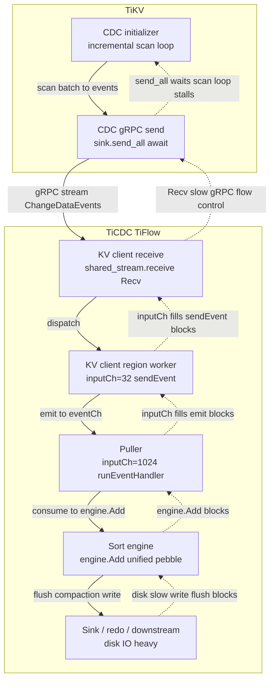

## 1. Symptoms

You can think of `resolved-ts` as a global watermark from TiKV to TiCDC. If it cannot advance in time, it impacts both the changefeed checkpoint and downstream consumption progress.

- A changefeed/table `resolved-ts` is essentially the **minimum** resolved-ts across all Regions that are being replicated
- If some Regions stay in **CDC initialization not finished** (TiKV incremental scan / initial scan not completed) for a long time, TiCDC won’t advance those Regions’ resolved-ts
- The slowest Region’s resolved-ts is stuck → the global resolved-ts is stuck → `resolved ts lag` keeps increasing over time (often “linear growth”)
- `resolved ts lag` is also a lower bound for `checkpoint ts lag`, so checkpoint lag can keep increasing as well

Typical business impact: downstream (MQ / MySQL / other sinks) consumption latency increases and triggers SLA alerts.

## 2. Quick diagnosis

1. Besides seeing changefeed resolved ts lag growing linearly, the incremental scan speed is also very slow.

2. `unresolved region count` may stay non-zero for a long time and cannot drop to 0.

3. When backlog is obvious (resolved-ts lag), disk write throughput should usually be high, but the actual write throughput is low (e.g. write speed < 50MB/s).

4. From experience: if TiCDC itself has no obvious bottleneck and the TiKV cluster is large enough, aggregate incremental scan throughput (all TiKVs together) can reach ~200GB/s. Compared to that, the observed write throughput is clearly too low.

## 3. Quick mitigation

If you don’t replace it with a higher performance disk, it won’t get better.

## 4. Full resolution

- Move TiCDC’s data directory to a high-performance disk (higher IOPS, lower latency, e.g. local NVMe / high-end SSD)
- See the official recommendation: [500 GB+ SSD](https://docs.pingcap.com/tidb/stable/deploy-ticdc/#software-and-hardware-recommendations)
- After upgrading the disk, you should observe write speed reaching ~200MB/s

## 5. Root-cause chain

### 5.1 Summary

**TiCDC’s `Unified Sorter` is disk-heavy. When TiCDC disk performance is insufficient, slower spill-to-disk triggers TiCDC flow control/backpressure, which slows down TiKV incremental scan sending. The incremental scan can’t finish in time, and resolved-ts lag rises abnormally.**

### 5.2 Detailed mechanism

1. A slow sorter blocks the processing path such as [`engine.Add(...)`](https://github.com/pingcap/tiflow/blob/2f2e42bebf8357b34cbe9627a3ecd8e1d5420095/cdc/processor/sourcemanager/manager.go#L142-L153), so the puller consumes more slowly
2. Upstream KV client / region worker channel [`regionWorkerInputChanSize`](https://github.com/pingcap/tiflow/blob/2f2e42bebf8357b34cbe9627a3ecd8e1d5420095/cdc/kv/shared_region_worker.go#L35) gets filled and blocks, so gRPC Recv slows down
3. gRPC flow control/backpressure propagates back to TiKV, so TiKV blocks when sending scan events at [`send_all(...).await`](https://github.com/tikv/tikv/blob/ee657ca4ce6c39ffe909c7a89d67bd37506c4708/components/cdc/src/initializer.rs#L522-L524)
4. The incremental scan can’t finish in time, and the [`INITIALIZED`](https://github.com/tikv/tikv/blob/ee657ca4ce6c39ffe909c7a89d67bd37506c4708/components/cdc/src/delegate.rs#L812-L816) event cannot be received/processed by TiCDC
5. The Region is still treated as “not initialized” → TiCDC doesn’t advance that Region’s resolved-ts → the global watermark is pinned by the slowest Region → resolved-ts lag grows linearly

### 5.3 Visualization

