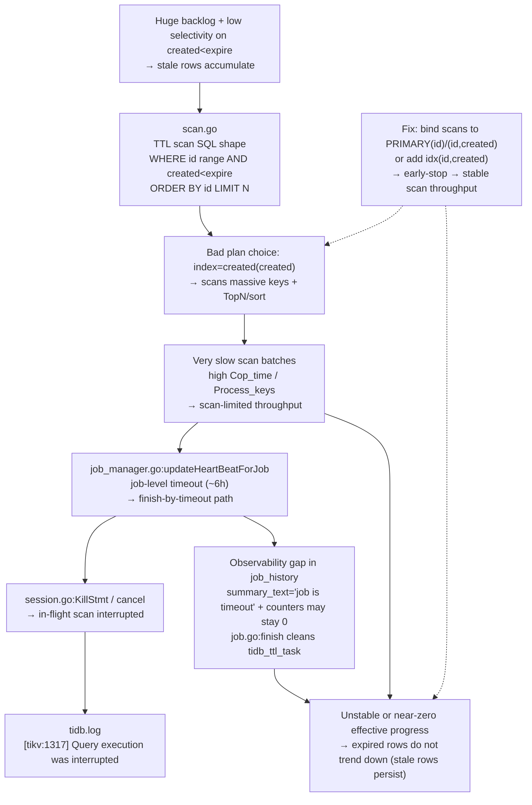

## 1. Symptoms

Two huge tables (billions of rows) had TTL enabled (e.g. `TTL=created + INTERVAL 6 MONTH`, `TTL_JOB_INTERVAL='1h'`), but expired rows kept accumulating.

One important reminder: **TiDB TTL does not guarantee “delete immediately at the deadline”**. Backlog is allowed by design. The real issue is when the backlog does not trend down over time.

A typical starting point is:

```sql
SELECT *
FROM mysql.tidb_ttl_job_history
ORDER BY create_time DESC
LIMIT 10;
```

And the job summary kept looking like (which easily leads to “TTL deletes nothing”):

```json
{"total_rows":0,"success_rows":0,"error_rows":0,"total_scan_task":0,"scheduled_scan_task":0,"finished_scan_task":0,"scan_task_err":"job is timeout"}
```

You may also see one or both of the following:

- Slow log / statement summary shows internal TTL scan SQL (`Is_internal=true`) that is extremely slow, and `Index_names` is often `created(created)`.
- TiDB log shows scan statements getting interrupted (often from cancel/kill path):

  ```text
  execute query for ttl scan task failed ... [tikv:1317] Query execution was interrupted
  ```

## 2. Quick diagnosis

This checklist is intentionally “outcome-first”, to avoid being misled by the all-zero job summary.

1. **Outcome evidence (most reliable)**: periodic `COUNT(*)` with a clear cutoff (expired rows going down, or at least no longer increasing).

   ```sql
   SELECT COUNT(*) AS expired_rows
   FROM db.t
   WHERE created < NOW() - INTERVAL 6 MONTH;
   ```

2. **Eliminate “it’s not running”** (global switch / schedule window / table-level enable):
   - `SELECT @@tidb_ttl_job_enable;`
   - `SHOW VARIABLES LIKE 'tidb_ttl_job_schedule_window%';`
   - `SHOW CREATE TABLE db.t;` (check `TTL_ENABLE='ON'`, `TTL_JOB_INTERVAL`)

3. **Inspect runtime state, not only history** (strongly recommended while a job is running):

   - Table status (current/last job):

     ```sql
     SELECT table_schema, table_name,
            current_job_id, current_job_owner_id, current_job_owner_hb_time,
            last_job_id, last_job_finish_time, last_job_summary_text
     FROM mysql.tidb_ttl_table_status
     WHERE table_schema='db' AND table_name='t';
     ```

   - Task-level evidence (TTL cleans `mysql.tidb_ttl_task` after finishing a job, so you must capture it during runtime):

     ```sql
     SELECT job_id, scan_id, status, owner_id, owner_hb_time, state
     FROM mysql.tidb_ttl_task
     WHERE job_id = '<current_job_id>'
     ORDER BY scan_id;
     ```

4. **External evidence**: internal TTL scan/delete statements in slow logs / statement summary + Grafana TTL throughput trends.
   - If you rely on statement summary, enable internal SQL: `SET GLOBAL tidb_stmt_summary_internal_query = ON;`

5. **Key comparison**: take a real TTL scan SQL and compare `EXPLAIN ANALYZE` default plan vs an id-driven plan (`PRIMARY(id)` or `(id, created)`):
   - If default uses `created(created)` with huge `total_process_keys` and long latency, that’s often the bottleneck.
   - If `PRIMARY(id)` / `(id, created)` reduces scanned keys/latency by an order of magnitude, the plan choice is the primary issue.

6. **Interpretation of “all-zero + job is timeout” (a common v8.5.1 pitfall)**  
   On the job timeout path, TiDB may write only `scan_task_err="job is timeout"` into `summary_text` and keep counters as `0`. This is an observability gap, not proof that nothing was scanned/deleted. Job finish also cleans `mysql.tidb_ttl_task`, making post-mortem harder.

## 3. Quick mitigation

The fastest way to get a predictable cleanup rate (without changing table schema) is usually:

1. Apply **global plan binding** to force TTL scan to be id-driven (`PRIMARY(id)`).
2. Keep `tidb_ttl_delete_rate_limit` conservative first (stability), then increase gradually while watching CDC/downstream lag.

If a one-time schema change is acceptable, a very common improvement for this TTL scan shape is a covering composite index and binding TTL scans to it:

```sql
ALTER TABLE db.t ADD INDEX idx_id_created (id, created);
```

Reason: TTL scan needs both `ORDER BY id` and `created < expire`. `(id, created)` often makes scans id-ordered, avoids unnecessary lookups, and enables early-stop.

## 4. Full resolution

1. Ensure the scan plan stays correct over time (binding consistently hit; verify via evidence). Target: scans no longer hit long-tail timeouts/cancels.
2. Only after scans are fast, tune knobs based on the real bottleneck:
   - `tidb_ttl_scan_worker_count` / `tidb_ttl_scan_batch_size`
   - `tidb_ttl_delete_worker_count` / `tidb_ttl_delete_batch_size` / `tidb_ttl_delete_rate_limit`
   - `tidb_ttl_running_tasks` (make concurrency bounded and predictable)
3. Close the observability loop: don’t rely solely on `job_history.deleted_rows`; prefer cutoff counts + TTL metrics/slow logs + runtime task states.

## 5. Root-cause chain

### 5.1 Summary

**TTL jobs repeatedly hit `'job is timeout'` (job-level timeout is ~6 hours). The direct cause is an expensive scan plan: TTL scan is planned as `created(created)`-driven. With a huge backlog and low selectivity on `created < expire`, `ORDER BY id LIMIT 500` degenerates into scanning a massive range (often with TopN/sort). Slow scans increase job timeouts/cancels, cancel in-flight scan statements, and make `job_history` look “all-zero”.**

### 5.2 Detailed mechanism

This is typically a combination of **insufficient execution throughput** and **misleading observability**.

1. A simplified end-to-end TTL flow:
   - leader timer fires and creates a job for each physical table;
   - a job is split into multiple scan tasks (often ~64) in `mysql.tidb_ttl_task`;
   - TaskManager on all TiDB instances claims tasks and runs scan workers + delete workers using internal SQL;
   - runtime progress is mainly in `mysql.tidb_ttl_task.state(JSON)`, final summaries in `mysql.tidb_ttl_job_history.summary_text`.

2. TTL scan SQL (simplified) contains both `created < expire` and `ORDER BY id LIMIT 500`:

   ```sql
   SELECT LOW_PRIORITY SQL_NO_CACHE id
   FROM t
   WHERE id > ? AND id < ?
     AND created < FROM_UNIXTIME(?)
   ORDER BY id
   LIMIT 500;
   ```

3. If the plan is `created(created)`-driven, it may scan an enormous `created < expire` range and then satisfy `ORDER BY id LIMIT 500` (TopN/sort), making scans slow and scan-limited.
4. Slow scans surface as two kinds of signals:
   - **job-level timeout**: a job exceeding the ~6-hour threshold is force-finished with `'job is timeout'`;
   - **statement cancel/kill**: on timeout/cancel, TiDB kills in-flight scan statements (often logged as `[tikv:1317] ... interrupted`).
5. On the timeout path, `job_history.summary_text` may record only `scan_task_err="job is timeout"` and keep counters at zero; job finish also cleans `mysql.tidb_ttl_task`, so partial progress evidence must be captured during runtime.

### 5.3 Visualization



## Appendix: Global plan binding (force PRIMARY)

If `EXPLAIN ANALYZE` proves `FORCE INDEX(PRIMARY)` is dramatically faster, apply a global binding so internal TTL statements also match it:

```sql
CREATE GLOBAL BINDING FOR
  SELECT LOW_PRIORITY SQL_NO_CACHE `id`
  FROM `db`.`t`
  WHERE `id` > ? AND `id` < ?
    AND `created` < FROM_UNIXTIME(?)
  ORDER BY `id` LIMIT ?
USING
  SELECT LOW_PRIORITY SQL_NO_CACHE `id`
  FROM `db`.`t` FORCE INDEX (`PRIMARY`)
  WHERE `id` > ? AND `id` < ?
    AND `created` < FROM_UNIXTIME(?)
  ORDER BY `id` LIMIT ?;
```

Validation options:

- `SHOW GLOBAL BINDINGS;` (enabled)
- Run the original SQL once, then `SELECT @@LAST_PLAN_FROM_BINDING;` returns `1`

## Appendix: Incident timeline (redacted)

This timeline is included to make the “evidence → hypothesis → verification → remediation” path reusable. Exact numbers/settings are not prescriptions.

- **2026-01-20 ~ 2026-01-21**: stale rows/backlog became obvious; `mysql.tidb_ttl_job_history` repeatedly showed `scan_task_err="job is timeout"` with an all-zero summary.
- **Same window**: TiDB logs showed TTL scan tasks being interrupted (`[tikv:1317] Query execution was interrupted`), suggesting a cancel/kill path rather than “SQL/privilege issue”.
- **Config evidence**: global TTL switch and schedule window were OK, but throughput settings were conservative (example: low `delete_rate_limit`, `scan/delete worker_count=4`, small batch sizes).
- **2026-01-22**: captured a real TTL scan SQL from slow log and compared `EXPLAIN ANALYZE` default plan vs an id-driven plan (`PRIMARY(id)`), confirming the default often picked `created(created)` and scanned an enormous number of keys.
- **Remediation**:
  - apply global plan binding to force an id-driven scan plan (`PRIMARY(id)` or `(id, created)`), making scans fast and stable;
  - then gradually raise throughput knobs (example: `scan/delete worker_count` from 4 → 8, `delete_batch_size` 100 → 200, `scan_batch_size` 500 → 1020, and increase `delete_rate_limit` as needed).
- **Validation**: use cutoff `COUNT(*)` as the primary truth, and use TTL metrics + internal SQL (slow log/stmt summary) to confirm throughput and plan stability.

## Appendix: Runtime evidence checklist (bookmark this)

1. Quick view of all TTL-related sysvars:

   ```sql
   SHOW VARIABLES LIKE 'tidb_ttl%';
   ```

2. Capture runtime tasks (because job finish cleans `mysql.tidb_ttl_task`):

   ```sql
   SELECT table_schema, table_name, current_job_id
   FROM mysql.tidb_ttl_table_status
   WHERE table_schema='db' AND table_name='t';

   SELECT scan_id, status, owner_id, owner_hb_time, state
   FROM mysql.tidb_ttl_task
   WHERE job_id = '<current_job_id>'
   ORDER BY scan_id;
   ```

3. Don’t rely on a single signal:
   - `job_history` answers “timeout/finish patterns”
   - `task.state(JSON)` answers “are we progressing right now?”
   - slow logs / TTL metrics answer “real throughput and bottleneck shifts”

4. System tables cheat sheet (the 4 you’ll use most):
   - `mysql.tidb_ttl_table_status`: one row per *physical table* (partitioned tables have more); current/last job + owner heartbeat + summaries
   - `mysql.tidb_ttl_task`: runtime tasks + `state(JSON)` (cleaned when job finishes)
   - `mysql.tidb_ttl_job_history`: final job summaries (watch the all-zero timeout pitfall)
   - `mysql.tidb_timers`: persisted TTL scheduling (interval/enable/watermark)

5. Common sysvars (from “running” to “fast enough”):
   - switches/windows: `tidb_ttl_job_enable`, `tidb_ttl_job_schedule_window_start_time`, `tidb_ttl_job_schedule_window_end_time`
   - concurrency: `tidb_ttl_scan_worker_count`, `tidb_ttl_delete_worker_count`, `tidb_ttl_running_tasks`
   - batch/throttling: `tidb_ttl_scan_batch_size`, `tidb_ttl_delete_batch_size`, `tidb_ttl_delete_rate_limit`
   - internal SQL visibility: `tidb_stmt_summary_internal_query` (controls whether internal statements appear in statement summary)
