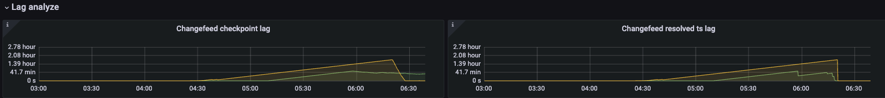
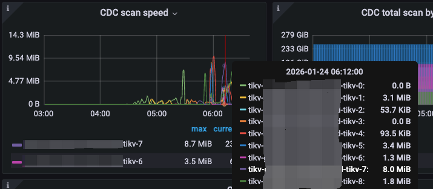
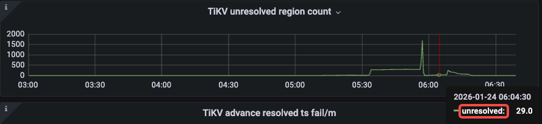
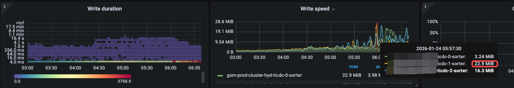
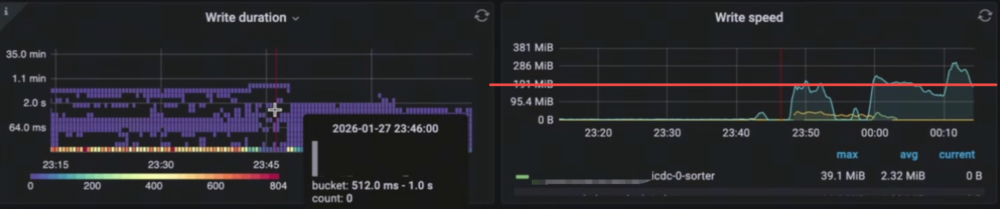
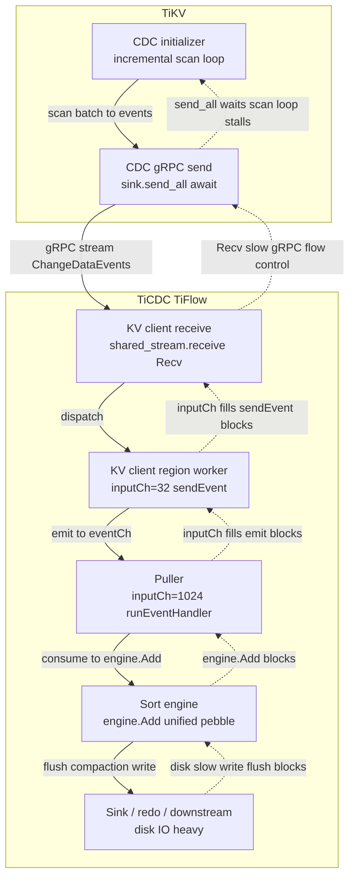

## 1. 问题现象

`resolved-ts` 可以理解为 changefeed 从 TiKV 到 TiCDC 的“全局水位线”（watermark）, 如果无法及时推进，会影响 Changefeed Checkpoint 以及下游消费进度。

- changefeed/table 的 `resolved-ts` 本质上取所有同步表 region 的 resolve-ts **最小值**
- 当某些 Region 长时间处于 **未完成 CDC 初始化**（TiKV incremental scan / initial scan 未完成）时，TiCDC 侧不会推进这些 Region 的 resolved-ts
- 最慢 Region 的 resolved-ts 不动 → 全局 resolved-ts 不动 → `resolved ts lag` 随时间持续增加
- `resolved ts lag` 作为 `checkpoint ts lag` 的下限，也会导致 checkpoint ts lag 一直增加。

业务侧常见影响是：下游（MQ / MySQL / 其它 sink）消费延迟扩大，触发 SLA 告警。

## 2. 快速判定

1. 除观察到 changefeed resolved ts lag 线性增长外，同时增量扫的速度非常慢。

2. 可能会出现 unresolve region count 长时间无法归 0。

3. 磁盘的 write speed 在明显积压（resolved-ts lag） 的情况下，本应该有非常高的吞吐，实际写入吞吐非常慢， 如图 write speed < 50MB/s。

4. 参考经验，在 TiCDC 侧无明显瓶颈，TiKV 数量足够多时，所有 TiKV 加载一起的增量扫吞吐可以达到 200GB/s，与此相比，这明显是一个非常低的写入吞吐。

## 3. 快速修复

如果不替换性能比较好的磁盘，无法缓解。

## 4. 完全解决

- 将 TiCDC 的数据盘调整为高性能磁盘（更高 IOPS、更低延迟，例如本地 NVMe/高性能 SSD）
- 可参考官方建议：[500 GB+ SSD](https://docs.pingcap.com/tidb/stable/deploy-ticdc/#software-and-hardware-recommendations) 
- 替换高性能磁盘后，可观察到 write speed 会达到 200MB/s

## 6. 根因链路

### 6.1 根因结论

**TiCDC 的 `Unified Sorter` 组件需要大量落盘, 当 TiCDC 磁盘性能不足时，落盘变慢引发 TiCDC 流控导致 TiKV 增量扫描发送变慢，增量扫描无法及时完成，进而引发 resolved-ts lag 异常升高。**

### 6.2 原理与链路细节

具体链路如下：
1. sorter 变慢会让 [`engine.Add(...)`](https://github.com/pingcap/tiflow/blob/2f2e42bebf8357b34cbe9627a3ecd8e1d5420095/cdc/processor/sourcemanager/manager.go#L142-L153) 等处理链路阻塞，puller 消费速度下降；
2. 上游 kv client / region worker 的 [channel(`regionWorkerInputChanSize`)](https://github.com/pingcap/tiflow/blob/2f2e42bebf8357b34cbe9627a3ecd8e1d5420095/cdc/kv/shared_region_worker.go#L35) 填满后开始阻塞，gRPC Recv 速度下降；
3. gRPC 流控/回压传回 TiKV，导致 TiKV 在发送 scan events 时阻塞[`send_all(...).await`](https://github.com/tikv/tikv/blob/ee657ca4ce6c39ffe909c7a89d67bd37506c4708/components/cdc/src/initializer.rs#L522-L524) 等待；
4. incremental scan 无法及时完成，[`INITIALIZED`](https://github.com/tikv/tikv/blob/ee657ca4ce6c39ffe909c7a89d67bd37506c4708/components/cdc/src/delegate.rs#L812-L816) 事件迟迟无法被 TiCDC 接收/处理；
5. Region 仍被视为“未初始化” → TiCDC 不推进该 Region resolved-ts → 全局 watermark 被最慢 Region 钉住 → resolved-ts lag 线性上涨。
6. 可视化链路

