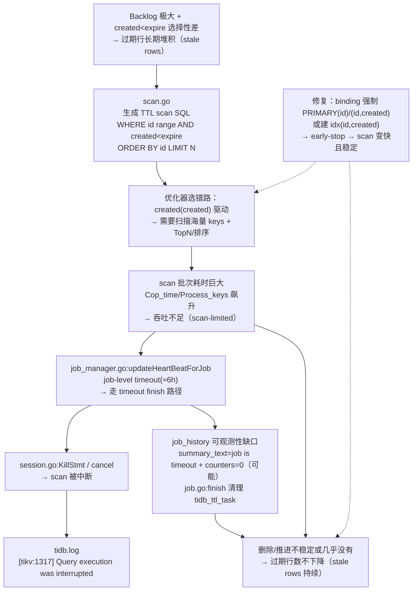

## 1. 问题现象

两张大表（十亿级行数）启用 TTL（例如 `TTL=created + INTERVAL 6 MONTH`，`TTL_JOB_INTERVAL='1h'`），但过期阈值之前的历史行仍然大量存在无法清除。
业务侧发现 stale rows/backlog 明显；mysql.tidb_ttl_job_history 多次出现 scan_task_err="job is timeout" 且 summary 全零。


```
SELECT * FROM mysql.tidb_ttl_job_history ORDER BY create_time DESC limit 10;
+----------------------------------+----------+-----------------+----------------------+---------------------+----------------+---------------------+---------------------+---------------------+------------------------------------------------------------------------------------------------------------------------------------------------------+--------------+--------------+-------------------+----------+
| job_id                           | table_id | parent_table_id | table_schema         | table_name          | partition_name | create_time         | finish_time         | ttl_expire          | summary_text                                                                                                                                         | expired_rows | deleted_rows | error_delete_rows | status   |
|----------------------------------+----------+-----------------+----------------------+---------------------+----------------+---------------------+---------------------+---------------------+------------------------------------------------------------------------------------------------------------------------------------------------------+--------------+--------------+-------------------+----------|
| d2005175e1b54407a8ee70fcde41be45 | 6116     | 6116            | xxx_app_side_schema | xxx_app_side_table_1 | <null>         | 2026-01-21 11:14:01 | 1970-01-01 00:00:01 | 2025-07-21 11:14:01 | <null>                                                                                                                                               | <null>       | <null>       | <null>            | running  |
| 63f2a87fded04d50b78bad9fd57bb168 | 6115     | 6115            | xxx_app_side_schema | xxx_app_side_table_2 | <null>         | 2026-01-21 08:08:20 | 1970-01-01 00:00:01 | 2025-07-21 08:08:20 | <null>                                                                                                                                               | <null>       | <null>       | <null>            | running  |
| cee2b60eb96c428fb9034700c46276f8 | 6116     | 6116            | xxx_app_side_schema | xxx_app_side_table_1 | <null>         | 2026-01-21 05:13:50 | 2026-01-21 11:14:00 | 2025-07-21 05:13:50 | {"total_rows":0,"success_rows":0,"error_rows":0,"total_scan_task":0,"scheduled_scan_task":0,"finished_scan_task":0,"scan_task_err":"job is timeout"} | 0            | 0            | 0                 | finished |
| 8132ea98904a4ef8bf1f3c4570d2edba | 6115     | 6115            | xxx_app_side_schema | xxx_app_side_table_2 | <null>         | 2026-01-21 02:08:09 | 2026-01-21 08:08:10 | 2025-07-21 02:08:09 | {"total_rows":0,"success_rows":0,"error_rows":0,"total_scan_task":0,"scheduled_scan_task":0,"finished_scan_task":0,"scan_task_err":"job is timeout"} | 0            | 0            | 0                 | finished |
| 6b1387ea574b4508a4823c0384e35259 | 6116     | 6116            | xxx_app_side_schema | xxx_app_side_table_1 | <null>         | 2026-01-20 23:13:30 | 2026-01-21 05:13:40 | 2025-07-20 23:13:30 | {"total_rows":0,"success_rows":0,"error_rows":0,"total_scan_task":0,"scheduled_scan_task":0,"finished_scan_task":0,"scan_task_err":"job is timeout"} | 0            | 0            | 0                 | finished |
| 6f8a56df49244a2cbe716eaf82c5691b | 6115     | 6115            | xxx_app_side_schema | xxx_app_side_table_2 | <null>         | 2026-01-20 20:07:52 | 2026-01-21 02:07:59 | 2025-07-20 20:07:52 | {"total_rows":0,"success_rows":0,"error_rows":0,"total_scan_task":0,"scheduled_scan_task":0,"finished_scan_task":0,"scan_task_err":"job is timeout"} | 0            | 0            | 0                 | finished |
| 55ec676bc2444e4eb77ca8430c3243db | 6116     | 6116            | xxx_app_side_schema | xxx_app_side_table_1 | <null>         | 2026-01-20 17:13:20 | 2026-01-20 23:13:20 | 2025-07-20 17:13:20 | {"total_rows":0,"success_rows":0,"error_rows":0,"total_scan_task":0,"scheduled_scan_task":0,"finished_scan_task":0,"scan_task_err":"job is timeout"} | 0            | 0            | 0                 | finished |
| 2515e4a04a0047879f1637cd63f90be3 | 6115     | 6115            | xxx_app_side_schema | xxx_app_side_table_2 | <null>         | 2026-01-20 14:07:41 | 2026-01-20 20:07:50 | 2025-07-20 14:07:41 | {"total_rows":0,"success_rows":0,"error_rows":0,"total_scan_task":0,"scheduled_scan_task":0,"finished_scan_task":0,"scan_task_err":"job is timeout"} | 0            | 0            | 0                 | finished |
| 5f4095e022b745d0ae3d3a69c16d7135 | 6116     | 6116            | xxx_app_side_schema | xxx_app_side_table_1 | <null>         | 2026-01-20 11:13:09 | 2026-01-20 17:13:10 | 2025-07-20 11:13:09 | {"total_rows":0,"success_rows":0,"error_rows":0,"total_scan_task":0,"scheduled_scan_task":0,"finished_scan_task":0,"scan_task_err":"job is timeout"} | 0            | 0            | 0                 | finished |
| a3a78208378e4d9b84020fd541026dfa | 6115     | 6115            | xxx_app_side_schema | xxx_app_side_table_2 | <null>         | 2026-01-20 08:07:30 | 2026-01-20 14:07:40 | 2025-07-20 08:07:30 | {"total_rows":0,"success_rows":0,"error_rows":0,"total_scan_task":0,"scheduled_scan_task":0,"finished_scan_task":0,"scan_task_err":"job is timeout"} | 0            | 0            | 0                 | finished |
+----------------------------------+----------+-----------------+---------------------+---------------------+----------------+---------------------+---------------------+---------------------+------------------------------------------------------------------------------------------------------------------------------------------------------+--------------+--------------+-------------------+----------+

```

排查经常从系统表开始：

```sql
SELECT *
FROM mysql.tidb_ttl_job_history
ORDER BY create_time DESC
LIMIT 10;
```

并长期看到类似 summary（看上去像“完全没删”）：

```json
{"total_rows":0,"success_rows":0,"error_rows":0,"total_scan_task":0,"scheduled_scan_task":0,"finished_scan_task":0,"scan_task_err":"job is timeout"}
```

与此同时，你可能还会在证据面看到这些信号（不是每个都必须同时出现）：

- **slow log / stmt summary** 出现 `Is_internal=true` 的 TTL scan SQL，但非常慢，且 `Index_names` 经常是 `created(created)`；
- TiDB 日志出现 scan 被中断（常见于被 cancel/kill 的路径）：

  ```text
  execute query for ttl scan task failed ... [tikv:1317] Query execution was interrupted
  ```

## 2. 快速判定


1. **结果证据（最可靠）**：用明确 cutoff 定期 `COUNT(*)`，确认过期行数是否在下降（或至少不再增长）。

   ```sql
   SELECT COUNT(*) AS expired_rows
   FROM db.t
   WHERE created < NOW() - INTERVAL 6 MONTH;
   ```

2. **先排除“没在跑”**（开关/时间窗/表级开关）：
   - `SELECT @@tidb_ttl_job_enable;`
   - `SHOW VARIABLES LIKE 'tidb_ttl_job_schedule_window%';`
   - `SHOW CREATE TABLE db.t;`（确认 `TTL_ENABLE='ON'`、`TTL_JOB_INTERVAL` 符合预期）

3. **看运行态，而不是只看历史**（强烈建议在 job 运行时抓一次）：

   - 表级 current/last job：

     ```sql
     SELECT table_schema, table_name,
            current_job_id, current_job_owner_id, current_job_owner_hb_time,
            last_job_id, last_job_finish_time, last_job_summary_text
     FROM mysql.tidb_ttl_table_status
     WHERE table_schema='db' AND table_name='t';
     ```

   - task 级别状态（`job_history` 超时后会清理 `mysql.tidb_ttl_task`，因此**必须趁运行中抓**）：

     ```sql
     SELECT job_id, scan_id, status, owner_id, owner_hb_time, state
     FROM mysql.tidb_ttl_task
     WHERE job_id = '<current_job_id>'
     ORDER BY scan_id;
     ```

4. **外部证据**（更贴近真实吞吐）：慢日志/statement summary 的 TTL scan/delete（`Is_internal=true`）+ Grafana TTL 指标（例如 “delete rows per hour”）。
   - 如果你依赖 statement summary，需要开启内部 SQL：`SET GLOBAL tidb_stmt_summary_internal_query = ON;`

5. **关键对比：执行计划是否“走错路”**  
   取一条真实 TTL scan SQL（从 slow log/stmt summary 抓），做 `EXPLAIN ANALYZE` 对比默认计划 vs `PRIMARY(id)` 驱动（或 `(id, created)`）：
   - 默认计划若走 `created(created)` 且 `total_process_keys` 极大、耗时很长，基本就是瓶颈来源；
   - 若 `PRIMARY(id)` 或 `(id, created)` 能把耗时/扫描 keys 数降低一个数量级以上，就可以把“scan 计划选错”定位为主因。

6. **理解 `job_history` 全零的含义（v8.5.1 常见坑）**  
   在 job timeout 的路径里，`summary_text` 可能只写入 `scan_task_err="job is timeout"`，并把计数保持为 0；这是一种**可观测性缺口**，不等价于“0 行被扫/被删”。同时，job finish 会清理 `mysql.tidb_ttl_task`，导致事后更难取证。

## 3. 快速修复

在不改表结构的前提下，最快把 TTL 从“尖峰 + 低谷”拉回“可预测清理速率”的做法通常是：

1. **用 Global Plan Binding 强制 TTL scan 走 `PRIMARY(id)`**（见下节）。
2. 先保持相对保守的吞吐（先稳，再逐步上调），例如从 `tidb_ttl_delete_rate_limit`、`tidb_ttl_delete_batch_size` 入手，并联动观察业务延迟、CDC/下游延迟、TiKV/PD 资源。

如果你允许做一次“对这个 SQL 形态更友好”的结构性优化，通常推荐增加覆盖索引并把 binding 指到它：

```sql
ALTER TABLE db.t ADD INDEX idx_id_created (id, created);
```

原因：TTL scan SQL 既需要 `ORDER BY id`，又需要 `created < expire` 过滤；`(id, created)` 往往能做到**按 id 顺序扫 + 无需回表评估 created + 更容易 early-stop**。

## 4. 完全解决

1. **让 scan 计划长期稳定**：持续确认 TTL 内部 scan 命中 binding（或 slow log/执行计划证据）。目标是：scan 不再“长尾到撞超时”。
2. **按瓶颈调参**：在 scan 已经足够快的前提下，再逐步调：
   - `tidb_ttl_scan_worker_count` / `tidb_ttl_scan_batch_size`
   - `tidb_ttl_delete_worker_count` / `tidb_ttl_delete_batch_size` / `tidb_ttl_delete_rate_limit`
   - `tidb_ttl_running_tasks`（建议从默认/自动收敛到可控上限）
3. **补齐观测闭环**：不要只盯 `job_history.deleted_rows`；优先用：
   - （a）过期行 `COUNT(*)` 的下降趋势；
   - （b）TTL 指标/slow log 的吞吐与耗时变化；
   - （c）`table_status` / `task.state` 在 job 运行态的进度与错误分布。

## 5. 根因链路

### 5.1 根因结论

需要先明确一件事：**TTL 不保证“到点即删”，存在 backlog 是符合语义的**；但如果 backlog 长期不下降（甚至线性增加），通常意味着 TTL pipeline 没有形成稳定吞吐，或者一直在超时/被取消。


**TTL job 反复出现 `job is timeout`（job-level timeout 约 6 小时），背后的直接原因是：TTL scan 计划被选成 `created(created)` 二级索引驱动，在 backlog 极大且 `created < expire` 选择性很差时，`ORDER BY id LIMIT 500` 退化成海量 keys 扫描（+ TopN/排序），导致 scan 过慢 → job 超时/被取消 → TiDB kill in-flight scan → job_history 走 timeout 汇总路径而“全零”。**

### 5.2 原理与链路细节

这类问题之所以“看起来像 TTL 没工作”，本质是**执行面吞吐不足 + 可观测性误读**叠加。

1. TTL 的端到端链路（极简版）：
   - leader 通过 timer 触发，为每个 physical table 创建一个 job；
   - job 会切成多个 scan task（常见切分数是 64），写入 `mysql.tidb_ttl_task`；
   - 各 TiDB 实例的 TTL TaskManager 抢 task，scan worker 用内部 SQL 找到过期行的 handle，再交给 delete worker 执行删除；
   - 运行态进度主要落在 `mysql.tidb_ttl_task.state(JSON)`，最终汇总落在 `mysql.tidb_ttl_job_history.summary_text`。

2. TTL 内部 scan SQL（形态简化）同时包含 `created < expire` 与 `ORDER BY id LIMIT 500`：

   ```sql
   SELECT LOW_PRIORITY SQL_NO_CACHE id
   FROM t
   WHERE id > ? AND id < ?
     AND created < FROM_UNIXTIME(?)
   ORDER BY id
   LIMIT 500;
   ```

3. 当优化器选择 `created(created)` 驱动：
   - 先扫描巨大 `created < expire` 范围，再满足 `ORDER BY id LIMIT 500`（可能出现 `TopN`/排序）。
   - scan 退化为“海量 keys 扫描”，吞吐转为 scan-limited。
4. scan 过慢时，会触发两类“超时/中断”信号：
   - **job-level timeout**：一次 job 运行超过阈值（≈6h）会被强制 finish；
   - **statement 被 cancel/kill**：job timeout/cancel 时，TiDB 会 kill 仍在跑的 scan statement，常见日志为 `[tikv:1317] Query execution was interrupted`。
5. timeout 路径的可观测性缺口：
   - `job_history.summary_text` 可能只记录 `scan_task_err="job is timeout"` 且计数为 0（不是 0 delete 的证明）；
   - job finish 会清理 `mysql.tidb_ttl_task`，因此“部分进度/错误分布”要在运行态抓。

### 5.3 可视化链路



## 附：Global Plan Binding（强制 PRIMARY）

如果 `EXPLAIN ANALYZE` 已证明 `FORCE INDEX(PRIMARY)` 显著更快，可用 binding 让 TTL 内部 SQL 稳定命中：

```sql
CREATE GLOBAL BINDING FOR
  SELECT LOW_PRIORITY SQL_NO_CACHE `id`
  FROM `db`.`t`
  WHERE `id` > ? AND `id` < ?
    AND `created` < FROM_UNIXTIME(?)
  ORDER BY `id` LIMIT ?
USING
  SELECT LOW_PRIORITY SQL_NO_CACHE `id`
  FROM `db`.`t` FORCE INDEX (`PRIMARY`)
  WHERE `id` > ? AND `id` < ?
    AND `created` < FROM_UNIXTIME(?)
  ORDER BY `id` LIMIT ?;
```

验证（任选）：

- `SHOW GLOBAL BINDINGS;` 确认 enabled
- 执行一次原 SQL 后 `SELECT @@LAST_PLAN_FROM_BINDING;` 返回 `1`

## 附：事件全过程（timeline，脱敏）

> 这部分来自一次真实 case 的过程记录（已脱敏），目的不是复刻具体参数，而是复用“证据→假设→验证→修复→复盘”的路径。

- **2026-01-20 ~ 2026-01-21**：业务侧发现 stale rows/backlog 明显；`mysql.tidb_ttl_job_history` 多次出现 `scan_task_err="job is timeout"` 且 summary 全零。
- **同一时间窗**：TiDB 日志里出现 TTL scan task 被中断（`[tikv:1317] Query execution was interrupted`），提示存在 cancel/kill 路径而非“权限/语法错误”。
- **配置侧取证**：确认 TTL 全局开关开启、时间窗覆盖全天，但吞吐参数偏保守（示例：`delete_rate_limit=10`、`scan/delete worker_count=4`、`batch_size=100/500`）。
- **2026-01-22**：从 slow log 抓一条真实 TTL scan SQL，做 `EXPLAIN ANALYZE` 对比默认计划与 id 驱动计划（`PRIMARY(id)`），确认默认计划常走 `created(created)` 且扫描 keys 数量级过大。
- **修复动作**：
  - 先用 Global Plan Binding 强制 scan 走 `PRIMARY(id)`（或 `(id, created)`）让 scan 变快且稳定；
  - 然后再逐步提升吞吐参数（示例：`scan/delete worker_count` 从 4 提到 8，`delete_batch_size` 从 100 到 200，`scan_batch_size` 从 500 到 1020，按需上调 `delete_rate_limit`）。
- **验收口径**：以 cutoff `COUNT(*)` 为主，辅以 TTL 指标与内部 SQL（slow log/stmt summary）确认吞吐与计划稳定性，避免被 `job_history` 的全零 summary 误导。

## 附：运行态抓证据（建议收藏）

1. 快速确认 TTL 相关参数（不用记）：

   ```sql
   SHOW VARIABLES LIKE 'tidb_ttl%';
   ```

2. 运行态抓 task（因为 job finish 会清理 `mysql.tidb_ttl_task`）：

   ```sql
   SELECT table_schema, table_name, current_job_id
   FROM mysql.tidb_ttl_table_status
   WHERE table_schema='db' AND table_name='t';

   SELECT scan_id, status, owner_id, owner_hb_time, state
   FROM mysql.tidb_ttl_task
   WHERE job_id = '<current_job_id>'
   ORDER BY scan_id;
   ```

   3. 别被单一口径误导：
   - `job_history`（最终汇总）适合看“是否反复 timeout / 是否 finish”
   - `task.state(JSON)`（运行态）适合看“有没有在推进、卡在哪里”
   - slow log / TTL 指标适合看“真实吞吐与瓶颈变化”

4. 系统表速查（最常用的 4 张）：
   - `mysql.tidb_ttl_table_status`：每个 *physical table* 一行（分区表会更多），看 current/last job、owner 心跳、summary
   - `mysql.tidb_ttl_task`：运行态 task + `state(JSON)`（job 结束会被清理）
   - `mysql.tidb_ttl_job_history`：每次 job 的最终汇总（注意 timeout path 的全零坑）
   - `mysql.tidb_timers`：TTL 定时调度的持久化（interval/enable/watermark）

5. 常用参数（从“能跑”到“能跑得快”的路径）：
   - 开关/时间窗：`tidb_ttl_job_enable`、`tidb_ttl_job_schedule_window_start_time`、`tidb_ttl_job_schedule_window_end_time`
   - 并行度：`tidb_ttl_scan_worker_count`、`tidb_ttl_delete_worker_count`、`tidb_ttl_running_tasks`
   - 批大小与限流：`tidb_ttl_scan_batch_size`、`tidb_ttl_delete_batch_size`、`tidb_ttl_delete_rate_limit`
   - 内部 SQL 观测：`tidb_stmt_summary_internal_query`（决定内部 SQL 是否进入 statement summary）
