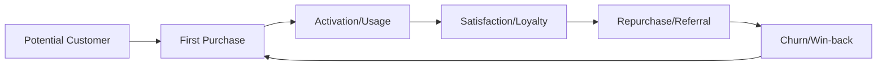
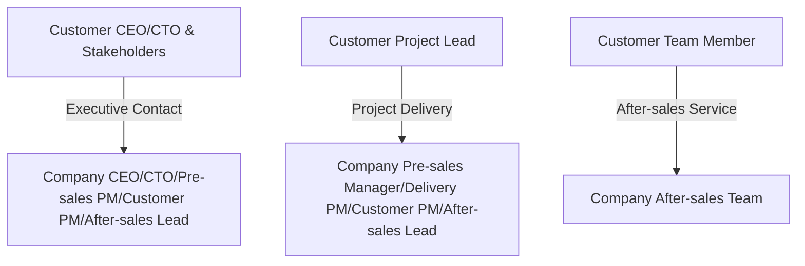
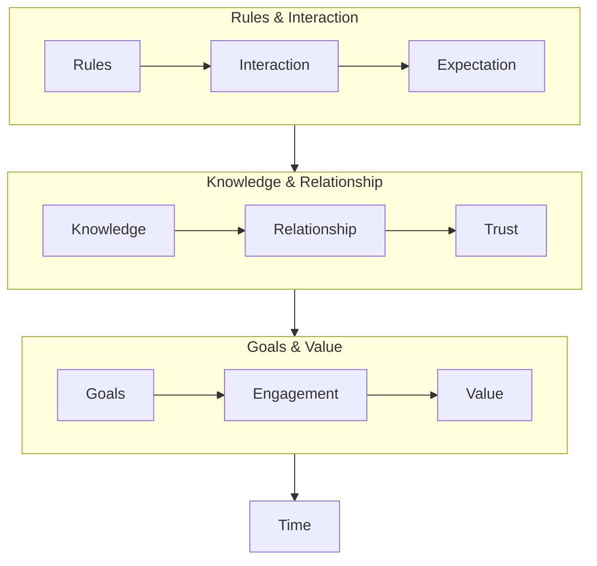

In today's business landscape, customer success is the ultimate weapon for sustainable growth, and the after-sales team is the frontline squad. Drawing from my hands-on experience in B2B after-sales, this article shares practical methods and insights for building a customer success system.

## 1. Customer Success & Support

### What is Customer Success?
Customer success means making sure customers have a smooth experience—only then can a business thrive. The after-sales team is the "frontline unit" in this system, directly facing customers, solving real problems, and safeguarding the customer experience. The goal is to help customers get the most out of your product or service, driving long-term growth. After-sales service is essential, directly impacting satisfaction, repeat business, and company performance.

### Customer Journey
A typical customer lifecycle: Potential Customer → First Purchase → Activation/Usage → Satisfaction/Loyalty → Repurchase/Referral → Churn/Win-back. After-sales covers "Activation/Usage" through "Repurchase/Referral" and "Churn/Win-back"—it's the engine of customer success.



In short: After-sales runs through the entire customer lifecycle and keeps customer success moving forward.

### Team Collaboration
Customer support is the tactical execution of customer success strategy. Teamwork is everything. Pre-sales, delivery, after-sales, and customer managers must work closely together to create a seamless, closed-loop service process—so customers get a great experience from start to finish.


 - Pre-sales: Research customer needs and design solutions.
 - Delivery: Implement and launch the product.
 - After-sales: Provide support and solve problems.
 - Customer managers: Maintain relationships and drive value.

```mermaid
graph TD
A[Support Squad] --> B[After-sales Team (Frontline)]
A --> C[Sales Team (Communication)]
A --> D[Project Management Team (Delivery)]
B --> E[Critical Issues]
B --> F[Urgent Issues]
B --> G[General Issues]
B --> H[Minor Issues]
```

Customer roles matter too. In practice, customers may include CEOs, CTOs, leaders, and team members at different levels. Companies assign the right people to communicate and serve each role, making sure everyone gets the support they need for success.



During support, issues are classified as critical, urgent, general, or minor. Proper classification helps allocate resources and respond efficiently, so key problems get solved first.

All these dimensions and divisions are designed to achieve customer success. Support isn't just about fixing problems—it's about improving experience, loyalty, and business growth.

## 2. Team Positioning

### Who Does After-sales Serve?

The after-sales team is the frontline of customer success, but it's never a solo act. In reality, after-sales works with customer project members, company project managers, pre-sales, and after-sales leads:

 - Customer project members (most important): Efficient, high-satisfaction support for issues during product/service use.
 - Company project manager: The customer's representative inside the company, understands mid-level feedback, and is sometimes a support target.
 - After-sales lead: With limited resources, timely communication helps identify issues and coordinate company resources.

### Key Metrics

The most common metrics for after-sales performance are "support efficiency" and "customer satisfaction." (Other details like issue classification, knowledge base, ticket automation, and regular follow-ups are also important but not covered here.) Support efficiency can be expressed as:


The more knowledge you accumulate, the higher the customer trust, and the faster you respond, the higher your support efficiency.


Each layer and term, simply put:
 - Rules: Agreed standards and boundaries for service, set expectations.
 - Interaction: Communication and collaboration, affects experience and feedback.
 - Expectation: What customers hope to get, the baseline for satisfaction.
 - Knowledge: Accumulated expertise, the foundation for solving problems and improving efficiency.
 - Relationship: Trust and cooperation, helps smooth communication and long-term partnership.
 - Trust: Customer's recognition and reliance, key to ongoing cooperation and satisfaction.
 - Goals: Shared outcomes, like problem-solving and business growth.
 - Engagement: Active involvement from both sides, drives goal achievement.
 - Value: Real benefits customers gain, the ultimate result of support.
 - Time: All layers require time to build and improve.

Summary: Clear rules, smooth communication, and customer expectations; knowledgeable teams, good relationships, and customer trust; shared goals, active engagement, and real value—all need time to accumulate for better after-sales service.

## 3. Practical Experience

To improve support efficiency, focus on these points:

**Principle**: Customers buy solutions, not just products or services—they want problems solved quickly. Always think from the customer's perspective, identify, analyze, and solve problems, earn trust, and keep improving.

### How to Improve Support Efficiency
1. Accurate Problem Identification
   - Why: Understanding the problem is crucial before solving it. Some issues can have a huge impact on the customer.
   - How: Gather background and requirements from the customer's perspective to avoid wasting time due to missing info.
   - Summary: Know the root, solve it fast.
2. Increase Product/Service Knowledge
   - Why: Familiarity with the product/service directly affects speed and accuracy.
   - How: Accumulate knowledge, use experience to judge new problems and find solutions quickly.
   - Summary: Know the product, solve problems efficiently.
3. Skillful & Fast Execution
   - Why: Knowledge tells you what to do, skills determine how fast and well you do it.
   - How: Practice, review, and summarize to make operations smoother and avoid repeated mistakes.
   - Summary: Knowledge sets direction, skills boost speed.
4. Teamwork Matters
   - Why: Some problems are beyond one person's ability; asking colleagues or other teams is faster.
   - How: Build cross-team communication habits, ask for help when needed, and report to key people to avoid wasted effort.
   - Summary: One person is limited, teamwork solves problems faster.

### How to Improve Customer Satisfaction
The key is understanding customers, earning trust, and using data to keep improving.

1. Qualitative improvement
   - Knowledge: Deepen mutual understanding through communication—help customers understand your product/service, and learn about their business and needs. Both sides benefit.
   - Trust: Trust is built over time.
2. Quantitative improvement
   - Usually, customers contact support via ticketing systems, and each ticket ends with a satisfaction survey.
   - Two metrics: response rate and satisfaction.
      - To improve response rate, use automated feedback and remind customers to participate.
      - To improve satisfaction, use the methods above to deliver better service.


## 4. References

1. [The Customer Success Economy](https://www.oreilly.com/library/view/the-customer-success/9781119572763/cover.xhtml)

