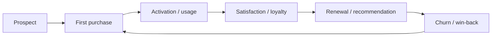
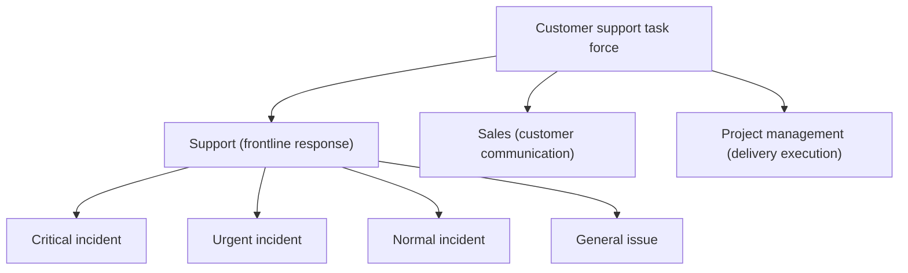
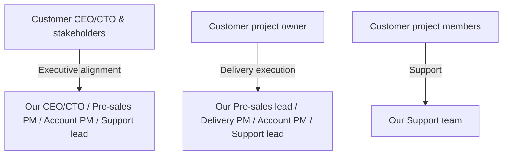
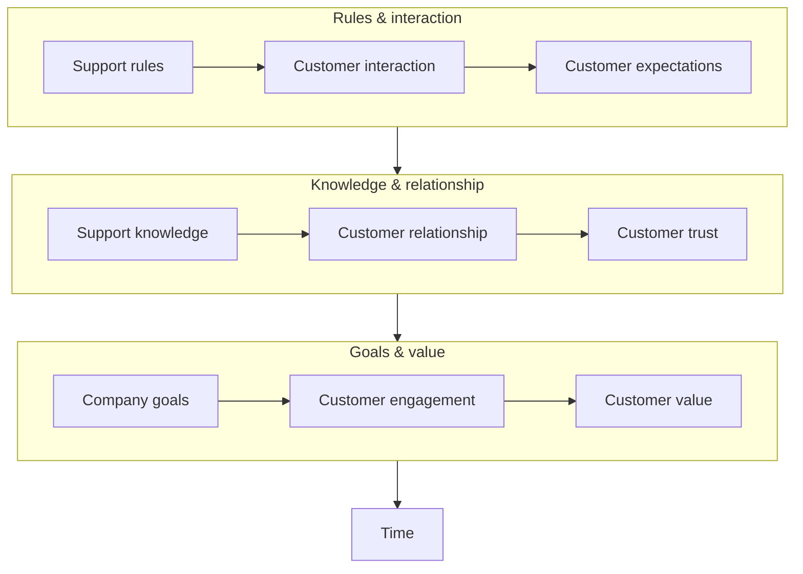

In B2B delivery, Customer Success is the long-term “growth engine”, while Support is the frontline unit that handles real incidents and protects the customer experience. This post summarizes practical support methods within a Customer Success system, based on my on-the-job experience.

## 1. Customer Success vs Customer Support

### Customer Success

Customer Success exists so customers can adopt the product smoothly and keep getting value—only then can the business grow sustainably. Support is the “frontline force” inside the CS system: directly facing the customer, solving issues, and defending the experience.

The goal of Customer Success is to help customers make good use of the product or service. Support is a critical part of that system and directly affects satisfaction, renewal, and outcomes.

### Customer journey

The customer lifecycle often looks like:

Prospect → First purchase → Activation/usage → Satisfaction/loyalty → Renewal/recommendation → Churn/win-back

Support runs through the stages from “activation/usage” to “renewal/recommendation” (and even “churn/win-back”), making it a core driver of customer success.

One sentence: Support spans the full lifecycle and is sustained momentum for customer success.

### Team collaboration

Customer Support is the concrete “tactics layer” under the Customer Success strategy, so cross-team collaboration matters. Pre-sales, delivery, support, and account teams should work as a closed loop to ensure a consistent experience from pre-sales to post-sales.

- Pre-sales: requirements discovery and solution design
- Delivery: implementation and go-live
- Support: issue triage and resolution
- Account/CSM: relationship management and value expansion

Customer hierarchy also matters in practice: a single account may include CEO/CTO, leads, and individual contributors. Different roles require different escalation levels and communication approaches.

Issue classification (critical/urgent/normal/general) helps allocate resources and respond efficiently, ensuring critical issues are handled first.

## 2. Support team positioning

### Who Support serves

Support is the “frontline” in a Customer Success system, but it’s not a solo role. In practice, Support collaborates with customer project members, internal PMs, pre-sales, and support leadership.

- Customer project members (**most important**): help customers solve issues efficiently while they use the product/service
- Internal PM: often the internal representative of customer feedback; sometimes also a key “service recipient” of Support
- Support lead: resources are always limited; communicating early helps incident recognition and company-wide scheduling

### Key metrics

Two common measures are “support efficiency” and “customer satisfaction”. Details like tiered response, knowledge base building, automation, and periodic business reviews are important but out of scope here.

Support efficiency can be expressed as:

$$
\text{Support Efficiency} = \frac{\text{Knowledge Accumulation} \times \text{Trust}}{\text{Response Time}}
$$

The more knowledge you have, the higher the trust you earn, and the faster you respond—then support efficiency goes up.

You can also understand post-sales maturity as layers:

In short:

- Rules: shared standards, clear expectations
- Interaction: frequent communication and fast feedback loops
- Expectations: what the customer wants to achieve
- Knowledge: solve issues faster with deeper understanding
- Relationship: smoother collaboration and longer-term partnership
- Trust: the customer believes you are reliable
- Goals: align on outcomes and “getting value”
- Engagement: both sides invest to move things forward
- Value: the customer feels the service is worth it
- Time: none of this happens overnight

## 3. Practical support playbook

**Core principle:** customers are buying an end-to-end solution, not a product feature. They want issues resolved fast. Think from the perspective of the person you serve, diagnose the real problem, solve it, earn trust, and continuously improve.

Using the same formula:

$$
\text{Support Efficiency} = \frac{\text{Knowledge Accumulation} \times \text{Trust}}{\text{Response Time}}
$$

### How to improve support efficiency

In practice, efficiency comes from understanding the problem, applying knowledge and skills, and leveraging the team—ultimately by reducing **time to resolution** (the denominator).

1. **Accurately identify the problem**
   - Why it matters: understand the problem before solving it; some issues have outsized impact
   - How: collect context and requirements from the customer’s perspective; avoid wasting time due to missing information
   - Takeaway: know the ground truth before acting

2. **Improve product/service understanding**
   - Why it matters: familiarity directly impacts speed and accuracy
   - How: build knowledge continuously; combine experience and data to reach a workable plan faster
   - Takeaway: better understanding → faster analysis

3. **Build skills, not just knowledge**
   - Why it matters: knowledge tells you what to do; skill determines how fast and how well you execute
   - How: practice, summarize, and retrospect; reduce repeated mistakes
   - Takeaway: knowledge sets direction; skills increase speed

4. **Leverage the team**
   - Why it matters: some issues exceed individual boundaries; collaboration resolves faster
   - How: build cross-team communication habits; escalate quickly when needed; keep key owners in the loop
   - Takeaway: individuals are limited; teams scale

### How to improve customer satisfaction

Satisfaction improves when you understand customers better, earn trust, and continuously improve with feedback loops.

1. **Qualitative improvements**
   - Knowledge: help customers better understand the product/service, and deepen your own understanding of their business context; both reinforce each other and improve communication efficiency
   - Trust: trust is a long-term process—small consistent wins matter more than big promises

2. **Quantitative improvements**
   - Most teams use a ticketing system; after a ticket is closed, a satisfaction survey is sent
   - Two key metrics: response rate and satisfaction score
     - Improve response rate: besides automation, remind the customer when appropriate (many customers miss the survey)
     - Improve satisfaction: depends on the methods above (clear diagnosis, fast resolution, good communication, and expectation management)

## 4. References

1. [The Customer Success Economy](https://book.douban.com/subject/36021637/)
