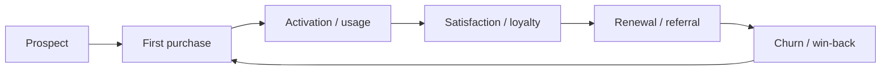
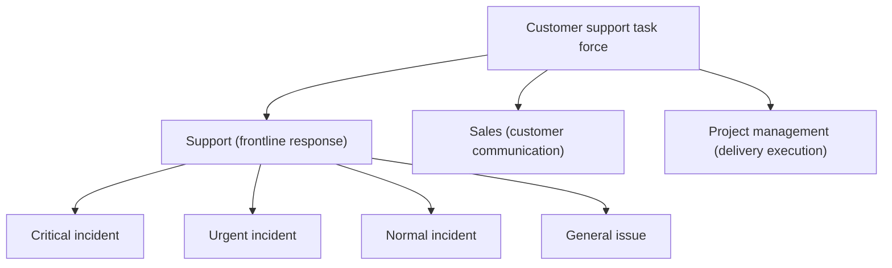
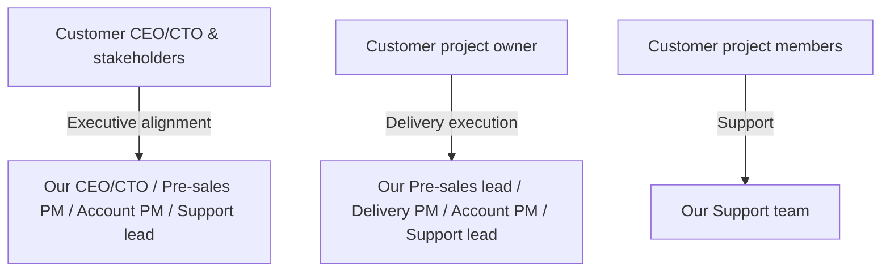
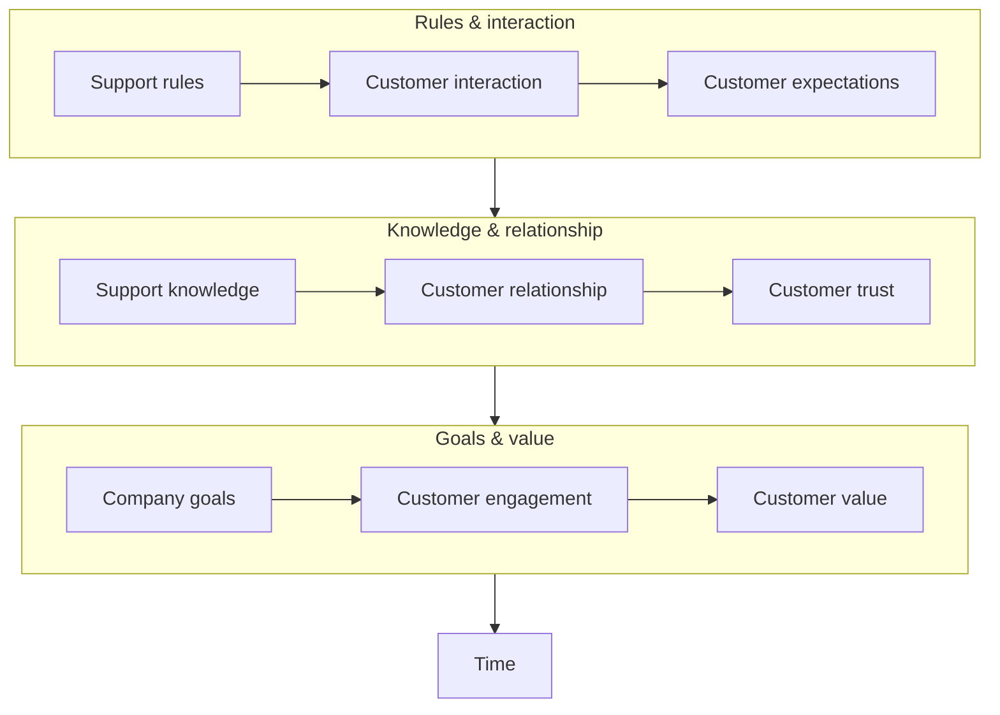

## 1. Customer Success and Customer Support

### Customer Success

Customer Success exists so customers can adopt the product smoothly and keep getting value—only then can a business grow sustainably. Support is the “frontline force” within the Customer Success system: facing customers directly, resolving real problems, and protecting the customer experience.

The goal of Customer Success is to help customers get value from the product or service. Support is an indispensable part of that system and directly affects satisfaction, renewals, and overall business outcomes.

### Customer journey

The customer lifecycle often looks like:

Prospect → First purchase → Activation/usage → Satisfaction/loyalty → Renewal/referral → Churn/win-back

Support runs through the stages from “activation/usage” to “renewal/referral”, and even “churn/win-back”. It is a core driver that sustains customer success over time.

In short: Support spans the full customer lifecycle and provides sustained momentum for Customer Success.

### Team collaboration

Customer Support is the tactical execution under a Customer Success strategy, so cross-team collaboration matters. Pre-sales, delivery, support, and account teams should work as a closed loop to ensure a consistent experience from pre-sales to post-sales.

- Pre-sales: requirements discovery and solution design
- Delivery: implementation and go-live
- Support: issue triage and resolution
- Account/CSM: relationship management and value expansion

Customer hierarchy also matters in practice: a single account may include CEO/CTO, leads, and individual contributors. Different roles require different escalation levels and communication approaches.

Issue classification (critical/urgent/normal/general) helps allocate resources and respond efficiently, ensuring critical issues are handled first.

Different dimensions and divisions of labor exist to better achieve Customer Success. Support doesn’t just “fix problems”—it improves the experience, strengthens loyalty, and helps the business grow.

## 2. Support team positioning

### Who Support serves

Support is the “frontline” in a Customer Success system, but it’s not a solo role. In practice, Support collaborates with customer project members, internal project managers, pre-sales, and support leadership.

- Customer project members (**most important**): support customers efficiently and help them resolve issues that arise while using the product/service
- Internal project manager: the customer’s “internal representative” who understands mid-level feedback; sometimes also a key stakeholder Support serves
- Support lead: resources are always limited; early communication helps triage, incident recognition, and company-wide resourcing

### Key metrics

Two common measures are “support efficiency” and “customer satisfaction”. Details like severity-based response, knowledge base building, ticketing automation, and periodic customer check-ins matter, but are out of scope here.

Support efficiency can be expressed as:

$$
\text{Support Efficiency} = \frac{\text{Knowledge Accumulation} \times \text{Trust}}{\text{Response Time}}
$$

The more knowledge you have, the higher the trust you earn, and the faster you respond—then support efficiency goes up.

You can also understand post-sales maturity as layers:

In short:

- Rules: shared standards, clear expectations
- Interaction: frequent communication and fast feedback loops
- Expectations: what the customer wants to achieve
- Knowledge: solve issues faster with deeper understanding
- Relationship: smoother collaboration and longer-term partnership
- Trust: the customer believes you are reliable
- Goals: align on outcomes and “getting value”
- Engagement: both sides invest to move things forward
- Value: the customer feels the service is worth it
- Time: none of this happens overnight

In short: set clear rules, communicate well, and align expectations; build knowledge, relationships, and trust; align goals, drive engagement, and create value—over time, this is how post-sales support gets better.

## 3. Practical post-sales practices

**Core principle:** customers are buying a solution—not just a product or a service. What they need most is problems solved quickly. Think from the perspective of the people you serve: identify the real problem, resolve it, earn trust, and keep improving.

Using the same formula:

$$
\text{Support Efficiency} = \frac{\text{Knowledge Accumulation} \times \text{Trust}}{\text{Response Time}}
$$

### How to improve support efficiency

In practice, efficiency comes from understanding the problem, applying knowledge and skills, and leveraging the team—ultimately by shortening **time to resolution**.

1. **Accurately identify the problem**
   - Why it matters: understand the problem before solving it; some issues have outsized impact
   - How: collect context and requirements from the customer’s perspective; avoid wasting time due to missing information
   - Takeaway: get to the ground truth first

2. **Improve product/service understanding**
   - Why it matters: familiarity directly impacts speed and accuracy
   - How: build knowledge continuously; combine experience and data to reach a workable plan faster
   - Takeaway: know the product → analyze faster

3. **Build skills, not just knowledge**
   - Why it matters: knowledge tells you what to do; skill determines how fast and how well you execute
   - How: practice, summarize, and reflect; reduce repeated mistakes
   - Takeaway: knowledge gives direction; skills bring speed

4. **Leverage the team**
   - Why it matters: some issues exceed individual boundaries; collaboration resolves faster
   - How: build cross-team communication habits; consult quickly when needed; keep key owners in the loop
   - Takeaway: individuals are limited; teams are scalable

### How to improve customer satisfaction

Satisfaction improves when you understand customers better, earn trust, and continuously improve with data and feedback loops.

1. **Qualitative improvements**
   - Knowledge: help customers better understand the product/service, and deepen your understanding of their business, roles, constraints, and communication styles; the two reinforce each other and improve communication efficiency
   - Trust: trust is a long-term process—small consistent wins matter more than big promises

2. **Quantitative improvements**
   - Most teams use a ticketing system; after a ticket is closed, a satisfaction survey is sent
   - Two key metrics: response rate and satisfaction score
     - Improve response rate: besides automation, remind the customer when appropriate (many customers miss the survey)
     - Improve satisfaction: depends on the methods above (clear diagnosis, fast resolution, good communication, and expectation management)

## 4. References

1. [The Customer Success Economy](https://book.douban.com/subject/36021637/)
