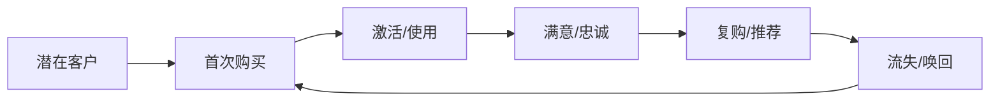
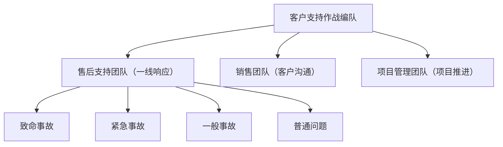
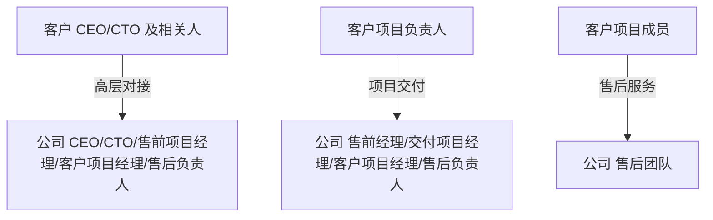
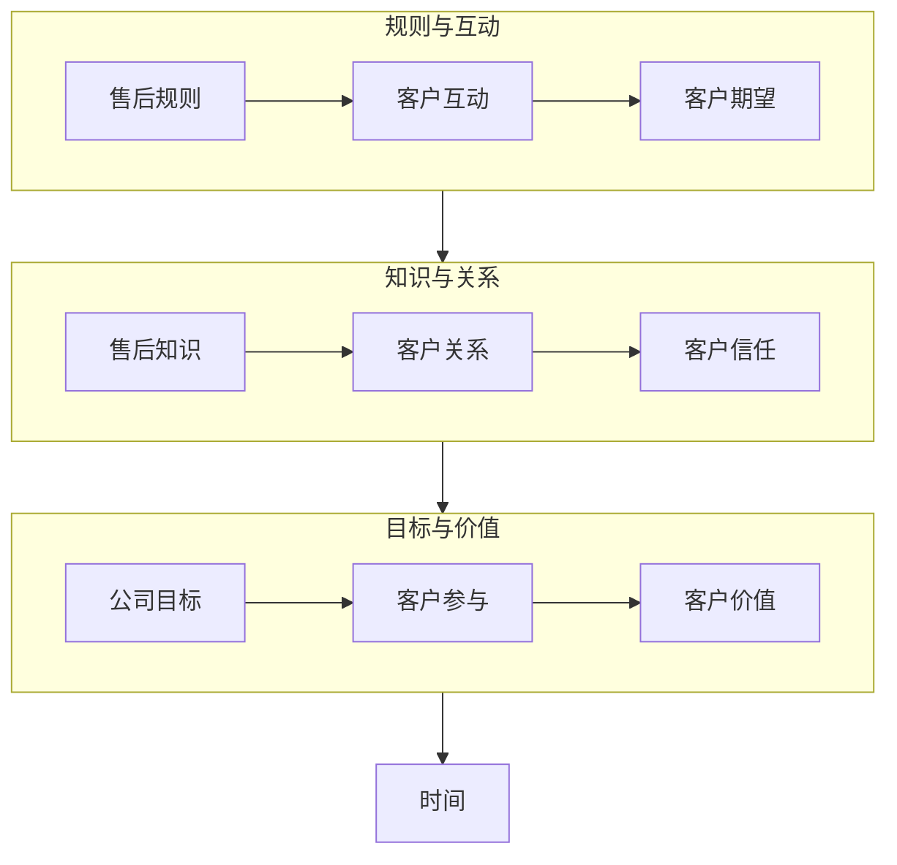

在企业经营的“战场”上，客户成功是企业的制胜武器，售后团队则是冲在前线的作战编队。本文结合我在 B2B 售后领域的实际经验，谈谈客户成功体系下的售后方法和心得体会。

## 一、客户成功与客户支持

### 客户成功
客户成功就是让客户用得顺心，企业才能持续发展。售后团队是客户成功体系里的“前线部队”，直接面对客户，解决实际问题，守护客户体验。
客户成功的目标，是帮助客户用好产品或服务，最终实现企业的持续增长。售后服务是这个体系中不可或缺的一环，直接影响客户满意度、复购率和企业业绩。

### 客户旅程

客户生命周期通常包括：潜在客户 → 首次购买 → 激活/使用 → 满意/忠诚 → 复购/推荐 → 流失/唤回。售后服务贯穿“激活/使用”到“复购/推荐”及“流失/召回”各阶段，是推动客户成功的核心动力。

一句话总结：售后贯穿客户全生命周期，是客户成功的持续动力。

### 团队协作

客户支持是客户成功战略下的具体战术，团队协作很重要。售前、交付、售后、客户经理等团队要密切配合，形成闭环服务流程，确保客户从售前到售后都能获得优质体验。

- 售前团队：负责客户需求调研与方案制定。
- 交付团队：负责产品实施与上线。
- 售后团队：负责客户支持与问题解决。
- 客户经理团队：负责客户关系维护与价值提升。

客户层级也很重要。实际工作中，客户可能涵盖 CEO、CTO、Leader、Worker 等不同层级。针对不同角色，企业会安排不同级别的人员或团队来负责沟通和服务，确保每一类客户都能获得合适的支持，实现客户成功。

客户支持过程中，问题可分为致命事故、紧急事故、一般事故、普通问题等。合理分级有助于资源分配和高效响应，确保关键问题优先解决。

不同的维度和分工，都是为了更好地实现客户成功。客户支持不仅解决问题，更提升客户体验，增强客户忠诚度，助力企业成长。

## 二、客户支持团队站位

### 服务对象

售后团队其实是客户成功体系里的“前线”，但不是单打独斗。实际工作中，售后会和客户项目成员、公司项目经理、售前、售后负责人等多方协作。
 - 客户项目成员（**最重要**）：高效，高满意度的支持客户使用 “产品/服务” 过程中产生的问题。
 - 公司项目经理：项目经理作为客户在公司内部的代表，更深知客户的中层反馈，在必要时候也是售后团队的服务对象。
 - 公司售后负责人：资源永远有限，及时与售后负责人沟通问题情况，有利于负责人对问题识别和公司整体资源调度。

### 重要指标

衡量售后团队表现，相对通用的是“支持效率”和“客户满意度”， 分级响应、知识库建设、自动化工单系统、定期客户回访等细节暂时不表。支持效率可以用一个公式来表达：

$$
支持效率 = \frac{知识积累 \times 信任程度}{响应时间}
$$

个人积累的知识越多、客户信任越高，响应速度越快，支持效率就越高。

售后服务的层次递进可以这样理解：

每一层和每个词，简单说就是：

 - 规则：大家约定好怎么做事，服务有标准，客户有预期。
 - 互动：多沟通，客户有问题能及时反馈，团队能快速响应。
 - 期望：客户希望得到什么结果，满意度的起点。
 - 知识：团队懂得越多，遇到问题就能越快解决。
 - 关系：和客户处得好，沟通顺畅，合作更长久。
 - 信任：客户觉得你靠谱，愿意把问题交给你。
 - 目标：大家一起努力，解决问题、让客户用得更好。
 - 参与：客户和团队都积极投入，事情推进得快。
 - 价值：客户觉得服务有用，愿意继续合作。
 - 时间：这些都不是一蹴而就，要靠时间慢慢积累。

一句话总结：规则定好，沟通顺畅，客户有期待；团队有知识，关系好，客户信任你；大家目标一致，积极参与，客户觉得有价值——这些都需要时间沉淀，才能让售后服务越来越好。

## 三、售后实操经验

在实际工作中，提升支持效率主要靠以下几点：

**总体原则**：客户购买的是 解决方案，而不仅仅是产品或服务本身，即：客户需要的是快速解决问题。站在自己服务的对象角度，识别、思考、解决问题，赢得客户信任，并持续迭代精进。

$$
f_e = \frac{knowledge \times trust}{time}
$$

### 如何提高客户支持效率

在实际支持中，我发现 理解问题、运用知识和技能、寻求团队支持 是提升效率的关键，主要体现为缩短 **问题解决时间**， 即： 缩小公式分子。以下是我的一些体会：

1. **精准识别问题**
   - 为什么重要：解决问题之前，先理解问题本身非常重要。一个问题可能对客户造成巨大影响。
   - 怎么做：站在客户角度，收集背景信息和需求，避免因信息不足而浪费时间。
   - 小结：知根知底，方能快速解决。
2. **提升产品/服务认知**
   - 为什么重要：熟悉产品和服务直接影响处理问题的速度和准确度。
   - 怎么做：平时积累知识，遇到新问题时结合经验快速判断，找到可行方案。
   - 小结：熟悉产品，分析问题更高效。
   - 小结：熟悉产品，分析问题更高效。
3. **精于技，速于事**
   - 为什么重要：知识告诉你“做什么”，技能决定“怎么做得快、做好”。
   - 怎么做：通过练习、总结和复盘，让操作更顺手，减少重复错误。
   - 小结：知识明方向，技能提速度。
4. **众人拾柴火焰高**
   - 为什么重要：有些问题超出个人能力边界时，寻求同事或其他团队的帮助更快。
   - 怎么做：建立跨部门沟通习惯，必要时快速请教，反馈给关键负责人，避免重复尝试浪费时间。
   - 小结：个人有限，团队无限，协作让问题快速落地。

### 如何提高客户满意度

提升客户满意度，核心是理解客户、赢得信任，并用数据持续优化。 即：扩大公式分母

1. 定性提高客户满意度

   - knowledge ： 通过与客户沟通过程中加深 “客户对公司产品/服务的理解” 及 “自身对客户业务及客户本身”, 二者是相互促进的，前者有利于服务对象以高效的方式与我们进行沟通，后者有利于我们逐渐了解客户的角色，权利，知识，性格等，亦能高效的沟通方式和技巧完成问题支持。
   - trust ：信任是一个过程，

3. 定量提高客户满意度
   - 普遍来说，客户会通过工单系统与支持团队取得联系，每个工单在完结时都会想客户发送满意度评分。
   - 这里有 2 个指标：反馈率与满意度
       - 参评率的提高，除了系统自动化触发的反馈外，必要时也以提示客户进行反馈，客户可能不会留意到满意度反馈。
       - 满意度的提高，就与之前提到的方式方法息息相关。

## 四、参考与延伸阅读

1. [客户成功经济](https://book.douban.com/subject/36021637/)

