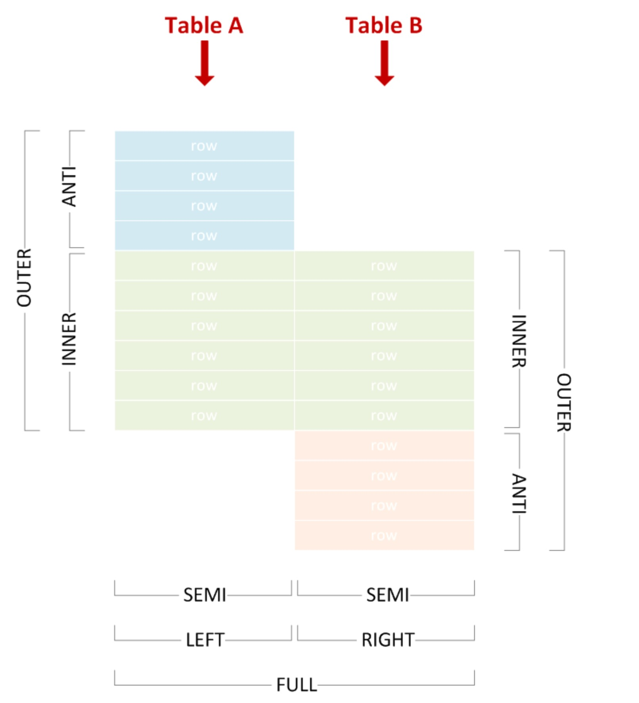

# What's Logical Optimizing in TiDB

## First of all

Actually, every logical rule struct has a method named `optimize()`

## rules of logical

From [here](https://github.com/pingcap/tidb/blob/17fac8bc2883dd287481a60f019beae948191a47/planner/core/optimizer.go#L597), we can see logical optimizing items will be applied one by one.  

```go
var optRuleList = []logicalOptRule{
 &gcSubstituter{},
 &columnPruner{},
 &resultReorder{},
 &buildKeySolver{},
 &decorrelateSolver{},
 &semiJoinRewriter{},
 &aggregationEliminator{},
 &skewDistinctAggRewriter{},
 &projectionEliminator{},
 &maxMinEliminator{},
 &ppdSolver{},
 &outerJoinEliminator{},
 &partitionProcessor{},
 &collectPredicateColumnsPoint{},
 &aggregationPushDownSolver{},
 &pushDownTopNOptimizer{},
 &syncWaitStatsLoadPoint{},
 &joinReOrderSolver{},
 &columnPruner{}, // column pruning again at last, note it will mess up the results of buildKeySolver
}
```

## gcSubstituter

By [mysql reference](https://dev.mysql.com/doc/refman/8.0/en/generated-column-index-optimizations.html) of `Generated Column(in short: gc)`, we can see what the function of gc is. And from [here](https://github.com/pingcap/tidb/blob/17fac8bc2883dd287481a60f019beae948191a47/planner/core/rule_generate_column_substitute.go#L97), you can figure out how tidb implment `gc` in period of logical plan. There are four parts of operands, (Selection, Projection, Sort, Aggregation), will subtitute gc as index.

1. LogicalSelection:  

    LogicalSelection represents a where or having predicate.
    firstly, in generated column function, index wouldn't none. Because of every calculating is based on index expression.
    secondly, when predicate operands are `=`, `>`, `>=`, `<`, `<=`, `like`, `or`, `and`, `not`. TiDB'll deal with it using generated column.  However, when predicate is `in`, there is a limition that all of scalars are the same type.  

2. LogicalProjection:

    LogicalProjection represents a select fields plan and TiDB'll loop every field(selected colums from SQL) and try subsitiuting generated column.  

3. LogicalSort:  

    LogicalSort stands for the order by plan. if there are any `sort` item in a query.

4. LogicalAggregation:

    LogicalAggregation represents an aggregate plan. And all agg functions are [here](https://github.com/pingcap/tidb/blob/17fac8bc2883dd287481a60f019beae948191a47/parser/ast/functions.go#L701). if there any field could be subtitiuted into one genereated colum, it'd be done.

    ```go
    // AggFuncCount is the name of Count function.
    AggFuncCount = "count"
    // AggFuncSum is the name of Sum function.
    AggFuncSum = "sum"
    // AggFuncAvg is the name of Avg function.
    AggFuncAvg = "avg"
    // AggFuncFirstRow is the name of FirstRowColumn function.
    AggFuncFirstRow = "firstrow"
    // AggFuncMax is the name of max function.
    AggFuncMax = "max"
    // AggFuncMin is the name of min function.
    AggFuncMin = "min"
    // AggFuncGroupConcat is the name of group_concat function.
    AggFuncGroupConcat = "group_concat"
    // AggFuncBitOr is the name of bit_or function.
    AggFuncBitOr = "bit_or"
    // AggFuncBitXor is the name of bit_xor function.
    AggFuncBitXor = "bit_xor"
    // AggFuncBitAnd is the name of bit_and function.
    AggFuncBitAnd = "bit_and"
    // AggFuncVarPop is the name of var_pop function
    AggFuncVarPop = "var_pop"
    // AggFuncVarSamp is the name of var_samp function
    AggFuncVarSamp = "var_samp"
    // AggFuncStddevPop is the name of stddev_pop/std/stddev function
    AggFuncStddevPop = "stddev_pop"
    // AggFuncStddevSamp is the name of stddev_samp function
    AggFuncStddevSamp = "stddev_samp"
    // AggFuncJsonArrayagg is the name of json_arrayagg function
    AggFuncJsonArrayagg = "json_arrayagg"
    // AggFuncJsonObjectAgg is the name of json_objectagg function
    AggFuncJsonObjectAgg = "json_objectagg"
    // AggFuncApproxCountDistinct is the name of approx_count_distinct function.
    AggFuncApproxCountDistinct = "approx_count_distinct"
    // AggFuncApproxPercentile is the name of approx_percentile function.
    AggFuncApproxPercentile = "approx_percentile"
    ```

## columnPruner

1. Actually, there are too many operands implmented `pruneCoumns`, you can PTAL at [it's interface](https://github.com/pingcap/tidb/blob/17fac8bc2883dd287481a60f019beae948191a47/planner/core/plan.go#L258). After parsing AST, TiDB has already had a basic logic plan and column info without any tuning, when we step in here. I'll choose `LogicalSelection` which is one of the easiest to take a look deeply.  
2. That just deals with every column selected in sql or filterd in predicate and prunes part of columns which don't need. In `LogicalSelection`, as result of `func filter` is nil, so result is equal to columns selected plus predicate for filtering.

    ```go
    func extractColumns(result []*Column, expr Expression, filter func(*Column) bool) []*Column {
     switch v := expr.(type) {
     case *Column:
      if filter == nil || filter(v) {
       result = append(result, v)
      }
     case *ScalarFunction:
      for _, arg := range v.GetArgs() {
       result = extractColumns(result, arg, filter)
      }
     }
     return result
    }
    ```

## resultReorder

1. ResultReorder reorder query results, which is not a common rule for all queries, it's specially implemented for a few customers. And here is a short comment in code place.  

    ```go
    /*
    Results of some queries are not ordered, for example:

        create table t (a int); insert into t values (1), (2); select a from t;

    In the case above, the result can be `1 2` or `2 1`, which is not ordered.
    This rule reorders results by modifying or injecting a Sort operator:
     1. iterate the plan from the root, and ignore all input-order operators (Sel/Proj/Limit);
     2. when meeting the first non-input-order operator,
        2.1. if it's a Sort, update it by appending all output columns into its order-by list,
        2.2. otherwise, inject a new Sort upon this operator.
    */
    ```

2. At [here](https://github.com/pingcap/tidb/blob/17fac8bc2883dd287481a60f019beae948191a47/planner/core/rule_result_reorder.go#L43), based on the such clear comment, TiDB'll do `1`, `2.1` and `2.2` by `func completeSort` and `func injectSort`. PTAL at [#pr](https://github.com/pingcap/tidb/pull/25971) for details.

## buildKeyInfo

BuildKeyInfo as their name will collect the information of unique keys into schema(`selfSchema` and `childSchema`) and check keys of schema from query input coule be used. in addition, that to check if a query returns no more than one row is also an important action inside of this step. [more details](https://github.com/pingcap/tidb/blob/17fac8bc2883dd287481a60f019beae948191a47/planner/core/plan.go#L274)

## decorrelateSolver

1. what's apply? from comments, `LogicalApply` gets one row from outer executor and gets one row from inner executor according to outer row.  
2. which means, there wouldn't have optimization without `Apply` operand logic.
3. if `innerPlan` is `LogicalSelection`, action is set new apply-plan children and reoptimize it using the same `decorrelateSolver` rule, you can see [here](https://github.com/pingcap/tidb/blob/17fac8bc2883dd287481a60f019beae948191a47/planner/core/rule_decorrelate.go#L150).
4. if `innerPlan` is `LogicalMaxOneRow`, action is the same as `LogicalSelection`.
5. if `innerPlan` is `LogicalProjection` and `JoinType` is `LeftOuterJoin`, action is it doesn't have optimization, because of below comments, every comparation will return 1 since the projection is evaluated after the join. And when an `Apply` is `apply.JoinType != SemiJoin && apply.JoinType != LeftOuterSemiJoin && apply.JoinType != AntiSemiJoin && apply.JoinType != AntiLeftOuterSemiJoin`, it'll step to next step and try to substitute the all the schema with new expressions which maybe have been optimized by `columnPruner`, which mainly it does is substitued all expressions or columns like `gcSubstitute`.
6. if `innerPlan` is `LogicalAggregation`,

    ```sql
    select (select 1 from t1 where t1.a=t2.a) from t2;
    -- when t1.a=t2.a is false, the result should be null
    -- after decorrelateSolver, it'll be a format below
    select t1.* from t2 left outer join (select distinct(t1.a) as a from t1) as sub on t2.a = sub.a;
    -- | t2.a |      | t1.a |        | t2.a | t1.a | join result |      | join result |
    -- |   1  | join |  0   |  -->   |   1  |   0  |     nll     | -->  | 1 | 1 |  1  |
    -- |   2  |      |  1   |        |   1  |   1  |      1      |
    --                               |   2  |   1  |     null    |
    --                               |   2  |   1  |     null    |
    ```

7. if `innerPlan` is `LogicalLimit` and `apply.JoinType != SemiJoin && apply.JoinType != LeftOuterSemiJoin && apply.JoinType != AntiSemiJoin && apply.JoinType != AntiLeftOuterSemiJoin`, that means if `LogicalLimit` is not SemiJoin, the output of it might be expanded even though we are `limit 1`. because of function of `semi join` below, if we did expanding, we'd get `semi join` the result of limit number of rows.

    ```sql
    select * from sale_detail;
    --返回结果。
    +------------+-------------+-------------+------------+------------+
    | shop_name  | customer_id | total_price | sale_date  | region     |
    +------------+-------------+-------------+------------+------------+
    | s1         | c1          | 100.1       | 2013       | china      |
    | s2         | c2          | 100.2       | 2013       | china      |
    | s3         | c3          | 100.3       | 2013       | china      |
    +------------+-------------+-------------+------------+------------+
    select * from sale_detail_sj;
    --返回结果。
    +------------+-------------+-------------+------------+------------+
    | shop_name  | customer_id | total_price | sale_date  | region     |
    +------------+-------------+-------------+------------+------------+
    | s1         | c1          | 100.1       | 2013       | china      |
    | s2         | c2          | 100.2       | 2013       | china      |
    | s5         | c2          | 100.2       | 2013       | china      |
    | s2         | c2          | 100.2       | 2013       | china      |
    +------------+-------------+-------------+------------+------------+

    select * from sale_detail a left semi join sale_detail_sj b on a.total_price=b.total_price;

    +------------+-------------+-------------+------------+------------+
    | shop_name  | customer_id | total_price | sale_date  | region     |
    +------------+-------------+-------------+------------+------------+
    | s2         | c2          | 100.2       | 2013       | china      |
    | s1         | c1          | 100.1       | 2013       | china      |
    +------------+-------------+-------------+------------+------------+

    [right result]  select count(*) from test t1 where exists (select value from test t2 where t1.id = t2.id limit 1);  
    [wrong result]  select count(*) from test t1 a semi join test t2 where t1.id = t2.id limit 1;  
    ```

8. if `innerPlan` is `LogicalAggregation`, It'll check if `Apply` can be pulled up and an aggregation can be pulled up, then, do related actions like add `sum` flag.

9. if `innerPlan` is `LogicalSort`, Since TiDB only pull up Selection, Projection, Aggregation, MaxOneRow, so there just setp in childen optimization.

[The text](https://zhuanlan.zhihu.com/p/52138596) may help you understand it easily.

## semiJoinRewriter

all of join types could show as pic below, which'll help understand what `semi join` is, [more details PTAL on `JOIN Terminology`](https://riptutorial.com/sql/example/22934/join-terminology--inner--outer--semi--anti---).:  


If it's `semi join` or `outer semi join`, then outer table condition should be pushed down into suboperand. And TiDB implemnted [`distinct`](https://docs.pingcap.com/zh/tidb/stable/agg-distinct-optimization#%E7%AE%80%E5%8D%95-distinct) by `firstRow | group by`, so, in some specific scernaios for avoiding that an aggregation may block the predicate push down, TiDB creates an `selection` Operand to push down conditions. Like an example below, the `HashAgg_22` firstly do a distinct operation as inner table, which a benefit is if there is any condition , then, that could be push down, and inner table size'll be small for a good performance. finally, after `semiJoinRewriter` step, it'll return an projection operand for select aimied fields and more details are [here](https://github.com/pingcap/tidb/blob/17fac8bc2883dd287481a60f019beae948191a47/planner/core/rule_semi_join_rewrite.go#L36) and this [#PR](https://github.com/pingcap/tidb/pull/35325).

```sql
mysql> create table t(id int,a int,b int);
mysql> explain select * from t where exists (select /*+ SEMI_JOIN_REWRITE() */ 1 from t t1 join t t2 where t1.a = t2.a and t1.a = t.a);
+------------------------------------+----------+-----------+---------------+-------------------------------------------------------+
| id                                 | estRows  | task      | access object | operator info                                         |
+------------------------------------+----------+-----------+---------------+-------------------------------------------------------+
| HashJoin_17                        | 9990.00  | root      |               | inner join, equal:[eq(test.t.a, test.t.a)]            |
| ├─HashAgg_22(Build)                | 7992.00  | root      |               | group by:test.t.a, funcs:firstrow(test.t.a)->test.t.a |
| │ └─HashJoin_23                    | 12487.50 | root      |               | inner join, equal:[eq(test.t.a, test.t.a)]            |
| │   ├─TableReader_30(Build)        | 9990.00  | root      |               | data:Selection_29                                     |
| │   │ └─Selection_29               | 9990.00  | cop[tikv] |               | not(isnull(test.t.a))                                 |
| │   │   └─TableFullScan_28         | 10000.00 | cop[tikv] | table:t2      | keep order:false, stats:pseudo                        |
| │   └─TableReader_27(Probe)        | 9990.00  | root      |               | data:Selection_26                                     |
| │     └─Selection_26               | 9990.00  | cop[tikv] |               | not(isnull(test.t.a))                                 |
| │       └─TableFullScan_25         | 10000.00 | cop[tikv] | table:t1      | keep order:false, stats:pseudo                        |
| └─TableReader_21(Probe)            | 9990.00  | root      |               | data:Selection_20                                     |
|   └─Selection_20                   | 9990.00  | cop[tikv] |               | not(isnull(test.t.a))                                 |
|     └─TableFullScan_19             | 10000.00 | cop[tikv] | table:t       | keep order:false, stats:pseudo                        |
+------------------------------------+----------+-----------+---------------+-------------------------------------------------------+

-- if t2 has conditions like `t2.b = xxx`, that can be push down to `selection`.
mysql> explain select * from t where exists (select /*+ SEMI_JOIN_REWRITE() */ 1 from t t1 join t t2 where t1.a = t2.a and t1.a = t.a and t1.b = 123);
+------------------------------------+----------+-----------+---------------+-------------------------------------------------------+
| id                                 | estRows  | task      | access object | operator info                                         |
+------------------------------------+----------+-----------+---------------+-------------------------------------------------------+
| HashJoin_17                        | 9.99     | root      |               | inner join, equal:[eq(test.t.a, test.t.a)]            |
| ├─HashAgg_22(Build)                | 7.99     | root      |               | group by:test.t.a, funcs:firstrow(test.t.a)->test.t.a |
| │ └─HashJoin_24                    | 12.49    | root      |               | inner join, equal:[eq(test.t.a, test.t.a)]            |
| │   ├─TableReader_27(Build)        | 9.99     | root      |               | data:Selection_26                                     |
| │   │ └─Selection_26               | 9.99     | cop[tikv] |               | eq(test.t.b, 123), not(isnull(test.t.a))              |
| │   │   └─TableFullScan_25         | 10000.00 | cop[tikv] | table:t1      | keep order:false, stats:pseudo                        |
| │   └─TableReader_30(Probe)        | 9990.00  | root      |               | data:Selection_29                                     |
| │     └─Selection_29               | 9990.00  | cop[tikv] |               | not(isnull(test.t.a))                                 |
| │       └─TableFullScan_28         | 10000.00 | cop[tikv] | table:t2      | keep order:false, stats:pseudo                        |
| └─TableReader_21(Probe)            | 9990.00  | root      |               | data:Selection_20                                     |
|   └─Selection_20                   | 9990.00  | cop[tikv] |               | not(isnull(test.t.a))                                 |
|     └─TableFullScan_19             | 10000.00 | cop[tikv] | table:t       | keep order:false, stats:pseudo                        |
+------------------------------------+----------+-----------+---------------+-------------------------------------------------------+
12 rows in set (0.01 sec)
```

## aggregationEliminator

Actually, `aggregationEliminator` will eliminate distinct in the aggregation function if the aggregation args have unique key column and if any aggregation can be eliminated, it'll be done. Like example below, IndexFullScan_13 chould be push down to TiKV side. more details are [here](https://github.com/pingcap/tidb/blob/17fac8bc2883dd287481a60f019beae948191a47/planner/core/rule_aggregation_elimination.go#L230-L231) and [this #PR](https://github.com/pingcap/tidb/issues/23436)

```sql
mysql> create table t1(a int , unique key(a));

-- without aggregationEliminator
mysql> desc select count(distinct a) from t;
+--------------------------+----------+-----------+---------------------+------------------------------------------+
| id                       | estRows  | task      | access object       | operator info                            |
+--------------------------+----------+-----------+---------------------+------------------------------------------+
| StreamAgg_6              | 1.00     | root      |                     | funcs:count(distinct test.t.a)->Column#3 |
| └─IndexReader_14         | 10000.00 | root      |                     | index:IndexFullScan_13                   |
|   └─IndexFullScan_13     | 10000.00 | cop[tikv] | table:t, index:a(a) | keep order:false, stats:pseudo           |
+--------------------------+--------

-- with aggregationEliminator
mysql> desc select count(distinct a) from t1;
+----------------------------+----------+-----------+----------------------+----------------------------------+
| id                         | estRows  | task      | access object        | operator info                    |
+----------------------------+----------+-----------+----------------------+----------------------------------+
| StreamAgg_20               | 1.00     | root      |                      | funcs:count(Column#5)->Column#3  |
| └─IndexReader_21           | 1.00     | root      |                      | index:StreamAgg_8                |
|   └─StreamAgg_8            | 1.00     | cop[tikv] |                      | funcs:count(test.t1.a)->Column#5 |
|     └─IndexFullScan_19     | 10000.00 | cop[tikv] | table:t1, index:a(a) | keep order:false, stats:pseudo   |
+----------------------------+----------+-----------+----------------------+----------------------------------+
```

## skewDistinctAggRewriter

Comments are very clear for `skewDistinctAggRewriter`, PTAL at [here](https://github.com/pingcap/tidb/blob/17fac8bc2883dd287481a60f019beae948191a47/planner/core/rule_aggregation_skew_rewrite.go#L49)

```go
// skewDistinctAggRewriter will rewrite group distinct aggregate into 2 level aggregates, e.g.:
//
// select S_NATIONKEY as s, count(S_SUPPKEY), count(distinct S_NAME) from supplier group by s;
//
// will be rewritten to
//
// select S_NATIONKEY as s, sum(c), count(S_NAME) from (
//   select S_NATIONKEY, S_NAME, count(S_SUPPKEY) c from supplier group by S_NATIONKEY, S_NAME
// ) as T group by s;
//
// If the group key is highly skewed and the distinct key has large number of distinct values
// (a.k.a. high cardinality), the query execution will be slow. This rule may help to ease the
// skew issue.
//
// The rewrite rule only applies to query that satisfies:
// - The aggregate has at least 1 group by column (the group key can be columns or expressions)
// - The aggregate has 1 and only 1 distinct aggregate function (limited to count, avg, sum)
//
// This rule is disabled by default. Use tidb_opt_skew_distinct_agg to enable the rule.
```

## projectionEliminator

The `projectionEliminator` eliminates the redundant projection in a logical plan. From [here](https://github.com/pingcap/tidb/blob/17fac8bc2883dd287481a60f019beae948191a47/planner/core/rule_eliminate_projection.go#L171), The actions it does is trying to extract all of columns from scalar functions in SQL-selected fields.

## maxMinEliminator

The `maxMinEliminator` tries to convert max/min to `Limit+Sort` operators. Actually, there are  two sceranio which can be divided into, on the one hand, it's just one aggFuc or multi aggFucs like `select max(a) from t` + `select min(a) from t` + `select max(b) from t`. For multi aggFucs, this rule'll check and split every agg into a slice, then, try to eliminate all of them using index. more details are [here](https://github.com/pingcap/tidb/blob/17fac8bc2883dd287481a60f019beae948191a47/planner/core/rule_max_min_eliminate.go#L213-L245)

## ppdSolver

The `ppd` named [PredicatePushDown](https://blogs.oracle.com/optimizer/post/optimizer-transformation-join-predicate-pushdown) from insight of oracle database, and this step pushes down the predicates in the where/on/having clauses as deeply as possible. It will accept a predicate that is an expression slice, and return the expressions that can't be pushed. Lots of operands have implmented [this interface](https://github.com/pingcap/tidb/blob/17fac8bc2883dd287481a60f019beae948191a47/planner/core/plan.go#L255), please debug it when you are facing a problem related it.
Interestingly, from [this page](https://blog.jooq.org/join-elimination-an-essential-optimiser-feature-for-advanced-sql-usage/), you know, sometime, people tend to write rudentant join because of easy thinking and writing. In [this #PR](https://github.com/pingcap/tidb/pull/8021), we can see TiDB has implemnted `outer join elimination` and `outer join elimination with distinct`. And an example are here below to show what the ppd is:  

```sql
-- OUTER JOIN Elimination, they are equal, A UNIQUE constraint on the left table (here: ADDRESS.ADDRESS_ID) is sufficient to show that for every CUSTOMER there can be at most one ADDRESS
SELECT c.* FROM customer c LEFT JOIN address a ON c.address_id = a.address_id
SELECT * FROM customer c

-- OUTER JOIN Elimination with DISTINCT, they are equal, when TiDB already has a UNIQUE constraint on (FIRST_NAME, LAST_NAME)
SELECT DISTINCT first_name, last_name FROM actor a LEFT JOIN film_actor fa ON a.actor_id = fa.actor_id
SELECT DISTINCT first_name, last_name FROM actor a
```

## partitionProcessor

Also comments in code space are very clear, [PTAL](https://github.com/pingcap/tidb/blob/17fac8bc2883dd287481a60f019beae948191a47/planner/core/rule_partition_processor.go#L61). Mainly, What it does is rewriting an select query into UnionScan and prune the columns in datasource.

```go
// partitionProcessor rewrites the ast for table partition.
// Used by static partition prune mode.
/*
// create table t (id int) partition by range (id)
//   (partition p1 values less than (10),
//    partition p2 values less than (20),
//    partition p3 values less than (30))
//
// select * from t is equal to
// select * from (union all
//      select * from p1 where id < 10
//      select * from p2 where id < 20
//      select * from p3 where id < 30)
*/
// partitionProcessor is here because it's easier to prune partition after predicate push down.
```

## collectPredicateColumnsPoint

Actually, It'll collect collect the indices which includes following conditions:

1. the indices contained the any one of histNeededColumns, eg: histNeededColumns contained A,B columns, and idx_a is composed up by A column, then we thought the idx_a should be collected.
2. The stats condition of idx_a can't meet loading all of info, which means its stats was evicted previously.

And, in [here](https://github.com/pingcap/tidb/blob/17fac8bc2883dd287481a60f019beae948191a47/planner/core/plan_stats.go#L39-L40) comparing with doc of [tidb_stats_load_sync_wait](https://docs.pingcap.com/zh/tidb/stable/system-variables#tidb_stats_load_sync_wait-%E4%BB%8E-v540-%E7%89%88%E6%9C%AC%E5%BC%80%E5%A7%8B%E5%BC%95%E5%85%A5), you could easily understand what kind of actions does if have on logical optimization. However, it just sends and the load column/index stats requests to stats handle, exactly, which was done in step of `syncWaitStatsLoadPoint`.

## aggregationPushDownSolver

EliminateAggregation will eliminate aggregation grouped by unique key, like something below:

```sql
-- there are equal, If a is a unique key, so this min() could be eliminated.
select min(b) from t group by a;
select b from t group by a
```

## pushDownTopNOptimizer

pushDownTopN will push down the topN or limit operator during logical optimization. Actually, what it does is just push topN to children operand.

## syncWaitStatsLoadPoint

SyncWaitStatsLoad syncs and waits for stats load until timeout with [tidb_stats_load_sync_wait](https://docs.pingcap.com/zh/tidb/v6.4/system-variables#tidb_stats_load_sync_wait-%E4%BB%8E-v540-%E7%89%88%E6%9C%AC%E5%BC%80%E5%A7%8B%E5%BC%95%E5%85%A5) and [tidb_stats_load_pseudo_timeout](https://docs.pingcap.com/zh/tidb/v6.4/system-variables#tidb_stats_load_pseudo_timeout-%E4%BB%8E-v540-%E7%89%88%E6%9C%AC%E5%BC%80%E5%A7%8B%E5%BC%95%E5%85%A5)

## joinReOrderSolver

This step recursively collects join groups and applies join reorder algorithm for each group. And it was composed with DP algorithm, greedy algorithm and joinOrderGroup, like hint function of [leading](https://docs.pingcap.com/zh/tidb/v6.4/optimizer-hints#leadingt1_name--tl_name-).
