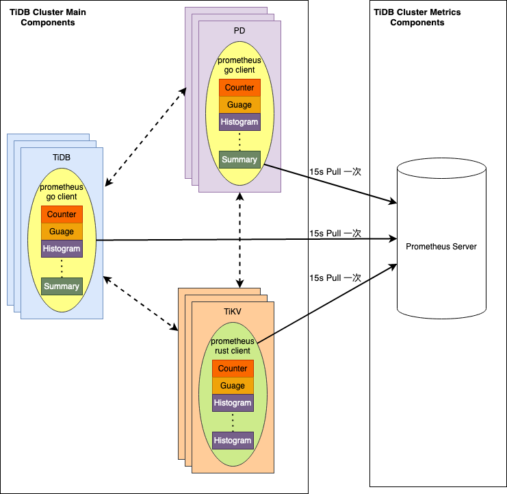

如果您需要100%的准确性，例如按请求计费，普罗米修斯不是一个好选择，因为收集的数据可能不够详细和完整。在这种情况下，您最好使用其他系统来收集和分析计费数据，并使用普罗米修斯进行其余的监控。

## 一、prometheus 特性定义


&nbsp;&nbsp;&nbsp;&nbsp;&nbsp;&nbsp;&nbsp;&nbsp;依据 [Prometheus 官网的定义](https://prometheus.io/docs/introduction/overview/#what-is-prometheus),Prometheus 是一个开源的、系统监控及警报的工具包。具有如下特点：


1. **多维时序数据：**Prometheus 以时间序列为基础，通过追加键值对标识的方式，实现了多维度的数据模型。
2. **查询语句支持：**Prometheus 支持 PromQL 允许对时间序列数据切片计算，以便生成图表、表格、警报。PromQL 与 SQL 类似，同属声明式查询语言，Prometheus 提供了多种函数完成，时序数据的聚合，如：rate、irate、delta 等等。
3. **可视效果美观：**Prometheus 支持多种的可视化模式，如：内置的 Dashboard 浏览器或集成 Grafana 等。
4. **存储方式高效：**Prometheus 以自定义格式将时间序列存储在内存及本地磁盘，缩放通过分片和联合实现。自 v2 以后，Prometheus 实现了类似于 LSM 数据库的 Block、WAL、Compaction 等结构，极大避免随机读、随机写，加快读写速率。  
5. **部署操作简单：**Prometheus 用 Go 编写，每台服务器仅依赖本地存储，独立于可靠且易于部署。
6. **告警系统精确：**Prometheus 的警报是依据 PromQL 定义，alertManager 处理来处理是否告警。
7. **多客户端支持：**Prometheus 支持十多种语言客户端库，允许轻量化检测服务，自定义库易于实现。
8. **三方集成众多：**Prometheus 可以轻松连接第三方 exporter 数据。如：系统信息、Docker、HAProxy、JMX 等指标。TiDB 监控系统中就引用了 Node_exporter、Blackbox_exporter 等三方开源 exporter 监控操作系统、网络运行情况。  


## 二、prometheus 逻辑结构  

```
Time Series Data  

Data Schema : idnetifier -> (t0, v0),(t1, v1),(t3, v3)...
Prometheus Data Model : <metric name{<label name>=<label value>, ...}
Typical set of identifiers :  
```


| Merics Name | Labels | Timestamp | Sample Value |
| - | - | - | - |
| {__name__}="" |  | @143417561287 | 94934 |
| {__name__}="" |  | @143417561287 | 94934 |
| {__name__}="" |  | @143417561287 | 94934 |


&nbsp;&nbsp;&nbsp;&nbsp;&nbsp;&nbsp;&nbsp;&nbsp;Prometheus Metric 配合 Label 会分拆成有限个指标，反映成二维平面上的点，在运算时通过取 `交集` 或 `并集` 实现 Metric 的聚合。每个指标点随时间的增加指标值的变化情况会保存在一个文件中，实现了并行读、写极大，提高了性能。


## 三、prometheus 时间过滤 

瞬时向量过滤器 : 指定时间戳内,选择一组标签的时间序列和对应的单个样本值；   

如：`tidb_server_handle_query_duration_seconds_bucket{tidb_cluster="$tidb_cluster",type="select"}` ，表示 TiDB 中 tidb_server_handle_query_duration_seconds 指标在 `tidb_cluster` 和 `type` 的标签组合下， 获取当前时间的瞬时样本值。    

区间向量过滤器 : 通过 `[]` 定义指标时间范围，获取 `瞬时向量过滤器` 所有时间范围内该指标的单个样本值；   
如：`tidb_server_handle_query_duration_seconds_bucket{tidb_cluster="$tidb_cluster",type="select"}` ，表示 TIDB 中 tidb_server_handle_query_duration_seconds_bucket 指标在时间范围内的所有值。     

时间位移操作   : 通过 `offset` 指定自当前时刻起向后偏移的时长；    
如：`tidb_server_handle_query_duration_seconds_bucket offset 5m` ，表示 TIDB 中 tidb_server_handle_query_duration_seconds_bucket 指标 5 min 之前那个时刻的瞬时值。    


## 四、prometheus 聚合操作

&nbsp;&nbsp;&nbsp;&nbsp;&nbsp;&nbsp;&nbsp;&nbsp;以由 Label 为 instance、job、le、sql_type 组合构成的 tidb_server_handle_query_duration_seconds_bucket Metric 为例；   
```json
{ 
    name = "tidb_server_handle_query_duration_seconds_bucket", # Metric Name : __name__
    instance = "172.16.6.155:10080",                           # Label : instance
    job = "tidb",                                              # Label : job
    le = "+Inf",                                               # Label : le
    sql_type = "Select"                                        # Label : sql_type
}
```

&nbsp;&nbsp;&nbsp;&nbsp;&nbsp;&nbsp;&nbsp;&nbsp;假设取 tidb_server_handle_query_duration_seconds_bucket { instance = "172.16.6.155:10080" , sql_type = "Select" , le = "+Inf" } [2m] 的瞬时值。第一步，从 prometheus 存储中截取对应时段的数据后对数据结果倒排重构。第二步，取各文件结果交集得出 Metric 在 2min 内的所有值。    
&nbsp;&nbsp;&nbsp;&nbsp;&nbsp;&nbsp;&nbsp;&nbsp;**注意：**第一步倒排的目的是为了实现，在有序数组下的快速归并查找，是基于性能层面考虑的操作。


&nbsp;&nbsp;&nbsp;&nbsp;&nbsp;&nbsp;&nbsp;&nbsp;在 Prometheus Dashboard 中汇聚结果，如下图所示。   


## 五、prometheus 指标类型

&nbsp;&nbsp;&nbsp;&nbsp;&nbsp;&nbsp;&nbsp;&nbsp;依据 [promehteus 官网介绍](https://prometheus.fuckcloudnative.io/di-er-zhang-gai-nian/metric_types) 指标类型仅存在于 client 端，在 server 端不区分指标类型，均视为无序时序数据。那么为什么要区分不同指标类型呢？    --> "待解释"   
&nbsp;&nbsp;&nbsp;&nbsp;&nbsp;&nbsp;&nbsp;&nbsp;TiDB 中封装 Prometheus 后，数据流转如下图所示；    
&nbsp;&nbsp;&nbsp;&nbsp;&nbsp;&nbsp;&nbsp;&nbsp;&nbsp;&nbsp;&nbsp;&nbsp;&nbsp;&nbsp;&nbsp;&nbsp;


### 5.1 Counter   

&nbsp;&nbsp;&nbsp;&nbsp;&nbsp;&nbsp;&nbsp;&nbsp;Counter 类型表示样本数据单调递增，即只增不减，除非监控系统发生了重置。例如：sql statement operation per second。
### 5.2 Gauge   

&nbsp;&nbsp;&nbsp;&nbsp;&nbsp;&nbsp;&nbsp;&nbsp;Gauge 类型表示样本数据可以任意变化的指标，即可增可减。例如：tikv region 的数量；

### 5.3 Histogram     

&nbsp;&nbsp;&nbsp;&nbsp;&nbsp;&nbsp;&nbsp;&nbsp;Histogram 类型在一段时间范围内对数据进行采样，将其记入自定义配置的 bucket 中，后续可通过制定区间对筛选数据、统计样本数量，最后呈现出直方图的表现形式。

### 5.4 Summary   
&nbsp;&nbsp;&nbsp;&nbsp;&nbsp;&nbsp;&nbsp;&nbsp;Summary 与 Histogram 的功能类似，表示一段时间内的数据样本结果，区别体现在计算分位数时 summary 直接基于 client 端存储的样本数据计算出百分位结果值，待 prometheus 定期 pull 数据时**存储百分位结果值**。而 Histogram 则是将**存储的样本数据**存储到 prometheus 中。

&nbsp;&nbsp;&nbsp;&nbsp;&nbsp;&nbsp;&nbsp;&nbsp;**注意**：根据 Breezewish 在 [TiKV 源码解析系列文章（三）Prometheus（上）](https://pingcap.com/zh/blog/tikv-source-code-reading-3) 中介绍的 **“rust-prometheus 库目前还只实现了前三种。TiKV 大部分指标都是 Counter 和 Histogram，少部分是 Gauge”** ，可以发现 rust prometheus client 并没有实现 summary 类型，并且在 tikv 中主要是用其他三种类型。Summary 类型在 [rust prometheus client doc](https://docs.rs/prometheus/latest/prometheus/proto/enum.MetricType.html?search=summary#variant.SUMMARY) 只有对应的 protocol type 定义，而没有对应的 struct 实现。    


## 六、prometheus 聚合函数


### 6.1 Rate


&nbsp;&nbsp;&nbsp;&nbsp;&nbsp;&nbsp;&nbsp;&nbsp;从代码看 [Rate](https://github.com/prometheus/prometheus/blob/9fcf0b3d46cc3cdff96e6e7baabfaf63d89a5a9d/promql/functions.go#L134-L146) 函数内部调用 [extrapolatedRate](https://github.com/prometheus/prometheus/blob/9fcf0b3d46cc3cdff96e6e7baabfaf63d89a5a9d/promql/functions.go#L59) 计算，经过简化后代码如下；    

```go
func extrapolatedRate(vals []parser.Value, args parser.Expressions, enh *EvalNodeHelper, isCounter, isRate bool) Vector {
	ms := args[0].(*parser.MatrixSelector)
	vs := ms.VectorSelector.(*parser.VectorSelector)
	var (
		samples    = vals[0].(Matrix)[0]                                        // 样本监控数据
		rangeStart = enh.Ts - durationMilliseconds(ms.Range+vs.Offset)          // 样本开始时间
		rangeEnd   = enh.Ts - durationMilliseconds(vs.Offset)                   // 样本终止时间
	)
    resultValue := samples.Points[len(samples.Points)-1].V - samples.Points[0].V// 终止时间样本数据减开始时间样本数据
	if isCounter {
		var lastValue float64                                                   // Counter 类型会循环时间区间内数据
		for _, sample := range samples.Points {                                 // ，如果下一个值比上一个值大，说明发
			if sample.V < lastValue {                                           // 生了计数器重置，如: 进程 crash 数
				resultValue += lastValue                                        // 据丢失，会补上 crash 后面的增量。
			}
			lastValue = sample.V
		}
	}
    // 样本开始时间点持续的时间到，当前时间前推后的时间距离，如: 指标 X[1m] 为 X 前推 1min，当前时间 02:03:02 ，那么前推结果为
    // 02:02:02，也就是取 02:02:02 --> 02:03:02 区间内的所有数据。假设指标每 15s 采一次，即: 采集时间点为 [02:02:16、02:0
    // 2:31、02:02:46、02:03:01];
    // 那么 durationToStart 为 02:02:16 - 02:02:02 = 00:00:14;
    // 同理 durationToEnd   为 02:03:02 - 02:03:01 = 00:00:01;    
    durationToStart := float64(samples.Points[0].T-rangeStart) / 1000           
	durationToEnd := float64(rangeEnd-samples.Points[len(samples.Points)-1].T) / 1000 // 
                                                     
    // sampledInterval 表示样本数据的第一个点和最后一个点间的时间间隔;
	sampledInterval := float64(samples.Points[len(samples.Points)-1].T-samples.Points[0].T) / 1000
    // averageDurationBetweenSamples 表示样本数据在区间内每个点的时间间隔，默认是 15s;
	averageDurationBetweenSamples := sampledInterval / float64(len(samples.Points)-1)

    if isCounter && resultValue > 0 && samples.Points[0].V >= 0 {
        // 在 Counter 指标类型时，用斜率公式 “零点时间/区间时间 = 开始时间样本值/结束时间到开始时间样本增量” 算出 推断的外延时间点
        durationToZero := sampledInterval * (samples.Points[0].V / resultValue)
        // 如果 durationToZero 低于 durationToStart，选取计时器重置的时间点到第一个采样时间点的时间区间作为 durationToStart
        if durationToZero < durationToStart {
            durationToStart = durationToZero
        }
	}

    extrapolationThreshold := averageDurationBetweenSamples * 1.1
	extrapolateToInterval := sampledInterval

    // 推断功能主要解决，最后一个采样点发生时间到查询时间存在一定距离，即：查询的是 02:03:02 的结果，但 prometheus 最后一次拉数据为 02:03:01
    // 因为设定了一个阈值 extrapolationThreshold，如果超过进行一定追加，达到延长时间采样点至查询目地时间的目的；
    // 最后，通过公式 “推断结果/真实结果 = 推断样本时间/真实样本时间” 解出 “查询时间，如 02:03:02 的推断结果”；
    // 代码为 resultValue = resultValue * (extrapolateToInterval / sampledInterval)
	if durationToStart < extrapolationThreshold {                   
		extrapolateToInterval += durationToStart                    
	} else {
		extrapolateToInterval += averageDurationBetweenSamples / 2  
	}
	if durationToEnd < extrapolationThreshold {
		extrapolateToInterval += durationToEnd                      
	} else {
		extrapolateToInterval += averageDurationBetweenSamples / 2  
	}
	resultValue = resultValue * (extrapolateToInterval / sampledInterval) 
	if isRate {
		resultValue = resultValue / ms.Range.Seconds()             
	}

	return append(enh.Out, Sample{
		Point: Point{V: resultValue},
	})
```

&nbsp;&nbsp;&nbsp;&nbsp;&nbsp;&nbsp;&nbsp;&nbsp; 函数意义：计算区间指标时间窗口内平均增长速率。 

&nbsp;&nbsp;&nbsp;&nbsp;&nbsp;&nbsp;&nbsp;&nbsp;从代码看 [funcRate](https://github.com/prometheus/prometheus/blob/9fcf0b3d46cc3cdff96e6e7baabfaf63d89a5a9d/promql/functions.go#L139) 调用返回 `extrapolatedRate(vals, args, enh, true, true)`。依据上文解读，会返回样本区间内 (最大值-最小值)/时间区间的结果，因为 counter 或 histogram(内部封装了 counter) 是累计值，意味着随时间增长监控指标始终增长。通过计算采样时间的增量代表采样时间内的指标值，再除以时间得出 “每秒指标的增长”，经过推断计算出查询时间点的平均增长率。   

### 6.2 increase

&nbsp;&nbsp;&nbsp;&nbsp;&nbsp;&nbsp;&nbsp;&nbsp;函数意义：样本采集区间内，指标样本的第一个值和最后一个值之间的增长量。 

&nbsp;&nbsp;&nbsp;&nbsp;&nbsp;&nbsp;&nbsp;&nbsp;从代码看 [funcIncrease](https://github.com/prometheus/prometheus/blob/9fcf0b3d46cc3cdff96e6e7baabfaf63d89a5a9d/promql/functions.go#L144) `extrapolatedRate(vals, args, enh, true, false)`。依据上文解读，会返回样本区间 (最大值-最小值) 的结果，同理因为 Counter 是累计值，代表样本增量，经过推断计算出查询时间点的样本增量。   


### 6.3 delta

&nbsp;&nbsp;&nbsp;&nbsp;&nbsp;&nbsp;&nbsp;&nbsp;函数意义：计算样本区间内，指标的第一个元素和最后一个元素的差值。

&nbsp;&nbsp;&nbsp;&nbsp;&nbsp;&nbsp;&nbsp;&nbsp;从代码看 [funcDelta](https://github.com/prometheus/prometheus/blob/9fcf0b3d46cc3cdff96e6e7baabfaf63d89a5a9d/promql/functions.go#L134) `extrapolatedRate(vals, args, enh, false, false)`。其实本质上功能与 increase 函数类似，只是少了计数器重置方面的考量。     


&nbsp;&nbsp;&nbsp;&nbsp;&nbsp;&nbsp;&nbsp;&nbsp;由于这个值被外推到指定的整个时间范围，所以即使样本值都是整数，你仍然可能会得到一个非整数值。
### 6.4 irate

&nbsp;&nbsp;&nbsp;&nbsp;&nbsp;&nbsp;&nbsp;&nbsp;函数意义：样本采集区间内，指标样本的最后一个值和倒数第二个值之间的增长量。    

&nbsp;&nbsp;&nbsp;&nbsp;&nbsp;&nbsp;&nbsp;&nbsp;从代码看 [funcIrate](https://github.com/prometheus/prometheus/blob/87ffac3e9d2104cd368d2e8962723d9fc3ee126f/promql/functions.go#L149) `instantValue(vals, enh.Out, true)`。函数内部调用 [instantValue](https://github.com/prometheus/prometheus/blob/87ffac3e9d2104cd368d2e8962723d9fc3ee126f/promql/functions.go#L158)  


### 6.5 histogram_quantile


对于 histogram ，取 `rate + []` 表示时间区间内指标的平均增量，


## 七、TiDB Duration 聚合解读


### 7.1 获取定义

&nbsp;&nbsp;&nbsp;&nbsp;&nbsp;&nbsp;&nbsp;&nbsp;在 Grafana 可发现 Duration 999 线的定义，如下代码块。  
```sql
histogram_quantile(0.999, sum(rate(tidb_server_handle_query_duration_seconds_bucket{k8s_cluster="$k8s_cluster", tidb_cluster="$tidb_cluster"}[1m])) by (le))
```

  

&nbsp;&nbsp;&nbsp;&nbsp;&nbsp;&nbsp;&nbsp;&nbsp;至于 {k8s_cluster="$k8s_cluster", tidb_cluster="$tidb_cluster"} 标签过滤可以暂时忽略，他是通过 Grafana 变量机制实现的过滤 TiDB Cluster 相关指标的机制。这里主要关注 Prometheus 如果实现数据的聚合，暂时忽略多集群数据的问题。对该问题，详情参考 [grafana 变量机制](https://www.mianshigee.com/tutorial/prometheus-book/grafana-templating.md) 深入研究。    

  


### 7.2 Metric 区间 
&nbsp;&nbsp;&nbsp;&nbsp;&nbsp;&nbsp;&nbsp;&nbsp;经过简化如下所示，下面开始 **“真正”** 进入聚合过程分析。   

```sql
tidb_server_handle_query_duration_seconds_bucket[1m]  
```

&nbsp;&nbsp;&nbsp;&nbsp;&nbsp;&nbsp;&nbsp;&nbsp;集合过程中，最内层先对指标 tidb_server_handle_query_duration_seconds_bucket 通过 **“区间向量过滤器”** 过滤出 1min 内该指标的所有数据。经过时间戳转译结果,如下代码块所示。    
&nbsp;&nbsp;&nbsp;&nbsp;&nbsp;&nbsp;&nbsp;&nbsp;从真实世界时间看，每行数据与上一行相比刚好增加 15s，因为在 TiDB 中默认配置每隔 15s prometheus 从 TiDB、TiKV、PD 中拉取缓存的数据。 4 * 15 = 60s 刚好代表 1min 内所有的数据。

```
            131 @ 1650531198.144           131 @ 2022-04-21 16:53:18   
            131 @ 1650531213.144   ---->   131 @ 2022-04-21 16:53:33      增加 15s
            131 @ 1650531228.144   ---->   131 @ 2022-04-21 16:53:48      增加 15s
            131 @ 1650531243.144           131 @ 2022-04-21 16:54:03      增加 15s
```

  


### 7.3 Rete 运算  

&nbsp;&nbsp;&nbsp;&nbsp;&nbsp;&nbsp;&nbsp;&nbsp;进入第二层运算，如下代码块所示。

```sql
rate(tidb_server_handle_query_duration_seconds_bucket[1m])
```
&nbsp;&nbsp;&nbsp;&nbsp;&nbsp;&nbsp;&nbsp;&nbsp;rate 函数表示数据点做差，函数原理参考上文。结果显示 1min 内标签为 {instance="172.16.6.155:10080", job="tidb", le="+Inf", sql_type="Begin"} 的指标聚合结果的增量为 0，又因为 prometheus 中保存的是累计值，在 rate 做差后，刚好表示这 1min 内符合 Lable 的指标聚合的增量。      

  

### 7.4 Sum 运算  

&nbsp;&nbsp;&nbsp;&nbsp;&nbsp;&nbsp;&nbsp;&nbsp;进入第三层运算，如下代码块所示。
```sql
sum(rate(tidb_server_handle_query_duration_seconds_bucket[1m])) by (le)
```

&nbsp;&nbsp;&nbsp;&nbsp;&nbsp;&nbsp;&nbsp;&nbsp;`sum( Metric_XXX ) by (le)` 运算目的是为了，聚合除 le 标签外的所有其他指标结果，也就是屏蔽 sql_type、job、instance 的 Label 差异，结果如下：

 
### 7.5 Histogram_quantile 运算  

&nbsp;&nbsp;&nbsp;&nbsp;&nbsp;&nbsp;&nbsp;&nbsp;进入第四层运算，如下代码块所示。
```sql
histogram_quantile(0.999, sum(rate(tidb_server_handle_query_duration_seconds_bucket[1m])) by (le))
```

&nbsp;&nbsp;&nbsp;&nbsp;&nbsp;&nbsp;&nbsp;&nbsp;首先，基于所有 le 做 sort，le 表示每个 bucket 的上边界，下边界由 别的 le 决定。首先判定第 99.9% 个数载哪个 bucket 区间，在用二元一次方程推断出该区间的第 99.9% 的数值。


## 八、Reference 

[Prometheus 是怎么存储数据的（陈皓）](https://www.bilibili.com/video/BV1a64y1X7ys?from=search&seid=16358382673192401481&spm_id_from=333.337.0.0)   
[Prometheus 指标类型](https://prometheus.fuckcloudnative.io/di-er-zhang-gai-nian/metric_types)  
[prometheus两种分位值histogram和summary对比histogram线性插值法原理](https://zhuanlan.zhihu.com/p/348863302)  
[Prometheus 原理和源码分析](https://www.infoq.cn/article/Prometheus-theory-source-code)  
[Prometheus原理和源码分析](https://www.bianchengquan.com/article/559917.html)   
