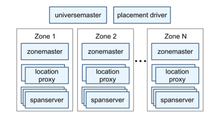
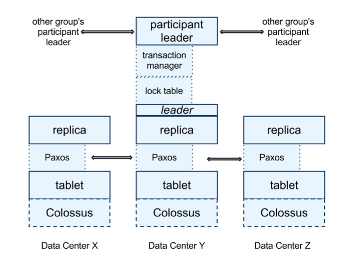
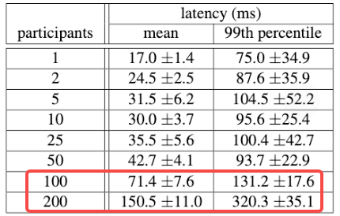
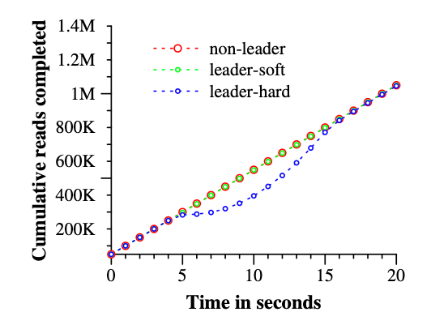

# What's Spanner Transaction

## 一、论文摘要

&nbsp;&nbsp;&nbsp;&nbsp;&nbsp;&nbsp;&nbsp;&nbsp;Spanner 是 Google 可扩展的、多版本的、**全球分布式的**、同步复制的数据库。最重要的是 Spanner 模拟了无锁只读事物、分布式原子操作。F1 是 Spanner 的第一个使用者、一个 Google 广告系统后台，数据跨 3 到 5 个数据中心，平时选择低延时的数据中心交互，1 到 2 个数据中心同时发生灾难时可数据自动幸存。**本人写这篇文章的用意是实现从一个较为宏观的角度介绍 Spanner 如何实现 可伸缩性，自动分片，容错，一致复制等特性。**

## 二、论文简介

&nbsp;&nbsp;&nbsp;&nbsp;&nbsp;&nbsp;&nbsp;&nbsp;Spanner 是一个可扩展的、全球分布式数据库，主要关注点是管理跨数据中心的复制数据，用 Paxos 状态机分片数据，客户端链接自动在 Replica 间失败均衡。当数据量、服务器数据量发生变化时，自动夸机器重新分配数据**平衡负载并响应故障**；  

1. 面对应用非关系模式的的负责、外层系统数据同步等强一致问题，Spanner 演变成类 BigTable 的键值存储的多版本数据库，用半关系型表存储临时数据，多版本数据携带时间戳，配合垃圾回收机制回收旧版本数据；
2. Spanner 提供通用事务模式，并支持 SQL 描述式语言处理；

**Spanner 重要特性：**  

1. 数据的复制配置可以由应用程序动态控制，并动态、透明地在数据中心之间移动数据，以平衡数据中心之间的资源；
1.1 选取读数据目的地距离**控制**读写延时；
1.2 选取各状态机间距离**控制**写数据时在分片数据间的延时；
1.3 选取几副本控**制读**读性能、持久性、可用性；  
2. 外部读写一致性，基于时间戳的全局读一致，此特性使一致性备份、原子模式修改、MapReduce 执行成为可能；
2.1 Spanner 是第一个实现全球范围基于时间戳 MVCC 机制的事务控制系统；
2.2 Spanner 通过 GPS 和原子时钟设计和实现了 TrueTime API ，直接暴露不确定的时钟，如果时钟偏差过大，Spanner 会降速等待直至误差小于 10ms；  

## 三、基本思想  

### 3.1 Spanner 设计和实现

&nbsp;&nbsp;&nbsp;&nbsp;&nbsp;&nbsp;&nbsp;&nbsp; Spanner 抽象了数据路径用于管理副本和位置，称为 “directory”，是最小数据移动单元。

**如下基本概念：**

1. 一个 Spanner 集群部署被称为 “universe”；
2. 一个 “universe” 下有多个 “Zone”，每个 “Zone” 是一个简单的 BigTable 集群，“Zone” 是可管理的部署单元；“Zone” 也是数据副本能复制的位置集合、物理隔离的集合，可以被动态的随加载、卸载从运行的系统中，一个数据中心可以有多个 “Zone”；  
3. 一个 “Zone” 的 “Zone Master” 指定副本数据复制到的上千个 “spanservers”，会有 “per-zone location proxies” 分配 “Client” 所能获取到数据的 “spanservers”；
4. “universe master” 和 “placement driver” 功能近似，前者主要用于打印所有 “Zone” 信息，后者以分钟为单位处理不同状态机间、“Zone” 间的数据移动；  

&nbsp;&nbsp;&nbsp;&nbsp;&nbsp;&nbsp;&nbsp;&nbsp;&nbsp;&nbsp;&nbsp;&nbsp;&nbsp;&nbsp;&nbsp;&nbsp;&nbsp;&nbsp;&nbsp;&nbsp;&nbsp;&nbsp;&nbsp;&nbsp;&nbsp;&nbsp;&nbsp;&nbsp;&nbsp;&nbsp;&nbsp;&nbsp;&nbsp;&nbsp;&nbsp;&nbsp;

**下图是基于 Tablet 实现的 Spanner，从下向上看：**

1. 每个 Tablet 存储 B-Tree 数据、Colossus 存储 WAL 日志；
2. Tablet 之上实现 Paxos 状态机，每个状态机存放自己的元数据、日志极其相关 tablet；
3. 当前 Spanner 每次 Paxos 交互写两次日志，一次写 tablet 日志，一次写 paxos 日志，Spanner 通过管道增大吞吐进而弥补这项设计引发的延时问题；

&nbsp;&nbsp;&nbsp;&nbsp;&nbsp;&nbsp;&nbsp;&nbsp;&nbsp;

&nbsp;&nbsp;&nbsp;&nbsp;&nbsp;&nbsp;&nbsp;&nbsp;&nbsp;Paxos 用于实现一致性复制，replica 数据存储在相关的 tablet 中，写必须通过 Paxos Group Leader，读可以通过已经及时更新的 replicate 高效获取。每个 Spanner Server 实现一个 Lock Table 通过 2PC 方式实现并发控制。

&nbsp;&nbsp;&nbsp;&nbsp;&nbsp;&nbsp;&nbsp;&nbsp;&nbsp;&nbsp;&nbsp;&nbsp;&nbsp;&nbsp;&nbsp;&nbsp;&nbsp;&nbsp;&nbsp;&nbsp;&nbsp;&nbsp;&nbsp;&nbsp;&nbsp;&nbsp;&nbsp;

&nbsp;&nbsp;&nbsp;&nbsp;&nbsp;&nbsp;&nbsp;&nbsp;&nbsp;Spanner 实现了长事务，用于解决因写冲突导致的乐观并发控制性能差、延迟大的问题。如下图，在每个 Paxos Group 成员在**状态机内部**均实现一个事务管理器，Txn Group 中会选出 Leader，其他称 Slave，Leader 使用事务管理器处理冲突；细节如下：
&nbsp;&nbsp;&nbsp;&nbsp;&nbsp;&nbsp;&nbsp;&nbsp;&nbsp;**注意： Txn Group 和 Paxos Group 的关系是，多个 Paxos Group 对一个 Txn Group；**

1. 如果一个事务仅包含一个 Paxos Group 可直接绕过事务管理器，因为 Lock Table 和 Paxos 本身就可以实现事务管理；
2. 如果一个事物包含多个 Paxos Group ，Txn 中会先选出本 Txn Leader ，其他的 Paxos Group Leader 成为候选者指向本 Txn；

### 3.2 Spanner "Dircetory" 抽象  

&nbsp;&nbsp;&nbsp;&nbsp;&nbsp;&nbsp;&nbsp;&nbsp;&nbsp;在键值对之上 Spanner 实现了 "Dircetory" 桶抽象，每一个 "Dircetory" 存放公共前缀的数据可以更好的控制局部数据，如：更利于范围扫描数据，这是基于 hash 规则分区无法实现的优势。Spanner 可以通过移动 "Dircetory" 来降低某个 Paxos Group 的负载，如：将经常访问的多个 "Dircetory" 合并为一个 "Dircetory"。一个 50MB 的 "Dircetory" 可以在几秒钟内移动。

&nbsp;&nbsp;&nbsp;&nbsp;&nbsp;&nbsp;&nbsp;&nbsp;&nbsp;移动 "Dircetory" 是用于移动 Paxos Group 的后台任务，通过添加、删除副本方式在组之间移动片段。movedir 从注册开始，后台启动数据移动，当它移动完数据后，使用事务来原子更新两个 Paxos Group 元数据。除移动数据外还可分割数据，如 "Dircetory" 变得太大，Spanner会将其分割成多个片段。

&nbsp;&nbsp;&nbsp;&nbsp;&nbsp;&nbsp;&nbsp;&nbsp;&nbsp;管理员可控制副本的数量、类型、地理位置的不同组合实现隔离与复制。例如，应用程序可能将所需要的数据存储在一个 "Dircetory" 中，加之地理位置实现 “用户A” 的数据在欧洲有三个副本，“用户B” 的数据在北美有五个副本。

### 3.4 TrueTime API 设计和实现

&nbsp;&nbsp;&nbsp;&nbsp;&nbsp;&nbsp;&nbsp;&nbsp;&nbsp;TrueTime 由每个数据中心的一组 “时间主机器” 和每个机器的 “时间守护程序” 实现，使用两种形式的时间参考，用以放置不同的失效模式。  

1. GPS 失灵的方式参考源漏洞包括天线和接收器故障、本地无线电干扰和GPS系统中断等。
2. 原子钟失灵的方式参考 GPS 以及原子钟彼此之间不相关，可能由于频率误差出现明显时间漂移。

### 3.3 Spanner 并发控制  

#### 3.3.1 读事务

Spanner 列出了支持的类型和缩机制如下：

| Operation Type | Concurrency Control |
| - | - |
| Read-Write Transcation |   Pessimistic |
| Read-Only Transcation | lock-free |
| Snapshot Read,client-provided timestamp |lock-free |
| Snapshot Read,client-provided bound | lock-free |

1. “Read-Write Transcation” 是一种具有快照隔离的性能的事务,必须预先声明为没有任何写操作,并在系统选择的时间戳上读取只读事务而不锁定。只读事务中的读操作可以在任何足够最新的 Replica 上进行。  
2. “Snapshot Read,client-provided timestamp” 通过客户端可以为快照读取指定时间戳，实现任何足够最新的 Replica 上执行无锁历史数据读取。对于只读事务和快照读取，一旦时间戳被选定就可视为提交成功，除非该时间戳的数据已经被垃圾收集。
3. “Snapshot Read,client-provided bound” 就是 “Snapshot Read,client-provided timestamp” 加上提供所需时间戳过期的上限，并让 Spanner 选择时间戳内的数据，进而避免在重试循环中缓冲结果。

#### 3.3.1 读写事务

&nbsp;&nbsp;&nbsp;&nbsp;&nbsp;&nbsp;&nbsp;&nbsp;&nbsp;TiDB 作者之一的 [TangLiu 对该部分给出了解读，本人觉得较为清晰，故原文应用](https://pingcap.com/zh/blog/Spanner-cap-truetime-transaction)；**虽然 Spanner 在实现写事务上处理依据使用 Split 数量不同分为 1PC 和 2PC，但本文只展示 2PC 的例子，详情请阅读这位作者文章**。

&nbsp;&nbsp;&nbsp;&nbsp;&nbsp;&nbsp;&nbsp;&nbsp;&nbsp;假设一个事务需要在 Split 1 读取数据 Row 1，同时将改动 Row 2，Row 3 分别写到 Split 2，Split 3，流程如下：

1. client 开始一个 read-write 事务。
2. client 需要读取 Row 1，告诉 API Layer 相关请求。
3. API Layer 发现 Row 1 在 Split 1。
4. API Layer 给 Split 1 的 Leader 发送一个 read request。
5. Split1 的 Leader 尝试将 Row 1 获取一个 read lock。如果这行数据之前有 write lock，则会持续等待。如果之前已经有另一个事务上了一个 read lock，则不会等待。至于 deadlock，采用 wound-wait 处理方式。
6. Leader 获取到 Row 1 的数据并且返回。
7. Clients 开始发起一个 commit request，包括 Row 2，Row 3 的改动。所有的跟这个事务关联的 Split 都变成参与者 participants。
8. 一个 participant 成为协调者 coordinator，譬如这个 case 里面 Row 2 成为 coordinator。Coordinator 的作用是确保事务在所有 participants 上面要不提交成功，要不失败。这些都是在 participants 和 coordinator 各自的 Split Leader 上面完成的。
9. Participants 开始获取 lock
9.1 Split 2 对 Row 2 获取 write lock。
9.2 Split 3 对 Row 3 获取 write lock。
9.3 Split 1 确定仍然持有 Row 1 的 read lock。
9.4 每个 participant 的 Split Leader 将 lock 复制到其他 Split 副本，这样就能保证即使节点挂了，lock 也仍然能被持有。
10. 如果所有的 participants 告诉 coordinator lock 已经被持有，那么就可以提交事务了。coordinator 会使用这个时候的时间点作为这次事务的提交时间点。
11. 如果某一个 participant 告诉 lock 不能被获取，事务就被取消
12. 如果所有 participants 和 coordinator 成功的获取了 lock，Coordinator 决定提交这次事务，并使用 TrueTime 获取一个 timestamp。这个 commit 决定，以及 Split 2 自己的 Row 2 的数据，都会复制到 Split 2 的大多数节点上面，复制成功之后，就可以认为这个事务已经被提交。
Coordinator 将结果告诉其他的 participants，各个 participant 的 Leader 自己将改动复制到其他副本上面。
13. 如果事务已经提交，coordinator 和所有的 participants 就 apply 实际的改动。
Coordinator Leader 返回给 client 说事务已经提交成功，并且返回事务的 timestamp。当然为了保证数据的一致性，需要有 commit-wait

## 四、性能论证

&nbsp;&nbsp;&nbsp;&nbsp;&nbsp;&nbsp;&nbsp;&nbsp;&nbsp;**基准测试环境**在分时机器上进行，每个 spanserver 运行在 4GB RAM 和 4核 的测试机，客户端独立运行承受压力。每个区域包含一个 spanserver。客户端和区域被放置在一组网络距离小于1ms的数据中心中。测试数据库由 50 个 Paxos Group 和 2500 个 “Directory” 创建，操作是4KB的独立读写，数据充分预热情况下。
&nbsp;&nbsp;&nbsp;&nbsp;&nbsp;&nbsp;&nbsp;&nbsp;&nbsp;1. **延时情况：1 副本提交等待大约是 5ms, Paxos 延迟大约是 9ms**。随着 Replica 数量的增加，由于 Paxos Group 数据同步并行执行，因此延迟基本保持不变。
&nbsp;&nbsp;&nbsp;&nbsp;&nbsp;&nbsp;&nbsp;&nbsp;&nbsp;2. **吞吐量情况：**客户端会发出足够多的操作导致服务器 cpu 饱和，快照读取可在任何最新的 Replica 上执行，吞吐量几乎随 Replica 的数量线性增加。但相同的实验环境写吞吐量随着 Replica 数量的增加，每次写所执行的工作量的线性增加量已经超过了写吞吐量带来的好处。

&nbsp;&nbsp;&nbsp;&nbsp;&nbsp;&nbsp;&nbsp;&nbsp;&nbsp;3. **扩展性情况：**下图展示了两阶段提交可以扩展到合理数量的参与者，实验了跨3个区域运行的实验，每个区域有25 个 spanserver。从 平均值 和 99 百分位数来看，扩展到 50 名都合理，但在 100 名参与者时延迟开始显著上升。  

&nbsp;&nbsp;&nbsp;&nbsp;&nbsp;&nbsp;&nbsp;&nbsp;&nbsp;&nbsp;&nbsp;&nbsp;&nbsp;&nbsp;&nbsp;&nbsp;&nbsp;&nbsp;&nbsp;&nbsp;&nbsp;&nbsp;&nbsp;&nbsp;&nbsp;&nbsp;&nbsp;&nbsp;&nbsp;&nbsp;&nbsp;&nbsp;&nbsp;&nbsp;&nbsp;&nbsp;&nbsp;&nbsp;&nbsp;&nbsp;&nbsp;&nbsp;&nbsp;&nbsp;&nbsp;

&nbsp;&nbsp;&nbsp;&nbsp;&nbsp;&nbsp;&nbsp;&nbsp;&nbsp;4. **可用性测试：**测试 “universe” 由 5 个 Zone 组成，每个 “Zone” 包含 25 个spanserver。测试数据自动被切分成 1250 个 Paxos Group，100 个测试客户端以 50K读/秒 的聚合速率持续发出非快照读。所有的 leader 都明确地放在 Zone 1。在每次测试的五秒钟内，一个 Zone 内的所有服务器全部宕机模拟灾难，同时非 leader 杀死了 Zone 2，hard-leader 杀死 Zone 1。实验结果为杀死 Zone 2 对读吞吐量没有影响，但 hard-leader 杀死Z1，需要重新选举 leader 会影响吞吐量大约在 3-4%。
&nbsp;&nbsp;&nbsp;&nbsp;&nbsp;&nbsp;&nbsp;&nbsp;&nbsp;另一方面，直接杀死 Zone 1 会使 TPS 几乎降至0。Paxos lease 被设置为10秒,当杀死 Zone 后，每个租约到期后的 Paxos Group 会选出新的 leader。在 kill 时间之后大约 10 秒，所有 Paxos Group 均有了 leader，吞吐量已经恢复。更短的租赁时间可缩短对可用性的影响，但将更耗网络流量。

&nbsp;&nbsp;&nbsp;&nbsp;&nbsp;&nbsp;&nbsp;&nbsp;&nbsp;&nbsp;&nbsp;&nbsp;&nbsp;&nbsp;&nbsp;&nbsp;&nbsp;&nbsp;&nbsp;&nbsp;&nbsp;&nbsp;&nbsp;&nbsp;&nbsp;&nbsp;&nbsp;&nbsp;&nbsp;&nbsp;&nbsp;&nbsp;&nbsp;&nbsp;&nbsp;&nbsp;

## 五、文章结论

1. Spanner 结合并扩展了数据库社区、系统社区思想，提供了半关系接口，事务，基于 sql 的查询语言，可伸缩性，自动分片，容错，一致复制，外部一致性，广域分布等特性。
2. Spanner 关键功能实现了 TrueTime，已经证明，在时间 API 中具体化时钟构建分布式系统成为可能。

## 六、引用文章  

[Paper -- Spanner: Google’s Globally-Distributed Database](http://static.googleusercontent.com/media/research.google.com/zh-CN//archive/spanner-osdi2012.pdf)
[TiDB Blog -- Spanner - CAP, TrueTime and Transaction by TangLiu](https://pingcap.com/zh/blog/Spanner-cap-truetime-transaction)
