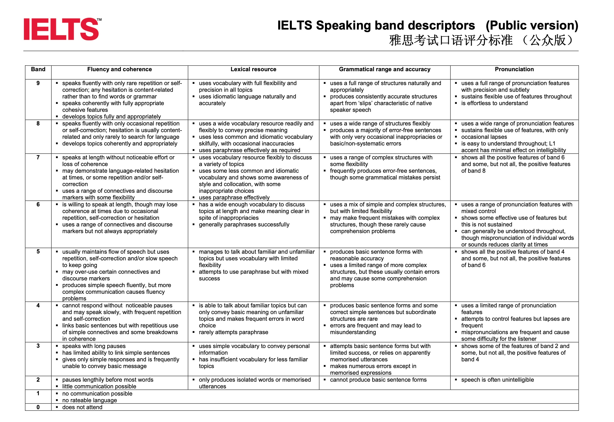

# How to prepare a IELTS exam

## Rules

## My Oral Problems

1. You are not willing to actively express yourself
2. You have trouble with fluency
3. Pronunciation is not a problem
4. Not being sensitive to the tenses or accuracy of questions

## Plans

1. Besides the oral part, I also tested the `listening` and felt so bad, because of just finished part of them and right ratio is just 1/14.  
2. So, I need put much more energy in `listening`, `reading` and `writing`. For oral part, the main aim should be keeping the feeling in oral part as usual, and trying to reach the fluent level.  
3. I think my aimed score is 7 at oral part of IELTS.

So, I wanna use 4 months to improve english, and everyday I'll put 2h, at the end day, adding up all of time, it should be 240h.

## Tests

I's my first time to test my oral english score for IELTS, which was powered by `liulishuo.IELTS`. And the result's showed below :

## Progress

1. Week schedule

    | | Saturday | Sunday | Monday | Tuesday | Wednesday | Thursday | Friday |
    | - | - | - | - | - | - | - | - |
    | | | | 1.得到雅思听力和口语的测试结果 2. 完成口语练习，在 `雅思考满分` | 1. 看并抄录一份 7min 的[乔布斯内部视频](https://www.bilibili.com/video/BV1Rt411U7Ve),目的是先听 3 遍，再背下来，再听看对听力是否有改善(有部分改善) 2. 翻译之前的英语笔记成中文，并复习其中内容（语法，单词，词组）3. 完成一个口语练习在 `雅思考满分` | 1. finish oral english homework. 2. finish one practice on `雅思考满分` | | |
    | 花费时间 | None | None | 3h(11:00 A.M.-2:00 A.M.) | 5h(11:00 P.M.-5:00 A.M.) | 1.5h(19:00 P.M.-20:30 P.M.) | | |

2. Daily progress

    | Date | Model Text | BestScore , BestTimeConsuming , MyBestScore , MyTimeConsuming |
    | - | - | - |
    | 2023-04-03| forgot to record | N/A |
    | 2023-04-04| Do you have patience? --> I will be lying if I say I have patient. Even though I know that patient is one of the most important virtue that one can have. I'm not a patient person, I am always want to rush things no matter it's for work, or in my personal life, even a minute more, I'll consider it as a waste of time. | 93, 35s,91,27s |
    | 2023-04-05| 1. Do you have patience? --> [My answer](https://ielts.kmf.com/speaking/wechat/speakinfo?exam_unique=168069586533056514&by_name=%25E5%25AD%25A6%25E5%2591%2598vQStk1), 2. What may distract you when you're trying to stay foucused? --> [My answer](https://ielts.kmf.com/speaking/wechat/speakinfo?exam_unique=168069625066321730&by_name=%25E5%25AD%25A6%25E5%2591%2598vQStk1), 3. What do you do to help you concentrate? --> [My answer](https://ielts.kmf.com/speaking/wechat/speakinfo?exam_unique=168069661875421160&by_name=%25E5%25AD%25A6%25E5%2591%2598vQStk1), 4. Is it difficult for you to stay focused on something? --> [My answer](https://ielts.kmf.com/speaking/wechat/speakinfo?exam_unique=168069700793308542&by_name=%25E5%25AD%25A6%25E5%2591%2598vQStk1) | N/A |

## New Words, Phrase, Sentences

This part is about new word I haven't seen and misunderstanding.

1. monologue 独白
2. interpret 说明
3. corridor 通道
4. entrance to somewhere 某地的入口
5. look out onto 向外看向
6. be moved by 被感动
7. put out 出版
8. put out of 消灭
9. it's what we are 这就是我们（口语中用的挺频繁的句型） + about + doing/clause
10. intention --> 目的
11. deliberate --> 深思熟虑的，故意的
12. manifesto --> 声明，宣言
13. phenomenal --> 杰出的，可感知的
14. billboards --> 广告牌
15. turn around --> 转向反方向，(生意或经济) 好转
16. estate --> 遗产
17. representative --> 典型的，有代表性的，代表，代理人
18. videotape --> 录像带

## Puzzled Part

This part isn't relevent to classes or plan I've made in daily life, but, which is the thing I feel puzzled when I was learning.

1. Difference between `think about` and `consider doing`  
In short, "think about" is more general and can refer to any kind of thought process, while "consider doing" usually implies a more focused thought process with the intention of making a decision.
2. Difference between `intention` and `aim`
The difference is that `intention` refers to objective thought process or actions, meanwhile, `aim` is more revelent to their subjective part of though process. For example of `aim`, I can make a sentence which's `I'm warring about if I can achieve my goal in the future`. If the scenario is I'am thinking about something in turly wold, the best choice should be `intention`.
3. Difference between `catastrophe` and `disaster`  
Catastrophe is any large and disastrous event of great significance while disaster is an unexpected natural or man-made catastrophe of substantial extent
4. When do we use solve or resolve?  
This difference means that solve and resolve are often used in slightly different contexts. To generalise, we tend to solve something objective, and resolve something subjective.
