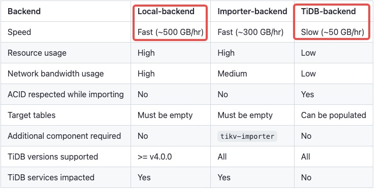

# Deploy Lightning on the TiDB Operator of Macbook M1

> **This document has been released, which means the original documents's been moved to the period of maintenance. [Please comment anything you want at the topic](http://forum.dbnest.net/t/topic/34).**

## 一、前言

1. The reason why it is necessary to learn K8S Lightning is that it is difficult to meet expectations when a large number of derivatives are simply based on mapping ports. There is a big difference in the import speed between tidb backend and local backend. [Reference TiDB website](https://docs.pingcap.com/tidb/v4.0/tidb-lightning-backends) see the table below.

    

2. Lighting is special, it's just an executable, and in exploring ways to use Lightning in Found 2, namely: **[k8s outside the cluster call tidb-Lightning binary](#3call-lightning-on-the-physical-machine)** and **[Use helm to create import task recommended by TiDB official website](#2-deploy-lightning-on-tidb-operator)**.

## 2. Deploy Lightning on TiDB-Operator

1. [TiDB import cluster data recommended by the official website](https://docs.pingcap.com/zh/tidb-in-kubernetes/stable/restore-data-using-tidb-lightning) is perfect, The following are specific steps.
2. Prepare the PV and deploy lightning.

    ```shell
    jan@Jan-M1-Pro tidb-config % vim tidb-lightning-values.yaml
    ......
    # For `local` backend, an extra PV is needed for local KV sorting.
    sortedKV:
      storageClassName: local-storage
      storage: 5Gi
    ......


    jan@Jan-M1-Pro tidb-config % helm search repo -l tidb-operator

    jan@Jan-M1-Pro tidb-config % helm inspect values pingcap/tidb-lightning --version=v1.4.0 > tidb-lightning-values.yaml
                                              local-storage            12d

    jan@Jan-M1-Pro tidb-config % kubectl get nodes --show-labels
    NAME             STATUS   ROLES           AGE   VERSION   LABELS
    docker-desktop   Ready    control-plane   13d   v1.25.4   beta.kubernetes.io/arch=arm64,beta.kubernetes.io/os=linux,kubernetes.io/arch=arm64,kubernetes.io/hostname=docker-desktop,kubernetes.io/os=linux,node-role.kubernetes.io/control-plane=,node.kubernetes.io/exclude-from-external-load-balancers=

    # find specific Node Name(such as：docker-desktop)
    jan@Jan-M1-Pro tidb-config % vim tidb-lightning-pv.yaml
    apiVersion: v1
    kind: PersistentVolume
    metadata:
      name: local-sharedssd
    spec:
      capacity:
        storage: 5Gi
      accessModes:
        - ReadWriteOnce
      persistentVolumeReclaimPolicy: Retain
      storageClassName: local-storage
      local:
        path: /Users/jan/Database/k8s/data_tidb/sharedssd
      nodeAffinity:
        required:
          nodeSelectorTerms:
          - matchExpressions:
            - key: kubernetes.io/hostname
              operator: In
              values:
              - docker-desktop

    jan@Jan-M1-Pro tidb-config % kubectl apply -f tidb-lightning-pv.yaml

    jan@Jan-M1-Pro tidb-config % kubectl get pv |grep -B 10 Available
    NAME                                       CAPACITY   ACCESS MODES   RECLAIM POLICY   STATUS      CLAIM                                       STORAGECLASS    REASON   AGE local-sharedssd                            5Gi        RWO            Retain           Available    

    jan@Jan-M1-Pro tidb-config % helm install jan-lightning pingcap/tidb-lightning --namespace=tidb-cluster --set failFast=true -f tidb-lightning-values.yaml --version=v1.4.0

    NAME: jan-lightning
    LAST DEPLOYED: Wed Mar 29 17:18:45 2023
    NAMESPACE: tidb-cluster
    STATUS: deployed
    REVISION: 1
    TEST SUITE: None
    NOTES:
    1. Check tidb-lightning status
      kubectl get job -n tidb-cluster -l app.kubernetes.io/name=jan-lightning-tidb-lightning
      kubectl get po -n tidb-cluster -l app.kubernetes.io/name=jan-lightning-tidb-lightning
    2. Check tidb-lightning logs
      kubectl logs -n tidb-cluster -l app.kubernetes.io/name=jan-lightning-tidb-lightning
    3. View tidb-lightning status page
      kubectl port-forward -n tidb-cluster svc/jan-lightning-tidb-lightning 8289:8289
      View http://localhost:8289 in web browser

    jan@Jan-M1-Pro tidb-config % kubectl logs -n tidb-cluster -l app.kubernetes.io/name=jan-lightning-tidb-lightning --tail=-1 |grep "successfully"
    tidb lightning exit successfully
    ```

3. Wait for the import to complete

    ```shell
    jan@Jan-M1-Pro tidb-config % kubectl get pod -n tidb-cluster |grep lightning
    jan-lightning-tidb-lightning-7ssfc     0/1     Completed   0          22h
    ```

## 3、Call Lightning on the physical machine

1. Since Lightning requires the operation port and status port of tikv, tidb and pd, they all need to be exposed to the local physical machine.

    ```shell
    jan@Jan-M1-Pro ~ % kubectl port-forward svc/basic-tidb 6000:4000 -n tidb-cluster
    Forwarding from 127.0.0.1:6000 -> 4000
    Forwarding from [::1]:6000 -> 4000
    Handling connection for 6000
    
    jan@Jan-M1-Pro ~ % kubectl port-forward svc/basic-tidb 10080:10080 -n tidb-cluster
    Forwarding from 127.0.0.1:10080 -> 10080
    Forwarding from [::1]:10080 -> 10080
    
    jan@Jan-M1-Pro ~ % kubectl port-forward svc/basic-pd 2379:2379 -n tidb-cluster
    Forwarding from 127.0.0.1:2379 -> 2379
    Forwarding from [::1]:2379 -> 2379
    
    
    jan@Jan-M1-Pro ~ % kubectl port-forward svc/basic-tikv-peer 20160:20160 -n tidb-cluster
    Forwarding from 127.0.0.1:20160 -> 20160
    Forwarding from [::1]:20160 -> 20160
    Handling connection for 20160
    ```

2. Even exposed ports still report errors, we can see from the error message which's ```\"transport: Error while dialing dial tcp: lookup basic-pd-0.basic-pd-peer.tidb-cluster.svc: no such host\"``` the tidb cluster returned the internal routing information of k8s to lightning.

      ```shell
      jan@Jan-M1-Pro tidb-config % tiup tidb-lightning -c ./lightning-config.yaml --log-file ./lightning.log
      tiup is checking updates for component tidb-lightning ...
      Starting component `tidb-lightning`: /Users/jan/.tiup/components/tidb-lightning/v6.6.0/tidb-lightning -c ./lightning-config.yaml --log-file ./lightning.log
      Verbose debug logs will be written to ./lightning.log
      
      {"level":"warn","ts":"2023-03-30T02:20:19.463+0800","logger":"etcd-client","caller":"v3@v3.5.2/retry_interceptor.go:62","msg":"retrying of unary invoker failed","target":"etcd-endpoints://0x14000d78000/127.0.0.1:2379","attempt":0,"error":"rpc error: code = DeadlineExceeded desc = latest balancer error: last connection error: connection error: desc = \"transport: Error while dialing dial tcp: lookup basic-pd-0.basic-pd-peer.tidb-cluster.svc: no such host\""}
      {"level":"info","ts":"2023-03-30T02:20:19.464+0800","logger":"etcd-client","caller":"v3@v3.5.2/client.go:207","msg":"Auto sync endpoints failed.","error":"context deadline exceeded"}
      tidb lightning encountered error: [Lightning:KV:ErrCreateKVClient]create kv client error: [PD:client:ErrClientCreateTSOStream]create TSO stream failed, retry timeout
      ```

3. The way around this is to add the domain name mapping of all SVCs to host

    ```shell
    jan@Jan-M1-Pro ~ % cat /etc/hosts
    ......
    127.0.0.1 basic-pd-0.basic-pd-peer.tidb-cluster.svc
    127.0.0.1 basic-tikv-0.basic-tikv-peer.tidb-cluster.svc
    ```

4. Import and verify

      ```sql
      mysql> show tables;
      Empty set (0.01 sec)
      
      // Specify a lightning import task and wait for it to complete
      
      mysql> show tables;
      +----------------+
      | Tables_in_test |
      +----------------+
      | sbtest1        |
      | sbtest10       |
      | sbtest2        |
      | sbtest3        |
      | sbtest4        |
      | sbtest5        |
      | sbtest6        |
      | sbtest7        |
      | sbtest8        |
      | sbtest9        |
      +----------------+
      10 rows in set (0.01 sec)
      
      mysql> select * from sbtest10 limit 1;
      +----+------+-------------------------------------------------------------------------------------------------------------------------+-------------------------------------------------------------+
      | id | k    | c                                                                                                                       | pad                                                         |
      +----+------+-------------------------------------------------------------------------------------------------------------------------+-------------------------------------------------------------+
      |  1 | 2506 | 77825755741-57613716249-41363434969-61943511716-24253397196-16456423243-71719660127-90287149046-57007239064-51092775305 | 22380089381-03483981033-98305230683-44627144526-67135627326 |
      +----+------+-------------------------------------------------------------------------------------------------------------------------+-------------------------------------------------------------+
      1 row in set (0.01 sec)
      ```
