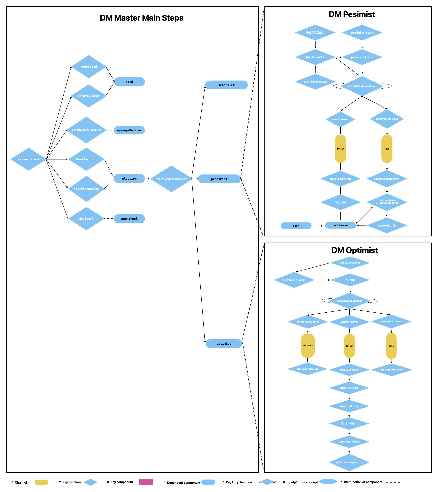

# DM Master

## What's DM Master



## Etcd

**How does DM Master high availability work.** Mostly, It's due to the avaliable characteristics of ectd, which's stored all persist data in DM Cluster. Meanwhile, by [the Election](#election), only the leader of DM Master is able to start working components and work with etcd,and the leader also periodically, checks if there's something seriously wrong with DM. Do the recover action right now at the right time.

## OpenapiHandles

DM provids [OpenAPI](https://docs.pingcap.com/tidb/stable/dm-open-api) to operate/create tasks, sources, etc. Just like you use it in dm-ctl commands. Mainly it's implmented by OpenapiHandler encapsulated in DM Master. And it works when the DM Master leader started. At the same time, DM Worker peer will redirect request to the leader to deal with if the one receives OpenAPI requests.

## AgentPool

1. This component was added dut to [this PR](https://github.com/pingcap/dm/pull/157), mainly looking forward to add rate limit and rpc client manage in dm-master. Though, it's the key component in the entire DM Master components, Why I decided to introducte the one is all because it appears inside the [Server](https://github.com/pingcap/tiflow/blob/c65e2b72198de10319008b31dcf13d51509ccfde/dm/master/server.go#L127) struct.

2. And the way it was implmented is just encapsulate the package of [golang rate.Limit](https://github.com/pingcap/tiflow/blob/c65e2b72198de10319008b31dcf13d51509ccfde/dm/master/agent_pool.go#L60) to filter.

## Election

1. **First**, It's a comman package encapsulated to implment functionality of leader election based on etcd.
2. **Second**, The function [compaignLoop](https://github.com/pingcap/tiflow/blob/c65e2b72198de10319008b31dcf13d51509ccfde/dm/pkg/election/election.go#L200) is the key to understand how the logical concept is continuously running. Periodically, it'll recampaign leader of DM master instances and **the leader'll start** some components including `Scheduler`, `Pessimist` and `Optimist`. The followers don't care about how to run the ones.
3. **Third,** It also splits task into subtasks which represents only one source(or on worker) in one migration subtask(**The conceptal fomuler : 1 worker VS 1 source VS 1 subtask**).

## Scheduler

1. **First**, Scheduler is part of Master, which's responsible for tasks of DM worker, such as `register/unregister`, `observe the online/offline`, `observe add/remove source config`, `schedule upstream sources`, `schedule data migration subtask` and so forth, more details at [here](https://github.com/pingcap/tiflow/blob/c65e2b72198de10319008b31dcf13d51509ccfde/dm/master/scheduler/scheduler.go#L44).  
2. **Second**, what scheduler actully does is that, on the one hand, some background gorountines are countinuous running after starting the master instance like [`observeWorkerEvent`](https://github.com/pingcap/tiflow/blob/c65e2b72198de10319008b31dcf13d51509ccfde/dm/master/scheduler/scheduler.go#L2081) is going to reveive the keepalive status triggerd by DM Worker, on the other hand, the others will be triggered when dmctl or openAPI sends some operations, like: [`RemoveSourceCfg`](https://github.com/pingcap/tiflow/blob/c65e2b72198de10319008b31dcf13d51509ccfde/dm/master/scheduler/scheduler.go#L441). Mostly, the functions were embended in GRPC defining.  
3. **Third**, It also generates subTasks from one replication task and persist them on etcd.

## Pessimist

1. First, we can see pessmist is come up with two parts of `DM Master` and `syncer` from the picture above. This part will focus on what the DM Master does inside. From [the function handleInfoPut of DM Master](https://github.com/pingcap/tiflow/blob/c65e2b72198de10319008b31dcf13d51509ccfde/dm/master/shardddl/pessimist.go#L464), we can make sure the one Info is handled by DM Master when the it receives enough Infos from etcd. Actually, dm-ctl also can generate operations ,like something seriously worng with DDL Lock, when you use `unlock-ddl-lock` inside using the logic of [`waitOwnerToBeDone`](https://github.com/pingcap/tiflow/blob/c65e2b72198de10319008b31dcf13d51509ccfde/dm/master/shardddl/pessimist.go#L343). From code, [shardOp.Exec](https://github.com/pingcap/tiflow/blob/c65e2b72198de10319008b31dcf13d51509ccfde/dm/syncer/ddl.go#L641) will be true when it's the owner of shard DDL Lock and written by [putOpForOwner](https://github.com/pingcap/tiflow/blob/c65e2b72198de10319008b31dcf13d51509ccfde/dm/master/shardddl/pessimist.go#L605) of DM master leader. What I mean is that this's the logic to implment actually the owner to execute the only one DDL to downstream. And in the `Syncer` of worker, what DM-worker does is just put info to etcd of DM-Master when `the HandleDDL function` receives any DDL MySQL binlog event, meanwhile, if it's the owner or first worker meets the DDL , it's also responsible for executing.

2. Second, PTAL at the conceptal logic of [shard-merge-pessimistic](https://docs.pingcap.com/zh/tidb-data-migration/v5.3/feature-shard-merge-pessimistic#%E5%AE%9E%E7%8E%B0%E5%8E%9F%E7%90%86). The [implement detail](https://github.com/pingcap/tiflow/blob/c65e2b72198de10319008b31dcf13d51509ccfde/dm/pkg/shardddl/pessimism/doc.go). In short, what it actually does is keeping every DML in a DM Cluster before a specific DDL timestamp which hasn't been synced, till the end of the DDL finished. In short, if there is DDL replication in a sharding group(multi MySQL sharding tables into one TiDB table), the worker which's the first thing to meet the DDL query will notify DM-Master to generate a lock then block related DDL and DML queries. Till all the DDL of sources have been reported to DM-Master, the one worker which's already been chose as owner starts to execute the DDL. if the DDL was executed successfully, it'll replay the DDL and DML queries blocked and replay replication as usual.

    

3. `LockKeeper` which encapsulates `Lock` used to keep and handle DDL lock conveniently, and lock has a 1 on 1 relationship with DDL at a specific time in a replication task. Both also don't need to be presistent. Because it can be re-constructed from the shard DDL info which were persisited in to etcd of DM-Master by DM-Worker. And, this strcut has a key founction named `TrySync`, which's to sync the lock **by increasing the number of remain**, which number is equal to the number of sources(related workers) if it's received the DDL event from MySQL Binlog.  

    ```go
    type Lock struct {
    mu sync.RWMutex

    ID     string   // lock's ID
    Task   string   // lock's corresponding task name
    Owner  string   // Owner's source ID (not DM-worker's name)
    DDLs   []string // DDL statements
    remain int      // remain count of sources needed to receive DDL info

    // whether the DDL info received from the source.
    // if all of them have been ready, then we call the lock `synced`.
    ready map[string]bool

    // whether the operations have done (exec/skip the shard DDL).
    // if all of them have done, then we call the lock `resolved`.
    done map[string]bool
    }

    type LockKeeper struct {
    mu    sync.RWMutex
    locks map[string]*Lock // lockID -> Lock
    }
    ```

4. `Info` represents the shard DDL information and `Operation` represents a shard DDL coordinate operation ,which all of information should be persistent in etcd. Another key defference between `Info` and `Operation` we have to know is something that the DM Worker just sends the Lock or DDL Info to the DM Master, and watch Operations from etcd of the one. So, DM Master will use [`func putOpForOwner`](https://github.com/pingcap/tiflow/blob/c65e2b72198de10319008b31dcf13d51509ccfde/dm/master/shardddl/pessimist.go#L601) to put operation into etcd to executed the DDL.

    ```go
    type Info struct {
        Task   string   `json:"task"`   // data migration task name
        Source string   `json:"source"` // upstream source ID
        Schema string   `json:"schema"` // schema name of the DDL
        Table  string   `json:"table"`  // table name of the DDL
        DDLs   []string `json:"ddls"`   // DDL statements
    }

    type Operation struct {
        ID     string   `json:"id"`     // the corresponding DDL lock ID
        Task   string   `json:"task"`   // data migration task name
        Source string   `json:"source"` // upstream source ID
        DDLs   []string `json:"ddls"`   // DDL statements
        Exec   bool     `json:"exec"`   // execute or skip the DDL statements
        Done   bool     `json:"done"`   // whether the `Exec` operation has done

        // only used to report to the caller of the watcher, do not marsh it.
        // if it's true, it means the Operation has been deleted in etcd.
        IsDeleted bool `json:"-"`
    }
    ```

5. At the end, I wanna claim here there're lots of key functions relevent to persist data like `handleInfoPut`, `handleOperationPut` and so forth. All of them are acting with the etcd of DM Master. But, in my main-step-pic, all didn't be carved clearly.

6. If you wanna more details, I recommand you to read this [content](https://tidb.net/blog/ebc3d5e6), which describes more info about how Lock is resolved, and how DMLs are resynced(I mentioned above the concept is block, actually it's ignored) at [here](https://tidb.net/blog/80c41c9d). These content don't have english version, please use other translating tools to solve that problem.

## Optimist

1. There'a also an important [conceptal logic](https://docs.pingcap.com/zh/tidb-data-migration/v5.3/feature-shard-merge-optimistic#%E5%8E%9F%E7%90%86) you have to know fist. I'll also take a summarize for the mode, the key tuning is that DDL doesn't blocking DML replication comparing with pessmistic mode.  

2. LockKeeper and Lock are used to keep and handle DDL lock conveniently. The conceptally logical function is equal to Lock in pessimism. This's highly equal to part of pessmist.  

3. And also there's a [doc](https://github.com/pingcap/tiflow/blob/c65e2b72198de10319008b31dcf13d51509ccfde/dm/pkg/shardddl/optimism/doc.go#L16) just simply saying different from pessmist. Actually I think you could read this page which's equal to the one or even more info you can get [here](https://docs.pingcap.com/tidb-data-migration/v5.3/feature-shard-merge-optimistic#restrictions). Let's get started to look what the DM Master does about sharding DDL replication in optimistic.

    

4. We can simply get that the Info and the Operation differ from pessmist by their structs. The info operatied by optimist includes many more things than pessmist like `TableInfoBefore`, `TableInfosAfter`, `DownTable` and so on, which are used to calculate how DDL should be converted.

    ```go
    type Info struct {
    Task       string   `json:"task"`        // data migration task name
    Source     string   `json:"source"`      // upstream source ID
    UpSchema   string   `json:"up-schema"`   // upstream/source schema name, different sources can have the same schema name
    UpTable    string   `json:"up-table"`    // upstream/source table name, different sources can have the same table name
    DownSchema string   `json:"down-schema"` // downstream/target schema name
    DownTable  string   `json:"down-table"`  // downstream/target table name
    DDLs       []string `json:"ddls"`        // DDL statements

    TableInfoBefore *model.TableInfo   `json:"table-info-before"` // the tracked table schema before applying the DDLs
    TableInfosAfter []*model.TableInfo `json:"table-info-after"`  // the tracked table schema after applying the DDLs

    // only used to report to the caller of the watcher, do not marsh it.
    // if it's true, it means the Info has been deleted in etcd.
    IsDeleted bool `json:"-"`

    // only set it when get/watch from etcd
    Version int64 `json:"-"`

    // only set it when get from etcd
    // use for sort infos in recoverlock
    Revision int64 `json:"-"`

    // use to resolve conflict
    IgnoreConflict bool `json:"ignore-conflict"`
    }

    type Operation struct {
    ID            string        `json:"id"`               // the corresponding DDL lock ID
    Task          string        `json:"task"`             // data migration task name
    Source        string        `json:"source"`           // upstream source ID
    UpSchema      string        `json:"up-schema"`        // upstream/source schema name, different sources can have the same schema name
    UpTable       string        `json:"up-table"`         // upstream/source table name, different sources can have the same table name
    DDLs          []string      `json:"ddls"`             // DDL statements need to apply to the downstream.
    ConflictStage ConflictStage `json:"conflict-stage"`   // current conflict stage.
    ConflictMsg   string        `json:"conflict-message"` // current conflict message
    Done          bool          `json:"done"`             // whether the operation has done
    Cols          []string      `json:"cols"`             // drop columns' name

    // only set it when get from etcd
    // use for sort infos in recovering locks
    Revision int64 `json:"-"`
    }
    ```

5. **How DM Master converts DDL info or schema info** is just trying to detect if there's any DDL conflict and allow every DML sync to downstream ASAP. And if there's an error or conflict, it'll be reported.
