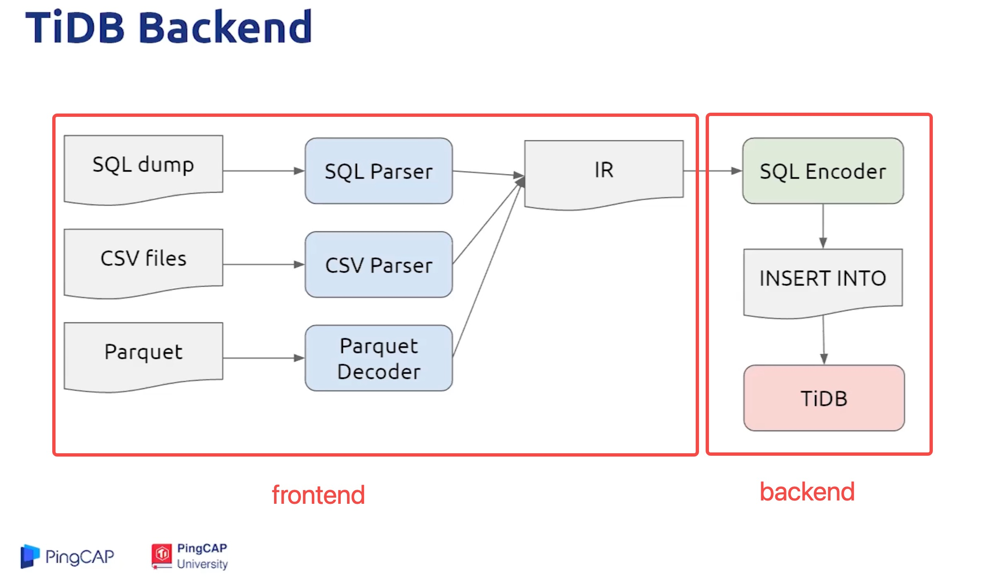

# TiDB-Lighting Architecture

## 1. Overview

1. If you wanna some older things or designs about [TiDB-Lighting](https://github.com/pingcap/tidb-lightning), and now It's been merged into [BR as the part of  TiDB repo](https://github.com/pingcap/tidb/tree/master/br/cmd/tidb-lightning).

2. Also tidb-lightning can be divided into two parts frontend and backend, more details from [a video sharing](https://www.bilibili.com/video/BV1D5411L7z5/).

    

3. Here's a simple steps to guide you how tidb-lightning runs. Inside the `run` function, every Options'll be executed steps by steps including a range of things code block below.

    >Startup step Chain : main() --> app.RunOnceWithOptions --> lightning.run --> restore.NewRestoreController --> Controller.run.

    ```go
    opts := []func(context.Context) error{
    rc.setGlobalVariables,
    rc.restoreSchema,
    rc.preCheckRequirements,
    rc.initCheckpoint,
    rc.restoreTables,
    rc.fullCompact,
    rc.cleanCheckpoints,
    }
    ```

4. Let's get started deeply on `preCheckRequirements`, `initCheckpoint`, `restoreTables` and `fullCompact`. Because, IMHO, It's the most useful for me/us to unsterstand how it works.

## 2. Main Steps

1. For `preCheckRequirements`,

2. For `initCheckpoint`,

    * [type DB interface](https://github.com/pingcap/tidb/blob/eb35c773b512e4e00c42caf7f04ea7397d00c127/br/pkg/lightning/checkpoints/checkpoints.go#L511) is a key interface to be familiar with what functions the checkpoint have.

3. For `restoreTables`, in short, it's the most important, pivotal to see how lightning does restore and responsible for somethings like `init concurrent thread pools`, `pause schedulers in PD`, `Restore engines` and so forth.

    * The two parameters including table-concurrency and index-concurrency can take effect in both tidb-bakcend and local-backend mode.  
        * table-concurrency : represent how many threads to import **table data** parallely inside the [Controller.restoreTables](https://github.com/pingcap/tidb/blob/eb35c773b512e4e00c42caf7f04ea7397d00c127/br/pkg/lightning/restore/restore.go#L1440).  
        * index-concurrency : the same as `table-concurrency` just serving for index parallely.
    * If in local-backend mode, there're a couple of special operations needed to be done and compared with tidb-backend mode.
        * **firstly**, [pauses schedulers](https://github.com/pingcap/tidb/blob/eb35c773b512e4e00c42caf7f04ea7397d00c127/br/pkg/lightning/restore/restore.go#L1468-L1475) existing in PD. And there's a tune named `CanPauseSchedulerByKeyRange`, after v6.1.0 version, which detects whether the scheduler can pause by the key range. If not, all existed schedulers in pd are gonna be deleted and saved in tidb-lightning, untill everthing is ok or tidb-lightning crashs, it'll be restored.
        * **Secondly**, disables GC of tidb cluster by calling `tikv://PdAddr?disableGC=true`. 
        * **Thirdly**, builds a checksum handler encapsulated a db connection inside.  
    * The other logics inside the function are being shared by two tidb or local beckend mode. Builds threads in the number of `index-concurrency` to receive index tasks and in the same way to receive table tasks with `table-concurrency`. Every task including two key info `TableRestore` and `Checkpoint` will be constructed by looping every table in meta, be put to allTasks channel and be processed by the two pools.
    * [`populateChunks`](https://github.com/pingcap/tidb/blob/eb35c773b512e4e00c42caf7f04ea7397d00c127/br/pkg/lightning/restore/table_restore.go#L97) will split source files into region size in the concurrency of Max(region-concurrency, 2). In short there's an inside [fun MarkTableRegion](https://github.com/pingcap/tidb/blob/eb35c773b512e4e00c42caf7f04ea7397d00c127/br/pkg/lightning/mydump/region.go#L149) belonged to MyDump, which's responsible for creating a new source file region. **So, if your sourfile is very big, It'll have a bad impact on concurrent executing**. In this case, a warn message will be here called `file is too big to be processed efficiently; we suggest splitting it at 256 MB each ...`.
    * There're some some special and important processes all named postProcess needed to execute rebase-auto-id/checksum/analyze according to the task config inside the [func Controller.restoreTables](https://github.com/pingcap/tidb/blob/eb35c773b512e4e00c42caf7f04ea7397d00c127/br/pkg/lightning/restore/restore.go#L1574-L1584). Untill all engines are already restored, the postProcesses will be executed in `table-concurrency` concurrently.

4. For `fullCompact`, I've gotta say it's for an orginal problem which'll cause performance ingesting data, but now this feature has **been deprecated**. The ["do not do compact after engine file imported"](https://github.com/pingcap/tidb-lightning/pull/119/commits) pointed that TiKV had supported `auto compaction` during importing data. Since then, there was no need to do compaction. That means, in higher version , TiKV is capable of compacting during importing whatever local-backen or tidb-backend mode you are using.

## 3. Frontend and Backend

### 3.1 Frontend

* [newChunkRestore](https://github.com/pingcap/tidb/blob/5d2030e1d19629b71811c3f14514bad7ed63261a/br/pkg/lightning/restore/table_restore.go#L494) is gonna generate a parser to encode csv/sql/parquent into kvs.

* [IR](https://github.com/pingcap/tidb/blob/5d2030e1d19629b71811c3f14514bad7ed63261a/dumpling/export/ir.go#L16) represents an intermediate representation.

### 3.2 Backend

## 4. Parameters
