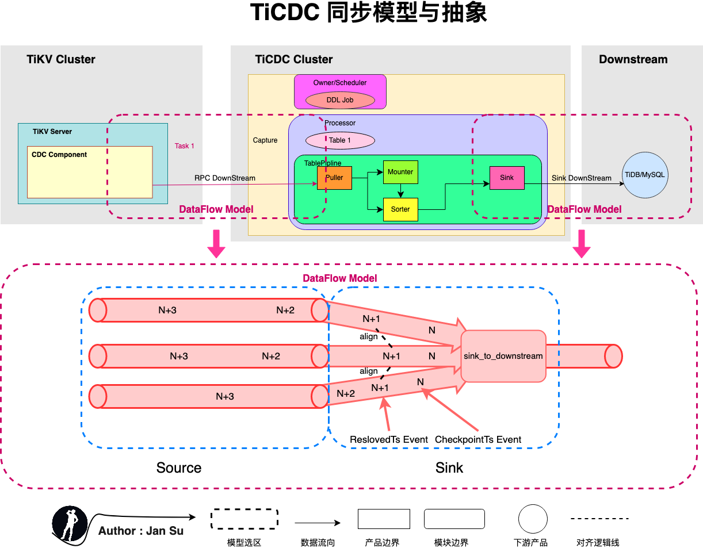
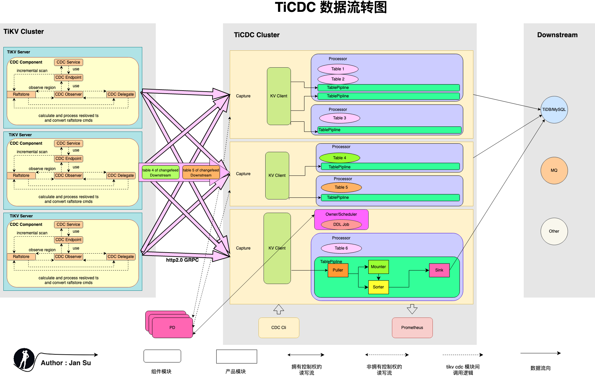
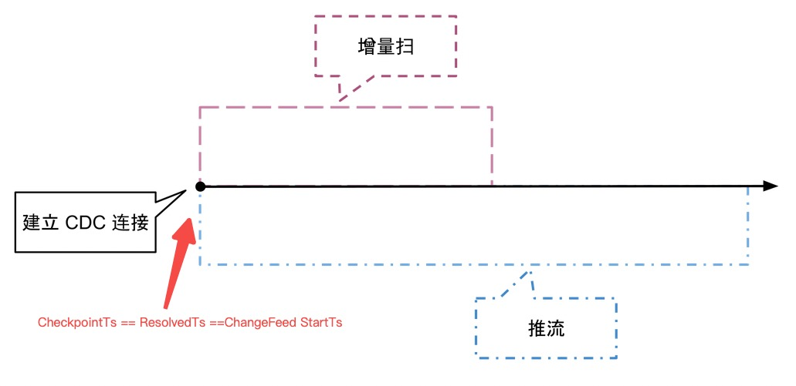
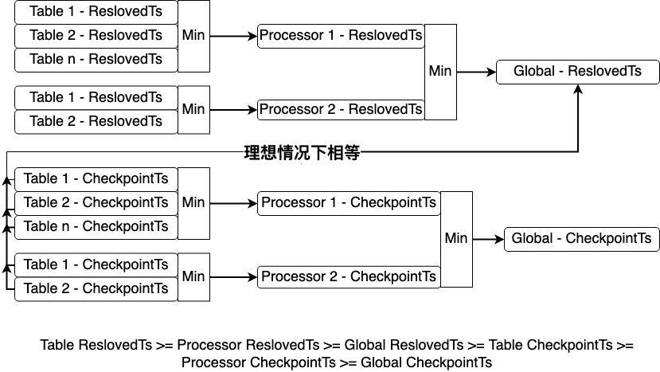
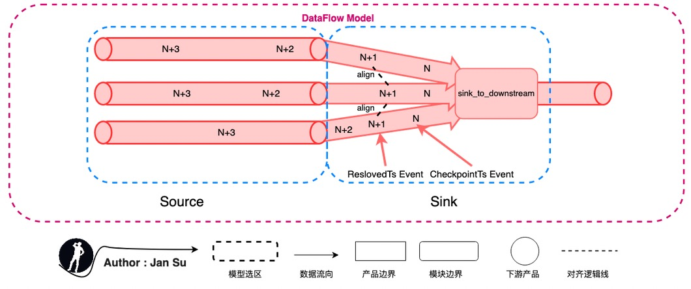

# Analyzing the Architecture Model

## 1. Synchronization Model

### 1.1 Stream Processing vs. Batch Processing

"Data synchronization" essentially belongs to "data processing," which involves transferring data from one end to another. The "end" refers to a product unit, including distributed clusters. The main types of "data processing" can be divided into "stream processing" and "batch processing." Their definitions, characteristics, and origins are as follows, borrowed from the [Flink official website's explanation of computing engines](https://flink.apache.org/flink-architecture.html):  
1. In terms of definition:  
   - Batch processing: Processes a fixed range of datasets using algorithms like MapReduce or Batch to meet functional requirements.  
   - Stream processing: Processes datasets without a fixed range using algorithms based on Event-Time data structures to meet functional requirements.  
2. In terms of characteristics:  
   - "Batch processing," as the name suggests, reduces unnecessary performance consumption during calls by processing in batches, thereby improving performance, e.g., MapReduce.  
   - "Stream processing" emerged as a counterpart to batch processing. For continuously generated data streams like log data or transaction data, stream processing optimizes computation methods based on the inherent orderliness of the data (e.g., occurrence time). For instance, in batch processing, if you want to count the number of changes from state A to state B in Log1 and Log2 between 3:00:00 and 4:00:00, the batch method would aggregate and summarize during the corresponding time window. However, if a change in Log1 falls outside the batch time window (e.g., 4:05:00) due to asynchronous threads or network transmission, this event cannot be calculated in the current batch and must wait for the next batch. This issue can lead to correctness problems in "data synchronization" processing, making stream processing particularly suitable for handling **stateful (e.g., time)** unbounded data streams.  

In summary, this section aims to illustrate that data synchronization is suitable for **stream event processing** types. During the study of TiCDC code, it was found to be based on stream event processing.  

### 1.2 Stream Processing Source and Sink

In the first article of the TiCDC series [TiCDC Series Sharing - 01 - Brief Background](https://tidb.net/blog/70588c4c), it was mentioned that TiCDC provides an At Least Once synchronization model. At Least Once describes: **"The delivery semantics of a stream processing system when any component node in the synchronization chain fails."** The complete set of related semantics is as follows:  
1. At Most Once: Operator events are processed only once, i.e., downstream operators are assumed to have successfully received messages from upstream by default. Data is lost in case of failure.  
2. At Least Once: Operator events may be processed multiple times, i.e., if downstream operators fail to receive messages, upstream operators will retransmit the data.  
3. Exactly Once: Operator events are effectively processed only once, i.e., if downstream operators fail to receive messages, they will receive retransmitted data from upstream. However, for the downstream's downstream operators (e.g., external systems like MySQL), the message is delivered effectively only once.  

In **stream processing (event processing)**, systems like Google Dataflow and Flink achieve Exactly Once through "deduplication" and ["distributed snapshots"](https://lamport.azurewebsites.net/pubs/chandy.pdf), respectively. Exactly Once offers better performance but has its pros and cons under different algorithms. For details, refer to [Flink China Blog - Discussing the 'Exactly Once' Feature in Stream Computing](https://juejin.cn/post/6844903857558913038#heading-5). Returning to why TiCDC only provides At Least Once is unknown. It might be due to factors like expectations, delivery, scheduling, and optimization. However, it is believed that this feature will be provided in the future.  

The following diagram abstracts the synchronization model by comparing it to general stream engines (Dataflow or Flink), where the source is the sender and the sink is the receiver. Currently, two parts in TiCDC can be categorized under this abstraction:  
1. The process of collecting kv change logs in the tikv cdc component and delivering them to TiCDC Capture.  
2. The process of collecting data in the puller and delivering it to downstream platforms like MySQL, MQ, or others.  



Abstracting to Source and Sink allows applying the "delivery semantics of stream processing systems" to this link. If message delivery fails in this link, it indicates the level of semantic support provided. As mentioned earlier, **TiCDC provides At Least Once semantic support**, which means it will retransmit, and the retransmitted duplicate data will be delivered again. However, due to the implementation of **"idempotency,"** data consistency is maintained.  
1. If the tikv cdc component fails to deliver a message to TiCDC Capture, it will retransmit.  
2. If TiCDC Capture fails to deliver a message to the Downstream Platform, it will retransmit.  

The abstraction of Source and Sink in TiCDC also verifies that TiCDC has some similar foundational definitions for achieving "Exactly Once," but it has not been implemented yet.  

## 2. Product Architecture

The following diagram shows the TiCDC data flow architecture. TiCDC consists of stateless nodes called Capture, which are composed to achieve high availability through PD's internal etcd. It supports creating multiple synchronization tasks and synchronizing data to multiple different downstreams.  
Before understanding TiCDC, it's essential to grasp some conceptual definitions, such as Owner, Processor, ChangeFeed, ReslovedTs, CheckpointTs, etc. Some concepts are sourced from the [TiDB official explanation](https://docs.pingcap.com/zh/tidb/stable/ticdc-glossary#%E5%8F%98%E6%9B%B4%E6%95%B0%E6%8D%AE), while others are derived from personal reading and research of relevant documents and source code. Discussions are welcome.  



### 2.1 Owner

Definition: A special role of Capture.  
Location: Internally within Capture, competing to become the Owner. Only one Capture will successfully become the Owner.  
Function: Maintains the synchronization status of all Capture in the global synchronization Task. For example, Table transfer Capture scheduling, executing DDL, updating the changefeed's Global CheckpointTs, and Global ResolvedTs.  

### 2.2 Processor

Definition: The synchronization processing unit of a data table.  
Location: Internally within Capture, multiple Processors can be started in each Capture. The number of Processors is related to ChangeFeed, i.e., a multi-table synchronization ChangeFeed is scheduled to each Capture. The Owner will build Processors on different Captures based on the (Capture, ChangeFeed, Table count) tuple.  
Function: Responsible for pulling, sorting, restoring, and distributing change data for the tables assigned to it. The creation of a ChangeFeed triggers the creation of a Processor, which reads the KeyRange and Region distribution of the assigned tables and establishes an EventFeed gRPC stream. During the continuous streaming process, it maintains its Processor ResolvedTs and Processor CheckpointTs and synchronizes data to the downstream based on the Global ResolvedTs.  

### 2.3 Puller

Definition: The module that pulls Change logs from tikv.  
Location: DDL Puller is located within the Processor, one for each Processor.  
&nbsp;&nbsp;&nbsp;&nbsp;&nbsp;&nbsp;&nbsp;&nbsp;Row change Puller is located within the TablePipline, one for each TablePipline (i.e., Table).  
Function: Continuously pulls Change Logs from TiKV, writing to Buffer and Sorter.  

### 2.4 Mounter

Definition: The module that translates KV Change Logs to TiCDC Change Events.  
Location: Internally within Capture, the Mounter is a global thread pool for Capture, but since it is called by each TablePipline, it is considered internal to Tablepipline.  
Function: Decodes RawKVEntry into RowChangedEvent, i.e., translates RawKV into the data needed by SQL.  

### 2.5 Sorter

Definition: The module that sorts unordered kv change logs.
Location: Internally within Tablepipline, the unifiedSorter wraps Level DB, other engines are not introduced here, [for details, refer to the design document ticdc-db-sorter](https://github.com/pingcap/tiflow/blob/master/docs/design/2022-03-16-ticdc-db-sorter.md).  
Function: Receives unsorted data, stores it in the internal LevelDB, and sorts it based on CheckpointTs for transaction and row data change restoration.  

### 2.6 Sink

Definition: The abstract module for synchronizing to multiple downstream platforms.  
Location: Internally within Capture.  
Function: Triggers row change events or DDL change events to synchronize change data to the downstream.  

### 2.7 ChangeFeed  

Definition: The unit of synchronization task in TiCDC, each ChangeFeed task includes the synchronization of multiple tables.  
Location: Located in PD, once a ChangeFeed is created, it will be processed by the corresponding module in Capture.  
Function: Provides an easily understandable "synchronization task" semantic definition for users.  

## 3. ReslovedTs and CheckpointTs

### 3.1 ReslovedTs  

Definition: The latest consistent data that TiDB can read ( ResolvedTs < All Unapply CommitTs  ), indicating that the tikv committed log before ResolvedTs has been received by the puller and can be restored as a complete transaction.  
Location: In the TiKV CDC Component, it observes the change of LockCF during data Apply to monitor the data changes of the Region.  
Function: Reduces the latency of TiCDC in restoring transactions, i.e., ResolvedTS ≤ Min Region StartTS < all unapplied CommitTS. The initialization, delivery, and recommendation principles of ReslovedTs are as follows:  
1. **ResolvedTs generation**: During the initialization phase, it is the event timestamp passed in at the beginning. After incremental scanning, it is obtained from the logs listened to from RaftStore.  
2. **ResolvedTs delivery**: TiKV CDC Component pushes the data of active Regions' Prewrite + Commit (carrying Ts) to the outside and promotes the non-active Regions' advancement through heartbeat (carrying Ts).  
3. **ResolvedTs advancement**: ResolvedTs is divided into Table-level, Processor-level, and Global-level. The resolved ts obtained by Capture from the kv client is advanced by taking the minimum of all regions sorted by table. That is, the event containing the resolved ts event output after sorting within the table is stored as the resolved ts of this table. The processor summarizes the resolved ts of all tables it is responsible for and the resolved ts of the ddl puller, takes the minimum value, and updates it as the resolved ts of the table. The owner reads the resolved ts of all tables, takes the minimum value, and updates the global resolved ts.  

### 3.2 CheckpointTs

Definition: A type of ResolvedTs, indicating that all data before CheckpointTs has been synchronized to the downstream.  
Location: In Tablepipline, Processor, and Owner, constantly updated during the continuous streaming phase.  
Function: Ensures transaction atomicity. For example, if a transaction spans multiple regions, some keys may be successfully delivered to the capture while others are not, leading to a loss of atomicity for the transaction. CheckpointTs indicates that all keys less than checkpointTs have been sent to the Capture before this time point.  

## 4. Startup Process  

Overall, the creation of a ChangeFeed goes through two stages: **"Incremental Scan" + "Continuous Streaming"**. The detailed description is as follows, referring to [ticdc-design](https://github.com/pingcap/tiflow/blob/master/docs/design/2020-03-04-ticdc-design-and-architecture-cn.md#tikv-%E5%85%B7%E4%BD%93%E8%A1%8C%E4%B8%BA)：  



### 4.1 Incremental Scan

When a ChangeFeed creation request is made, it carries a checkpoint_ts. Upon receiving the request, TiKV constructs a rocksdb snapshot and retrieves the Range ( checkpoint_ts, uint64::MAX ] - all records greater than checkpoint_ts.  
The incremental scan targets the data in TiKV RocksDB. As shown in the example, the incremental scan (TS1,TS5] scans LockCF + DefaultCF and constructs the corresponding perwirte records. It scans DefaultCF and WriteCF to build the records without locks greater than @TS1, simultaneously constructing the data for the continuous streaming phase.  

```sql
@TS1 begin;                                                 
@TS2 update Table_Jan set name = 'Jan Su' where id = 1;                           
@TS3                          begin;                      
@TS4 commit;                                                
@TS5                          update Table_Jan set name = 'Jan Su' where id = 2;
```

### 4.2 Continuous Streaming  

After the incremental scan, TiCDC continuously streams data through **"TiKV CDC Component --> Capture --> Downstream"**, maintaining CheckpointTs and ResolvedTs in real-time. Inside the TiKV CDC Component, a Region Map is maintained to listen to the log changes of RaftStore in real-time to push data to Capture. The Capture internally sorts the scattered TiKV Change Logs received and restores transactions to distribute and consume data to the downstream.  

### 4.3 Log Listening

After the incremental scan, the TiKV CDC Component registers an Observer in the Coprocessor to listen to the TiKV Change Log generated by RaftStore, continuously providing the data needed for the sustained push after the incremental scan.  

## 5. State Maintenance  

For DML changes, all Processors synchronize to the Global ResolvedTs, write to the downstream, and then update the CheckpointTs. For DDL changes, all processor CheckpointTs synchronize to the DDL commitTs, and then execute the DDL to the downstream. The calculation methods for Global ResolvedTs and Processor ResolvedTs are as follows, and maintain the following chart:  
1. Global ResolvedTs is calculated by the owner, taking the minimum value of all Processor's ResolvedTs and DDL puller's ResolvedTs.  
2. Processor ResolvedTs is calculated by the Processor, taking the minimum value of all Tablepipline's ResolvedTs.  



## 6. State Fault Tolerance  

State fault tolerance refers to how TiCDC provides "At Least Once" fault tolerance guarantees when data delivery ends fail.  
**The following are two possible scenarios for state fault tolerance:** The CheckpointTs and ResolvedTs of the Table can be understood similarly to the Snapshot mechanism in "Exactly Once," but they provide "At Least Once" semantic guarantees.  

1. **Taking the tikv cdc component as the data delivery end:** The receiving end is TiCDC Capture. Suppose the change log data of the table (N+2) managed by the Tablepipline is already in the Puller. Still, due to the Region Leader change, the DownStream connection between GRPC and TiKV needs to be re-established. The data will be re-pulled based on the Table ResolvedTs (N+1), but this data already exists in the Puller, causing data redundancy. The "At Least Once" semantic guarantee will result in the re-pulled data being restored as redundant data changes, i.e., the subsequent data will overwrite the previous data during synchronization to the downstream, making the operation idempotent.  

2. **Taking TiCDC Capture as the data delivery end:** The receiving end is the Downstream Platform. When the Capture where the Table is located crashes, the Owner will detect it and create a new Processor and Tablepipline on other Captures. It will request the TiKV CDC Component to reconstruct the GRPC Stream connection to pull TiKV Change Log data based on the CheckpointTs stored in PD, achieving high availability and fault tolerance.  



## 7. References

[1. Introduction to Apache Flink Concepts: The Cornerstone of Stateful Stream Processing Engines](https://www.bilibili.com/video/BV1qb411H7mY?spm_id_from=333.337.search-card.all.click)  
[2. Analysis of Flink Exactly Once State Fault Tolerance Paper Lamport's "Distributed Snapshots"](https://zhuanlan.zhihu.com/p/96045864)  
[3. Original Text of Flink Exactly Once State Fault Tolerance Distributed Snapshots: Determining Global States of Distributed Systems](https://lamport.azurewebsites.net/pubs/chandy.pdf)  
[4. Flink Official Website Computing Engine Description](https://flink.apache.org/flink-architecture.html)  
[5. TiCDC Series Sharing - 01 - Brief Background](https://tidb.net/blog/70588c4c)  
[6. Comparison of Implementation Methods for Exactly Once "Distributed Snapshots" and "Deduplication"](https://juejin.cn/post/6844903857558913038#heading-5)  
[7. TiCDC Design Document ticdc-db-sorter](https://github.com/pingcap/tiflow/blob/master/docs/design/2022-03-16-ticdc-db-sorter.md)  
[8. TiCDC Design Document Introduction to "Incremental Scan + Streaming"](https://github.com/pingcap/tiflow/blob/master/docs/design/2020-03-04-ticdc-design-and-architecture-cn.md#tikv-%E5%85%B7%E4%BD%93%E8%A1%8C%E4%B8%BA)
