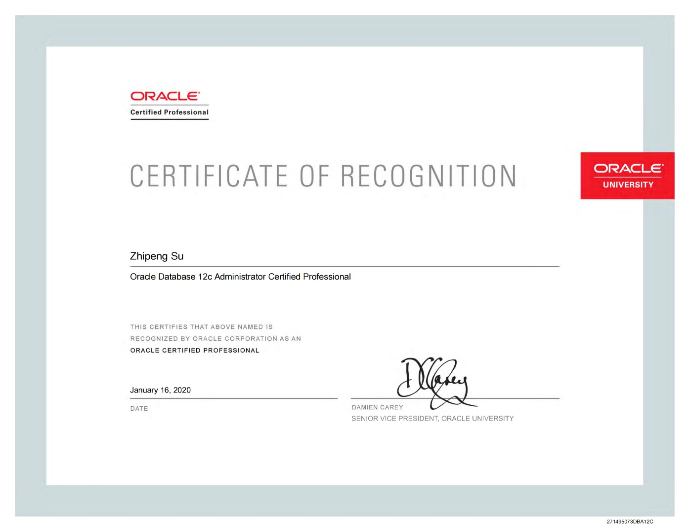
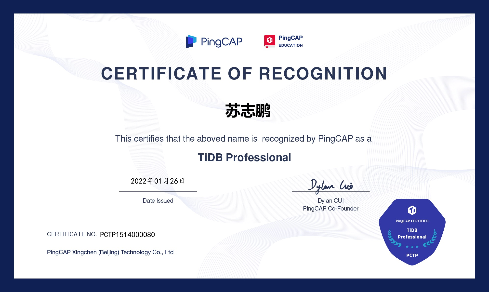
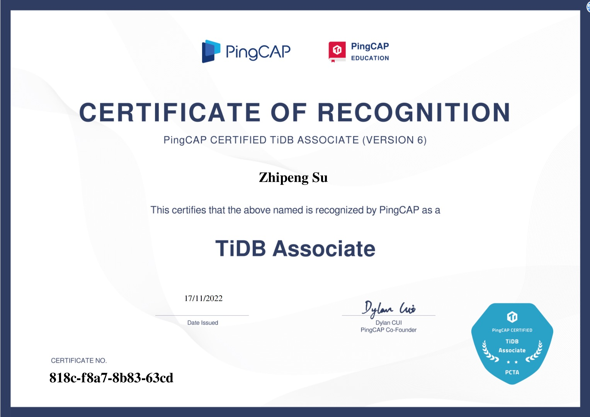
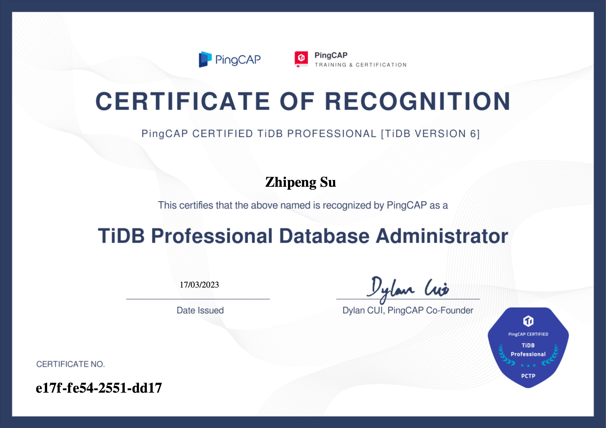
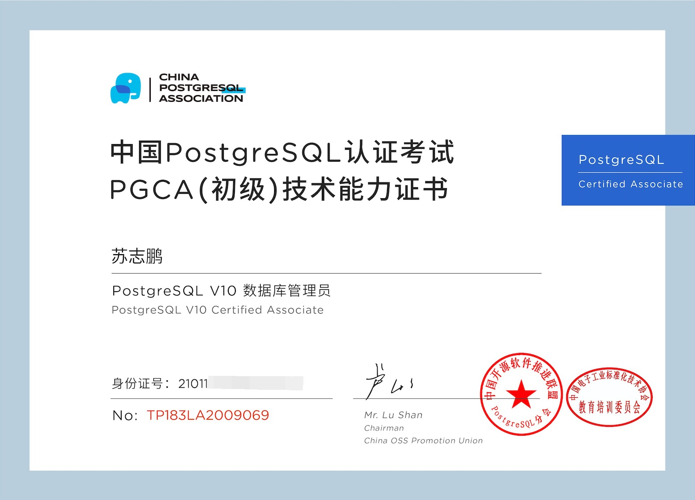
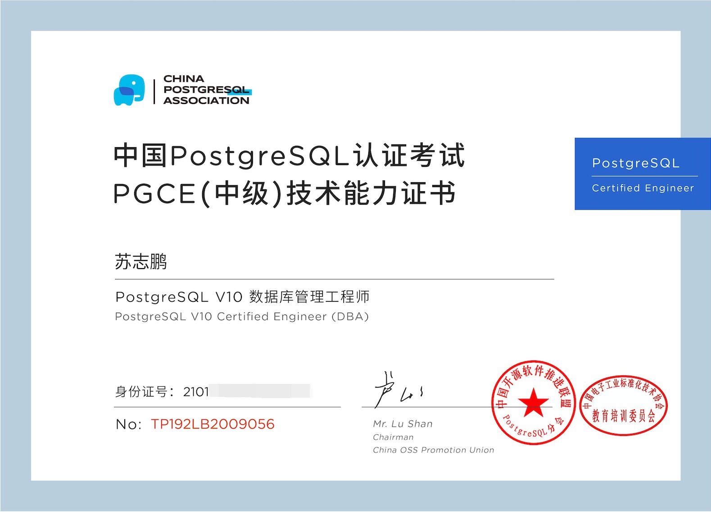
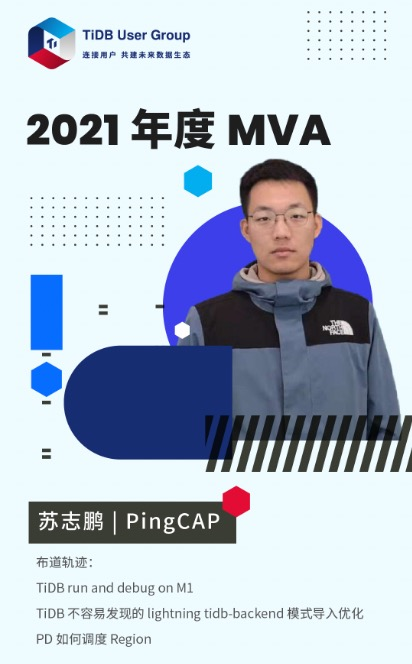

# 博客及博主简介


- Bilibili：[AskAric](https://space.bilibili.com/318184941?spm_id_from=333.1007.0.0)
- 技术博客：[TiDB Point_Get 点查的一生](./tidb/07TiDB-源码阅读/7-1TiDB/02TiDB%20Point_Get%20点查的一生.md)
- Github：<https://github.com/aricSu>
- Email：jan-su-dev@outlook.com
- Wechat：xh9836(```请说明你的来意及获取位置```)

## 博客内容

1. **是什么**：主要是记录个人在 **数据库方面知识**、**英语笔记**，及 **值得分享的内容**。
2. **为什么**：期望以 博客 的形式，克服自己的遗忘，并给志趣相投的伙伴提供资料，也纠错自己。
3. **怎么做**：在导航栏 **“文档笔记”** 中，记录学习过程，也欢迎大家在 **“社区”** 中留下你的意见和问题。

## 技术缘起

1. 初中时，读到一本书《马云创业启示录》（PS：虽然书中内容与技术关系不大）让我看到了，互联网带给中国的改变。随后我也增开过几次网店，并赚了些零花钱😁，这番经历导致了我在大学时毅然决定走向 IT 相关专业，并在大学期间协助老师使用 **Python + Scrapy + chrome-driver + phantomjs** 爬取 Boss 直聘，51 job 等信息用于分析，学院课程改革方向与市场需求匹配。
2. 临近毕业，在老师的推荐下走进数据库行业。初入行业，选择了稳定且周边生态健全的 Oracle 学习，但当时做的是数据库管理员（DBA），个人觉得还是应该深入数据库内部（代码层）去了解一下，就像 **`What I cannot create, I do not understand. -- Richard Phillips Feynman`** 说的一样，不会造便不能真正理解。随后，有幸来到 [PingCAP](https://baike.baidu.com/item/PingCAP/60056692?fr=aladdin) 工作，学习新一代分布式 HTAP 数据库。
3. 秉承深入内核学习思路，在这个过程中逐渐了解 Golang, Rust, NodeJs 等语言，技术之路很有趣，是推动世界前进的重要力量。

---


## 视频演讲

1. [【2022年】TiDB 社区年度总结 - 版主 - 苏志鹏（jansu-dev）](https://asktug.com/t/topic/998896#h-2)

---

## 证书荣誉

1. Oracle OCP


2. TiDB PTCP(chinese version)


3. TiDB PTCA(english/global version)


4. TiDB PTCP(english/global version 6)


5. PostgreSQL PGCA


6. PostgreSQL PGCE


7. AskTUG MVA: [相关链接](https://asktug.com/t/topic/273501)


---

## 关于生活
