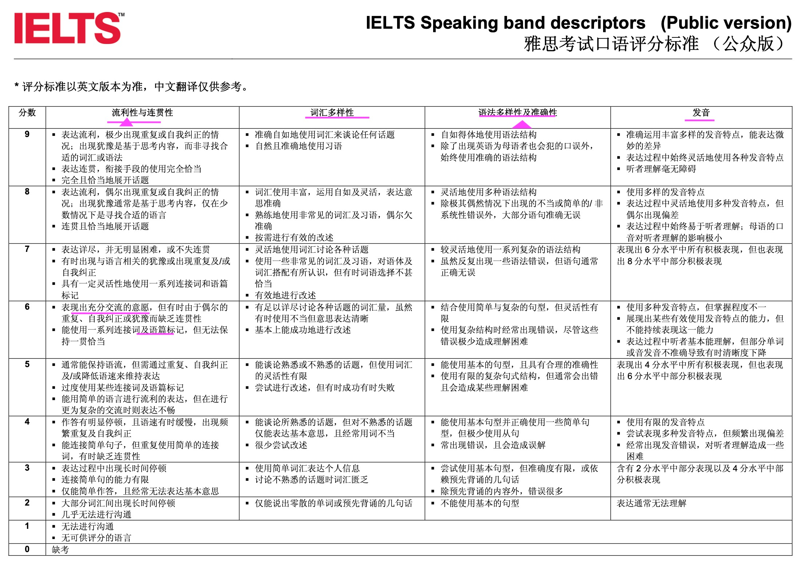
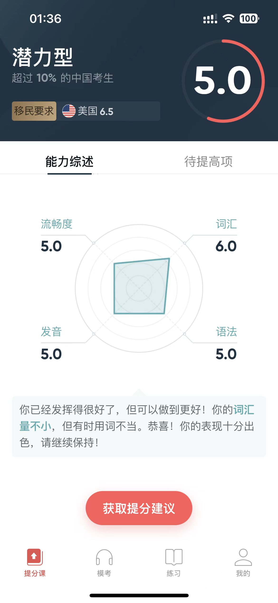

# 如何准备雅思

## 雅思规则

## 口语问题

1. 积极表达意愿不强
2. 流畅度有问题
3. 发音问题不大
4. 对问题的时态或准确性不敏感

## 我的计划

1. 除了英语之外，我还测试了 `听` 的部分，感觉很难。只做了 14 道听力真题，只听出其中 1 个题，感觉很不好。  
2. 所以，需要大量的时间去联系 `听`, `读`, `写` 三个部分，对 `说` 的部分前期以保持语感，修正连贯性为主。  
3. 我认为最后的雅思目标分是 7。

以 4 个月为期，每天 1h 投入，总时间为 `30 * 4 * 2 = 240h`.

## 测试结果

我第一次使用 `流利说.雅思` 测试的雅思口语结果如下，为 5.0 分。

## 学习进度

| | Saturday | Sunday | Monday | Tuesday | Wednesday | Thursday | Friday |
| - | - | - | - | - | - | - | - |
| | | | 1.得到雅思听力和口语的测试结果 2. 完成口语练习，在 `雅思考满分` | 1. 看并抄录一份 7min 的[乔布斯内部视频](https://www.bilibili.com/video/BV1Rt411U7Ve),目的是先听 3 遍，再背下来，再听看对听力是否有改善(有部分改善) 2. 翻译之前的英语笔记成中文，并复习其中内容（语法，单词，词组）3. 完成一个口语练习在 `雅思考满分` | | | |
| 花费时间 | None | None | 3h(11:00-2:00) | 5h(11:00-5:00) | | | |

| Date | Model Text | BestScore | BestTimeConsuming | MyBestScore | MyTimeConsuming |
| - | - | - | - | - | - |
| 2023:04:03| forgot to record | N/A | N/A | N/A | N/A |
| 2023:04:04| Do you have patience? --> I will be lying if I say I have patient. Even though I know that patient is one of the most important virtue that one can have. I'm not a patient person, I am always want to rush things no matter it's for work, or in my personal life, even a minute more, I'll consider it as a waste of time. | 93 | 35s | 91 | 27s |

## 新单词，新句子，新词组

这一部分是关于我没有见过的新词和误解。

1. monologue 独白
2. interpret 说明
3. corridor 通道
4. entrance to somewhere 某地的入口
5. look out onto 向外看向
6. be moved by 被感动
7. put out 出版
8. put out of 消灭
9. it's what we are 这就是我们（口语中用的挺频繁的句型） + about + doing/clause
10. intention --> 目的
11. deliberate --> 深思熟虑的，故意的
12. manifesto --> 声明，宣言
13. phenomenal --> 杰出的，可感知的
14. billboards --> 广告牌
15. turn around --> 转向反方向，(生意或经济) 好转
16. estate --> 遗产
17. representative --> 典型的，有代表性的，代表，代理人
18. videotape --> 录像带

## 迷惑部分

这部分是与课程或计划无关，但是，在学习过程中产生的一些疑惑。

1. `think about doing` 与 `consider doing` 的不同  
大部分场景可以通用，简而言之，不同在于`think about` 是更通用的且可以指向任何的思考过程，同时，`consider doing` 通常意味着更加集中在做决定的场景上。
2. `intention` 与 `aim` 的不同  
意义相似，不同在于 intention 通常使用在一个客观的指定动作或思考过程中，而 aim 更多是的主观层面的目标。
