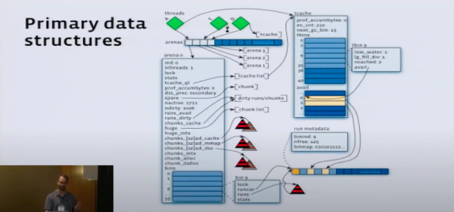
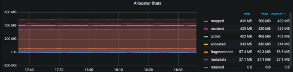
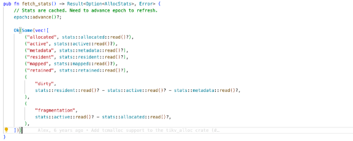
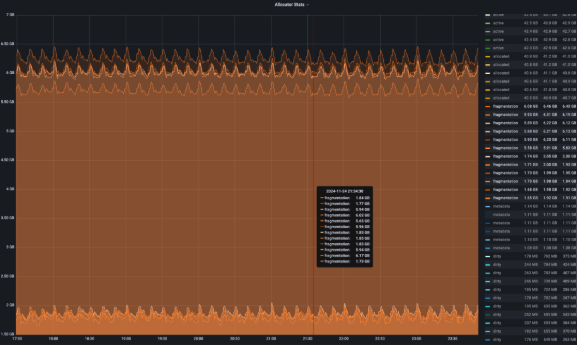

# TIKV 监控面板 - Allocator Stats

## 1. 面板简介

&nbsp;&nbsp;&nbsp;&nbsp;&nbsp;&nbsp;&nbsp;&nbsp;简而言之，Jemalloc 是一个通用的 malloc(3) 实现，着重于减少内存碎片和提高多线程并发性能，TiKV 使用 Jemalloc 管理内存。TiKV 的 Allocator Stats 面板对分析 TiKV 内存消耗至关重要。

## 2. 面板位置

>     Cluster-TiKV-Details --> Memory --> Allocator Stats

## 3. 面板详情

类型如下：

* mapped
* resident
* active
* allocated
* fragmentation
* metadata
* retained
* dirty

***

1. **allocated** : Jemalloc 接到 APP 申请的物理内存总字节数。
2. **active** : Jemalloc 为进程分配的物理内存总字节数，通常 active >= allocated，表示已分配且正在使用的内存。
3. **metadata** : Jemalloc 为管理内存额外的 metadata 物理内存消耗。
4. **mapped** : Jemalloc 映射的内存总字节数，mapped > active(为 APP 映射的)。
5. **resident** : Jemalloc 从当前实际驻留在物理内存中的内存量。即：通过系统调用从操作系统申请的 OS 内存，反映了实际占用物理内存的大小。
6. **retained** : Jemalloc 保留的虚拟内存(virtual memory)映射大小，与物理内存（physical memory）没有强关系。
7. **dirty** : **resident - active - metadata**, 一个物理内存区域被分配又被释放，说明可以被 Jemalloc GC 了，就是“脏”的。Jemalloc 会定期用 madvise() 清理脏页，会经历 dirty -> muzzy -> retained 的过程。
8. **fragmentation** : **active - allocated**, 代表内存碎片(内部碎片 + 外部碎片)的占用情况。

&nbsp;&nbsp;&nbsp;&nbsp;&nbsp;&nbsp;&nbsp;&nbsp; 一个经典的场景，如果 TiKV 在 Region 均衡的前提下，内存高度不均衡（GB 级别）有可能是内存碎片导致的，如下图所示。

## 4. 参考文献

1. [jemalloc doc](https://jemalloc.net/jemalloc.3.html#stats.active)
2. [tikv code addr](https://github.com/tikv/tikv/blob/568b414e99bebf118eedd9b50f24f299efbcab79/components/tikv_alloc/src/jemalloc.rs#L169-L189)
3. [youjiali blog](https://youjiali1995.github.io/allocator/jemalloc)
4. [Jemalloc analysis](https://zhuanlan.zhihu.com/p/48957114)
5. [Tick Tock, malloc Needs a Clock](https://www.youtube.com/watch?v=RcWp5vwGlYU&list=PLn0nrSd4xjjZoaFwsTnmS1UFj3ob7gf7s)