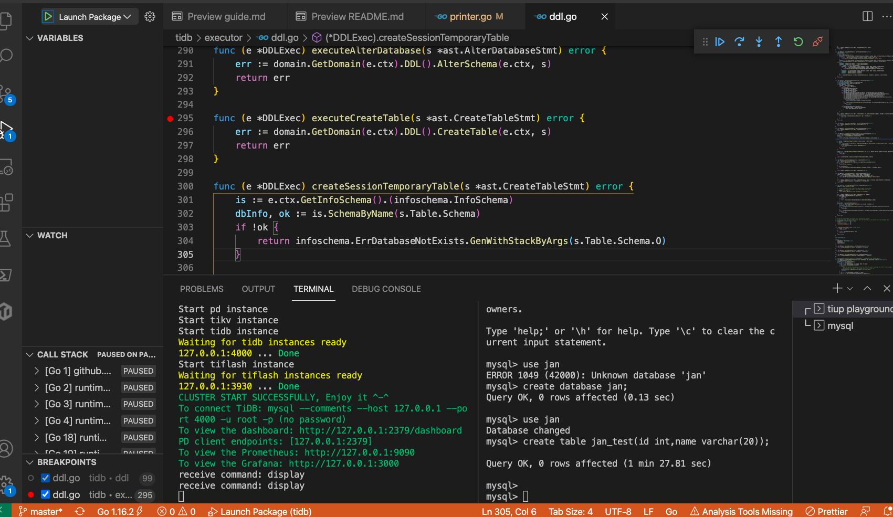

# TiDB run and debug on M1

## 一、Summary

&nbsp;&nbsp;&nbsp;&nbsp;&nbsp;&nbsp;&nbsp;&nbsp;前不久刚换 Mac M1 时，不禁被自己的盲目的 “吃螃蟹🦀️行为” 蠢哭了。由于 M1 的是 arm 服务器，在做各种数据库测试时搭建本地环境很是不便，尤其是 DEBUG 数据库代码。

&nbsp;&nbsp;&nbsp;&nbsp;&nbsp;&nbsp;&nbsp;&nbsp;**我曾做过如下尝试：**  

&nbsp;&nbsp;&nbsp;&nbsp;&nbsp;&nbsp;&nbsp;&nbsp; 1. 在远程家中 windows 搭建虚拟机，购买腾讯云服务器作为中间跳板机，使用 frp 软件穿透内网映射虚拟机 IP 至云服务器 IP：  
&nbsp;&nbsp;&nbsp;&nbsp;&nbsp;&nbsp;&nbsp;&nbsp; 优点：Oracle、TiDB、MySQL、PG 随机搭建，不受平台、机器指令集限制。  
&nbsp;&nbsp;&nbsp;&nbsp;&nbsp;&nbsp;&nbsp;&nbsp; 缺点：内网穿透效率效率受外网网速限制，有时在客户现场想做个实验直接卡死。  
&nbsp;&nbsp;&nbsp;&nbsp;&nbsp;&nbsp;&nbsp;&nbsp;&nbsp;&nbsp;&nbsp;&nbsp;&nbsp;&nbsp;&nbsp;&nbsp;&nbsp;&nbsp;&nbsp; 此外，更不便的是使用 vscode 的 remote code 功能或 TiDE 去 debug tidb 时灵是不灵。  

&nbsp;&nbsp;&nbsp;&nbsp;&nbsp;&nbsp;&nbsp;&nbsp; 2. 在 M1 arch 架构长寻找运行 x86 软指令集的 VM，目前已经有些软件支持了，如：QEMU、ACVM、UTM、ToyVM 等，详情可浏览 [油管视频-Apple Silicon M1 Virtualization: Running x86 and ARM Virtual Machines](https://www.youtube.com/watch?v=vm8fvNxByHU)，结果不是运行效率低下几乎卡死，就是不定不稳定会影响数据库使用，投入产出比不高。  

&nbsp;&nbsp;&nbsp;&nbsp;&nbsp;&nbsp;&nbsp;&nbsp;**最后惊喜的发现， TiDB 原生支持了 TiDB running on M1，[详情参考官网](https://docs.pingcap.com/zh/tidb/stable/quick-start-with-tidb#%E5%9C%A8-mac-os-%E4%B8%8A%E9%83%A8%E7%BD%B2%E6%9C%AC%E5%9C%B0%E6%B5%8B%E8%AF%95%E7%8E%AF%E5%A2%83)**  
&nbsp;&nbsp;&nbsp;&nbsp;&nbsp;&nbsp;&nbsp;&nbsp; 1. 起初，我曾尝试过直接在 M1 上 build tidb，当时应为依赖库有问题，尚未成功。在看了一篇 [TiDB 作者文章-在 ARM64 上面运行 TiDB](https://www.jianshu.com/p/e07928fb7577) 发现在 arm 上是应有成功经验的，于是重新尝试。  
&nbsp;&nbsp;&nbsp;&nbsp;&nbsp;&nbsp;&nbsp;&nbsp; 2. 这是 build 直接就成功了，查阅 tidb 官方文档发现从 v5.2.2 开始已经提供了 tiup playground 实验集群支持。  

## 二、Tiup Operations

&nbsp;&nbsp;&nbsp;&nbsp;&nbsp;&nbsp;&nbsp;&nbsp; 分别安装、启动可持久化 tidb 存储层数据的集群，名为 mycluster。启动之后 Dashboard、Promethus 均可观察到部分图像。但美中不足的是，当我想 tiup cluster cluster-name deploy topology.yaml 真正部署一个集群时，发现 tiup 之前基于 linux 自定义的 service，但 M1 中并不是一套指令，所以会报错。
&nbsp;&nbsp;&nbsp;&nbsp;&nbsp;&nbsp;&nbsp;&nbsp; **不过已经能满足日常实验、DEBUG需求了**

```shell
curl --proto '=https' --tlsv1.2 -sSf https://tiup-mirrors.pingcap.com/install.sh | sh \
tiup --tag mycluster playground v5.2.1 --db 1 --pd 3 --kv 3 --monitor
```

## 三、Patching TiDB

### 3.1 改写代码

1. Clone Repo 库代码；

    ```shell
    git clone https://github.com/pingcap/tidb.git  \
    && cd tidb/util/printer 
    ```

2. 手动将日志内容 logutil.BgLogger().Info("Welcome to TiDB version." 修改为 logutil.BgLogger().Info("Welcome to TiDB **which is special Jan** version."；

### 3.2 手动 Build TiDB

&nbsp;&nbsp;&nbsp;&nbsp;&nbsp;&nbsp;&nbsp;&nbsp;Build TiDB 观察到 Build TiDB Server successfully! 说明已经编译成功。

```shell
cd ../.. && make
```

### 3.3 手动 Patch TiDB  

&nbsp;&nbsp;&nbsp;&nbsp;&nbsp;&nbsp;&nbsp;&nbsp;手动将新编译好的 tidb-server 二进制文件放入 tiup 启动目录。**注意：**替换 YOUR_COMPUTER_USERNAME 为自己真正用户名。

```shell
cd bin && mv tidb-server tidb-server.version_jan \
mv tidb-server.version_jan /Users/YOUR_COMPUTER_USERNAME/.tiup/components/tidb/v5.2.1/ \
mv tidb-server.bak && mv tidb-server.version_jan tidb-server
```

### 3.4 日志验证  

&nbsp;&nbsp;&nbsp;&nbsp;&nbsp;&nbsp;&nbsp;&nbsp;  启动 tidb 并验证改动是否生效。cat 观察到信息 “Welcome to TiDB which is special Jan version” 说明改动成功。

```shell
tiup --tag mycluster playground v5.2.1 --db 1 --pd 3 --kv 3 --monitor \

cd /Users/YOUR_COMPUTER_USERNAME/.tiup/data/mycluster/tidb-0 \

cat tidb.log|grep "Jan version"
```

## 四、TiDE DEBUG TiDB

&nbsp;&nbsp;&nbsp;&nbsp;&nbsp;&nbsp;&nbsp;&nbsp; VsCode 安装 TiDE 按照 与 TiDE Step-by-Step Guide 一步步操作便可 DEBUG 了，或者参考 [Aiky哇](https://blog.csdn.net/qq_35423190/article/details/115676932) 写的指引也挺好，基本内容一致。
&nbsp;&nbsp;&nbsp;&nbsp;&nbsp;&nbsp;&nbsp;&nbsp; **下面展示一张我本地电脑 DEBUG 成功的图片，✌️！**

