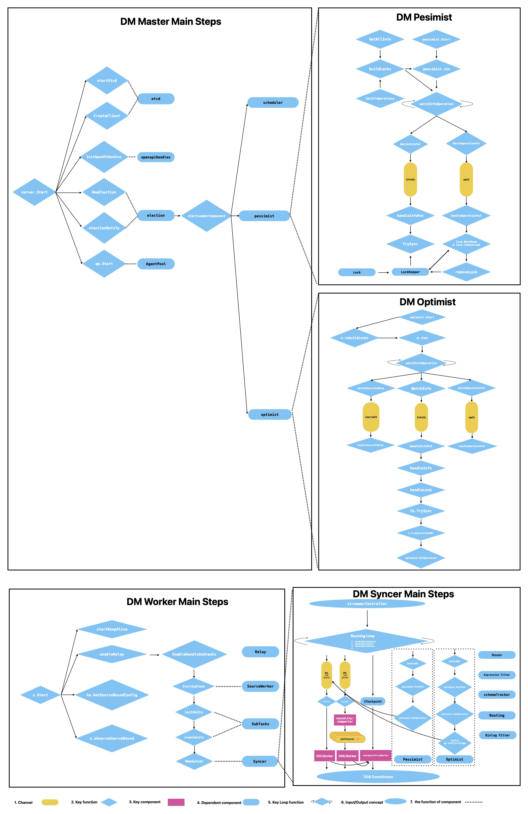

# DM Architecture Overview

## 什么是 DM

1. 如果你第一次看到我的文档，我想你已经熟悉DM了。没有这些，我想大家可以看看[DM官网](https://docs.pingcap.com/zh/tidb/stable/dm-arch)。

2. 正如我们可以看到下面的架构，简而言之，它用来不断地将数据从 MySQL 单实例或分片 MySQL 集群迁移到TiDB集群。DM-worker 与 MySQL 实例的数量是1比1的关系，DM 实际上所做的是读取 MySQL binlog，并在TiDB集群的复制过程中将它们全部转换为 DML (插入、更新、删除类型) 和 DDL 语句。

    

## 文章目的

1. 在“Master”，“Worker”，“Syncer”和“SourceWorker”的基础上，我想简单介绍一下DM。所以，在读完它们之后，你可以知道DM是如何工作的，每个关键组件的含义和职责。

2. 对于“Metrics”一页，当生产环境中出现严重错误或出错时，它似乎更有用。这包括每一个指标的介绍，它们是如何计算的，以及何时触发它们进行计算。

## 文章结构

1. 对于DM工具，作为一个支持者的角色，首先我非常赞同当你试图修复或调查一些问题时，你应该学习工具的架构。这一切都是因为产品环境对客户的应用非常重要。关于工具如何运行的主要思想或知识在故障排除中是非常重要的。这样，你就可以尽快修复它，比正常情况下更大更快。

2. 而且，我还尝试将DM如何运行的一些主要步骤分散到一张图片中，这在学习日常生活时很有用，或者在进行故障排除时直接在源代码目录中搜索函数名。在相关的页面中，我将解释我在图片中雕刻的每个组件的更多细节 [`DM master`](./03TiDB-DM%20Master.md), [`DM Worker`](./04TiDB-DM%20Worker.md) and [`DM Syncer`](./05TiDB-DM%20syncer.md)。

    

3. 在这一系列DM页面的末尾，我写了指标的含义以及它们计算每个指标的方法。这对你的调查很有帮助。

## Keys inside Etcd

[代码位置](https://github.com/pingcap/tiflow/blob/c65e2b72198de10319008b31dcf13d51509ccfde/dm/common/common.go#L26)，我认为当你想深入获取信息时，它会很有用，你不能轻易地使用OpenAPI或dm-ctl。就像 `ClusterIDKey = "/dm-cluster/id"` and `StageSubTaskKeyAdapter KeyAdapter = keyHexEncoderDecoder("/dm-master/stage/subtask/")` ...
