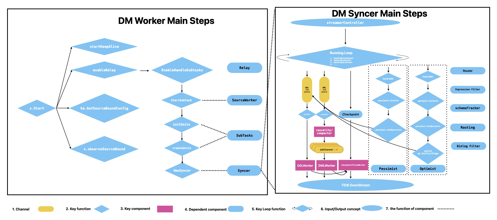

# DM Worker

## What's DM Worker

DM Worker从 [func start](https://github.com/pingcap/tiflow/blob/c65e2b72198de10319008b31dcf13d51509ccfde/dm/worker/server.go#L106-L108) 开始，启动一系列组件，包括 `startKeepAlive`， `RelayHandler`， `SubTasks`， `Syncer`。关于 Relay 配置，有一个[逻辑](https://github.com/pingcap/tiflow/blob/c65e2b72198de10319008b31dcf13d51509ccfde/dm/worker/server.go#L160-L164)来判定是否使用远程MySQL Binlog或本地 Relay 日志。



## KeepAlive

1. **功能是什么?** DM Worker 与 Master 保持心跳。如果 Worker 失去了与 Master 的连接，它将停止所有任务并尝试再次连接主服务器。

2. **它是如何工作的。** [defaultKeepAliveTTL](https://github.com/pingcap/tiflow/blob/c65e2b72198de10319008b31dcf13d51509ccfde/dm/worker/join.go#L103)是1分钟，它定期使用[etcd cli.Grant](https://github.com/pingcap/tiflow/blob/c65e2b72198de10319008b31dcf13d51509ccfde/dm/pkg/ha/keepalive.go#L116)将kv与TTL放在etcd。通过这种方式，DM Master可以将子任务转换到另一个活跃的DM Worker中，如果这个Worker已经绑定了一个特定的MySQL Binlog，那么这个Worker就会出现严重的问题。

## Relay

1. **如何检测它是否已配置。** 当配置不能从 DM Master 获取，这意味着任务已经删除或尚未配置，启动[逻辑](https://github.com/pingcap/tiflow/blob/c65e2b72198de10319008b31dcf13d51509ccfde/dm/worker/server.go#L183-L185)进入[func enableHandleSubtasks](https://github.com/pingcap/tiflow/blob/c65e2b72198de10319008b31dcf13d51509ccfde/dm/worker/server.go#L686-L688)来证明是否使用 Relay 日志。

2. **如何工作，如果它是配置。** 更多 Relay 实现信息在[这篇文章- DM源码阅读系列文章(六)中继日志的实现](https://cn.pingcap.com/blog/dm-source-code-reading-6)(顺便说一句:你需要英文版本可能需要自行翻译)。简单地说，Relay log 是一个避免远程 MySQL Binlog 突然消失的桥梁功能，它是通过首先读取每个有用的Binlog，比如插入/更新…使用[GetEvent](https://github.com/pingcap/dm/blob/f6f0566424/relay/reader/reader.go#L128)，然后写入中继日志目录来实现，如下所示。DM Worker 在启用 Relay 时，调用[func parseFile](https://github.com/pingcap/dm/blob/f6f0566424/pkg/streamer/reader.go#L244)解析中继日志到同步器。  
    **a. server-uuid.index** : 一个已经组织了binglog事件的索引，以提供一个结构来索引读取的位置。  
    **b. 842965eb-091c-11e9-9e45-9a3bff03fa39** : 由 [func utils.AddSuffixForUUID](https://github.com/pingcap/tiflow/blob/c65e2b72198de10319008b31dcf13d51509ccfde/dm/relay/meta.go#L279)以 `fmt.Sprintf("%s%s%06d", uuid, uuidIndexSeparator, id)` 格式生成的目录。  
    **c. relay.meta** : 记录当前过程或进度。  
    **d. mysql-bin.00000X** : X的最大值是正在写入的最新文件。  

    ```shell
    <deploy_dir>/relay_log/
    |-- 7e427cc0-091c-11e9-9e45-72b7c59d52d7.000001
    |   |-- mysql-bin.000001
    |   |-- mysql-bin.000002
    |   |-- mysql-bin.000003
    |   |-- mysql-bin.000004
    |   `-- relay.meta
    |-- 842965eb-091c-11e9-9e45-9a3bff03fa39.000002
    |   |-- mysql-bin.000001
    |   `-- relay.meta
    `--  server-uuid.index
    ```

## SubTasks

1. **SubTasks 是什么意思** SubTask表示数据迁移的子任务。也就是说，子任务数等于MySQL Binlog数。都是因为他们的关系是1比1。我们可以在下面看到[它的 struct](https://github.com/pingcap/tiflow/blob/c65e2b72198de10319008b31dcf13d51509ccfde/dm/worker/subtask.go#L77)。我们都知道，一个工人到现在为止只有一个binlog。一个值得注意的特性是PingCAP试图解耦 1-1 的关系，您可以通过跟踪 [Issue](https://github.com/pingcap/tiflow/issues/4687) 来流动进度。

    ```go
    type SubTask struct {
    cfg *config.SubTaskConfig

    ......

    workerName string

    validator *syncer.DataValidator
    }
    ```

2. **它是如何创建的。** 从任务生成子任务的主要地方是在[OpenAPITaskToSubTaskConfigs](https://github.com/pingcap/tiflow/blob/c65e2b72198de10319008b31dcf13d51509ccfde/dm/master/openapi_controller.go#L386)和[StartTask](https://github.com/pingcap/tiflow/blob/c65e2b72198de10319008b31dcf13d51509ccfde/dm/master/server.go#L510)。值得注意的是，不仅只有两个，还有[UpdateTask](https://github.com/pingcap/tiflow/blob/c65e2b72198de10319008b31dcf13d51509ccfde/dm/master/server.go#L725)。但我们只是关注它的来源。所以，如果你感兴趣，你可以自己探索。

## SourceWorker

1. **它负责什么?** SourceWorker管理一个源(上游)，主要与子任务和中继相关。它有很多函数，如“updateSourceStatus”，“fetchSubTasksAndAdjust”，“operateRelay”和“PurgeRelay”…，我们可以看到功能是什么。

2. **它是如何工作的。** 只关注SourceWorker功能的主要部分(StartSubTask)。如前所述，当一个DM Worker启动时，它通过请求etcd来获得子任务配置和绑定关系。因此，遵循 `EnableHandleSubtasks——> w.s tstartsubtask——>st. Run——>initUnits——>createUnits`，将清楚地显示一个工作逻辑。并且，在 [func createRealUnits](https://github.com/pingcap/tiflow/blob/c65e2b72198de10319008b31dcf13d51509ccfde/dm/worker/subtask.go#L52) 中，有一些步骤来调整 `modelall` 或 `ModeIncrement` 。如果有兴趣，请自学。

## Syncer

我不得不说 `Syncer` 是 DM Worker 最重要的组件，甚至是DM。所以，它被分成一个单独的内容来解释它是如何工作的。在 [这里](./05TiDB-DM%20syncer.md)。
